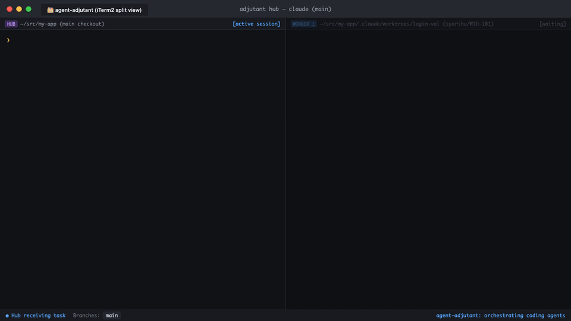

[English](README.md) | 日本語

# agent-adjutant


> 英語版が正本 ([README.md](README.md))

コーディングエージェントのためのタスク hub を、1つのバイナリで。



`adjutant` はリポジトリの「副官」として、タスクを worker に割り振り、その報告を受け取ります。hub がタスクを選定して worktree を作成し、指示書を用意して別タブで worker を起動します。worker が作業中に関係のないバグを見つけた場合は、自ら修正や Issue 起票を行わずに hub へ差し戻します。これら一連のワークフローは手順書（プロンプト）としてバイナリに同梱されています。

## なぜプロンプトを配信するバイナリなのか

従来、エージェントへの手順書は各エージェントのコマンドディレクトリに Markdown ファイルとして配置していました。しかし、ツールのアップデートに伴いファイルが乖離し、環境ごとに古い手順書が残り続ける問題がありました。MCP 経由でバイナリから配信することで、エージェントは常に単一の最新手順を参照できます。

また、hub 名の解決や設定の読み込み、タブ操作、メッセージの受け渡しといった機械的な処理も、以前は複数の手順書に重複して記載されていました。これらを CLI コマンドとして切り出し、手順書からはそのコマンドを呼び出す構成に整理しています。

## インストール

Homebrew の場合:

```bash
brew install syarihu/tap/agent-adjutant # `adjutant` と短縮版 `adj` の両方が入ります
adjutant install-mcp                   # Claude Code に MCP サーバーを登録（user スコープ）
adjutant install-mcp --target json          # 他のクライアント向けに設定用 JSON を出力
```

Cargo の場合:

```bash
cargo install --git https://github.com/syarihu/agent-adjutant # `adjutant` と短縮版 `adj` の両方が入ります
# またはローカルチェックアウトから:
#   cargo install --path .
# または cargo install を使わない場合:
#   cargo build --release && cp target/release/adjutant target/release/adj ~/bin/
```

`install-mcp` は `claude mcp add` を直接実行して Claude Code に登録します。他のクライアントを使う場合は `--target json` で設定 JSON を出力して手動登録できます。

**登録前にバイナリへ PATH を通してください。** PATH が通っていない状態で `install-mcp` を実行するとビルドディレクトリの絶対パスで登録されるため、`cargo clean` などでバイナリが消えるとサーバーが動かなくなります。

**`adj` は `adjutant` の短縮名です。** どちらを実行しても同じように動作します。`adj work` から起動された worker タブも `adj worker` として立ち上がります。

## 2つのモード

シェル側（エージェント起動前のランチャーやフック、手順書内の `Bash` ステップ向け。すべて `adj` でも実行可能）：

| コマンド | 説明 |
| --- | --- |
| `adjutant hub` | このリポジトリの hub をメインチェックアウトで1つ起動 |
| `adjutant hub-name [--json]` | hub のセッション名（報告先のアドレス）を出力 |
| `adjutant config` | このリポジトリ向けに解決された設定を JSON で出力 |
| `adjutant pending [--json\|--read N\|--ack N\|--path]` | hub 宛ての未処理メッセージを一覧・確認 |
| `adjutant send --subject … --body …` | hub にメッセージを送信（本文は stdin 可） |
| `adjutant work --worktree … --title …` | 新しいタブを開いて worker を起動 |
| `adjutant worker --worktree …` | 自身を worker として起動（`work` のタブ内で実行されるコマンド） |
| `adjutant tell --worktree … --subject …` | 指定 worktree の worker にメッセージを送信 |
| `adjutant outbox [--clear]` | hub から現在の worker 宛てに届いたメッセージを確認 |
| `adjutant spawn --cwd … -- cmd …` | 新しいタブを開いてコマンドを実行 |
| `adjutant focus` | 実行中の hub タブをアクティブにする（なければ exit 1） |
| `adjutant ide --worktree …` | worktree を設定されたエディタで開く |
| `adjutant title --title …` | 現在のタブの名前を設定（hub 自身も使用） |
| `adjutant notify --message …` | 人間にデスクトップ通知を送る |
| `adjutant worktree-path --name …` | タスク用 worktree のブランチ名・パス・ベースを出力 |
| `adjutant hub-stop` | このリポジトリの hub 実行記録をクリア |

エージェント側（`adjutant mcp`）：7つのツールと3つのプロンプトを提供します。

- **プロンプト**: `adj-hub`（hub 実行）、`adj-worker`（タスクの着手から完了引き渡しまで）、`adj-report`（作業中に発見したバグを hub に報告）。Claude Code では `/mcp__adjutant__adj-hub` のように呼び出せます。
- **ツール**: `adjutant_config`、`adjutant_hub_status`、`adjutant_send`、`adjutant_pending`、`adjutant_tell`、`adjutant_outbox`、`adjutant_skill`。`adjutant_skill` は、プロンプト機能に未対応のエージェントでも同じ手順書を取得できるように用意されています。

名前の使い分けとして、人間が入力する CLI コマンドやプロンプトは短く（`adj`, `adj-…`）、システムが参照する MCP サーバー名やツール名は長めに（`adjutant`, `adjutant_…`）揃えています。

リポジトリ固有の情報を扱うコマンドは `--repo owner/name` を受け取ります。省略した場合は、カレントディレクトリ（worktree 含む）の git origin リモートからリポジトリを自動判定します。

MCP の `instructions` は約5行の最小限に抑えています。1500行を超える詳細な手順書は、hub や worker が必要になったタイミングでオンデマンドに取得するため、常時コンテキストを圧迫しません。

## 権限

MCP 経由で配信される手順書からは、個別ツールの許可リスト（`allowed-tools`）を指定できません。

そのため、**hub も worker も既定では自動実行モード（unattended）で起動します**。worker のビルドや hub の受信箱監視が確認ダイアログで止まるのを防ぐためです。ただし、Issue の起票確認やタスクの着手確認など、人による判断が必要なチェックポイント（`AskUserQuestion`）は手順書側で維持されます。スキップされるのは `gh issue view` などの日常的なコマンド実行確認です。

都度確認を挟みたい場合は、設定で `hubRunner` を変更してください：

```jsonc
"hubRunner": "claude -n {name} {prompt}"
```

その場合、hub が停止しないよう `~/.claude/settings.json` で必要なツールを事前に許可しておく必要があります：

```jsonc
"permissions": { "allow": [
  "Bash(adj:*)", "Bash(adjutant:*)",
  "Bash(git:*)", "Bash(gh:*)",
  "Bash(cat:*)", "Bash(ls:*)", "Bash(mkdir:*)", "Bash(mv:*)", "Bash(cp:*)",
  "Bash(sed:*)", "Bash(awk:*)", "Bash(printf:*)", "Bash(date:*)", "Bash(ps:*)",
  "Bash(basename:*)", "Bash(open:*)", "Bash(which:*)",
  "Bash(proctor:*)", "Bash(lk:*)", "Bash(codex:*)",
  "mcp__adjutant__adjutant_config", "mcp__adjutant__adjutant_hub_status",
  "mcp__adjutant__adjutant_send", "mcp__adjutant__adjutant_pending",
  "mcp__adjutant__adjutant_tell", "mcp__adjutant__adjutant_outbox",
  "mcp__adjutant__adjutant_skill"
]}
```

hub はメインチェックアウトで動作します。手順書によってメイン側での直接実装は禁止され、作業は必ず worktree 上の worker に委任されますが、これは手順書による制約であり、OS レベルのサンドボックスではない点に留意してください。

## 設定

設定ファイルは `~/.config/adjutant/config.json` です（`$XDG_CONFIG_HOME` および `ADJUTANT_CONFIG` に対応）。詳細は **`config.example.json`** を参照してください。`//` で始まるキーはスキーマ説明用で、実行時に自動で除去されます。

設定は「リポジトリ固有エントリ > `defaults` > トップレベル > 組み込みの既定値」の順に優先されます。設定内容に不備があってもエラー終了はせず、`warnings` を含んだ上で hub が警告を通知します。

各設定項目はコマンドテンプレートになっており、プレースホルダは**シェルクォートされた状態で**展開されます。テンプレート側でプレースホルダを引用符で囲まないでください：

| キー | プレースホルダ | 既定値 |
| --- | --- | --- |
| `terminal.spawn` | `{cwd}` `{title}` `{command}` | iTerm2 |
| `terminal.focus` | `{pid}` `{tty}` `{title}` | iTerm2 |
| `terminal.title` | `{title}` | tty への OSC エスケープシーケンス（`spawn` が開く全タブにも適用） |
| `wake` | `{pid}` `{tty}` `{subject}` `{line}` | iTerm2 の `write text` で対象セッションに入力 |
| `hubWake` / `workerWake` | 同上 | `wake` を方向別に上書き |
| `agentRunner` | `{prompt}` `{worktree}` `{title}` | `claude --permission-mode auto {prompt}` |
| `hubRunner` | `{name}` `{prompt}` | `claude -n {name} --permission-mode auto {prompt}` |
| `notification` | `{title}` `{message}` `{nwo}` | `terminal-notifier`（未インストールなら `osascript`） |
| `ide` | `{worktree}` | なし（手順書内でユーザーに確認） |
| `worktreePattern` | `{repo}` `{branch}` `{name}` | `.claude/worktrees/{name}` |

キーを省略した場合は既定値が使われ、`false` を指定した場合はその機能が無効化されます。`terminal` や `wake` 系はキー単位でマージされるため、必要な項目だけを上書きできます。

### 通知の詳細設定
組み込みの通知は `terminal-notifier` があればそれを使い、無ければ `osascript` にフォールバックします。この優先順位には理由があります。コマンドラインの `osascript` が出した通知は macOS が**スクリプトエディタ**からのものとして扱うため、通知バナーの送り主が意図しないアプリになり、クリックしても空のスクリプトエディタが起動するだけで、呼び出し元のセッションには戻れません。[`terminal-notifier`](https://github.com/julienXX/terminal-notifier)（`brew install terminal-notifier`）が入っている場合、組み込みの通知は次のコマンドになります：

```jsonc
"terminal-notifier -title {title} -message {message} -sound Glass -activate com.googlecode.iterm2"
```

これでクリック時にターミナルが前面に出ます。さらに `{nwo}` を使うと、タブ単位まで狙えます。`{nwo}` はそのメッセージが属するリポジトリで、`--repo` が受け取るのと同じ値です（`owner/name`、ただし使える remote が無いチェックアウトではそのディレクトリ名になります）。クリック時に `adj focus --repo {nwo}` を実行する通知コマンドにすれば、**そのリポジトリの hub タブそのもの**が前面に出ます。ただしテンプレート内にクォートで囲んだコマンドを入れ子にするのは避け、スクリプトを用意してそれを指定してください（理由は後述の wake の注意点と同じで、置換される値が自身のクォートを伴って展開されるためです）。なお `adjutant notify` をリポジトリ外で実行した場合 `{nwo}` は空になり、その旨が標準エラー出力に出ます。

macOS 以外には組み込みの通知手段がなく、通知できないことはエラーではなく無音として扱われます。そのため Linux で hub を動かす場合はこのキーの設定が必要です（例: `"notify-send {title} {message}"`）。逆に proctor のサイドバーや tmux のステータス行など、セッションを監視する仕組みが別にある場合は、バナーを二重に出さず `false` で無効化してください。

テンプレートが実際にどのコマンドへ展開されるかは `adjutant notify --message … --dry-run` で確認できます（実際の送信は行われません）。

### wake の詳細設定
`wake`（セッションへの入力通知）は、「ターミナルにどう入力するか」と「エージェントに何を伝えるか」に分かれています。そのため、`hubWake` / `workerWake` ではオブジェクト形式で個別に上書きできます：

```jsonc
"wake": "tmux send-keys -t {tty} {line} Enter",   // ターミナル側の操作
"workerWake": { "line": "check `adj outbox`" }     // エージェント側の入力文言
```

- **複数コマンドの実行**: `sh -c '…'` で囲むとクォートの二重展開で壊れる可能性があるため、シェルスクリプトを用意してそれを呼び出してください。
- **カレントディレクトリ**: `spawn` テンプレートに `{cwd}` が含まれている場合はそのコマンド自身でディレクトリ移動を行うものとみなし、含まれていない場合は先頭に `cd` が付与されます。
- **タブ名**: 新規タブの名前はターミナル API ではなく、タブ内で実行されるシェルが `adjutant title` を呼ぶことで設定されます。
- **環境変数**: `agentEnv` で、hub および worker の起動時に渡す環境変数を設定できます。別プロファイルでエージェントを動かしたい場合に便利です。

## 両者はどうやって連絡を取り合うか

### アドレス体系（hub 名）
宛先アドレスとなる hub 名は、両セッションともに `adjutant hub-name` で自動算出します。リポジトリの `owner/name` を正規化した文字列と、小文字化ハッシュの組み合わせで構成され、リポジトリ間での受信箱の衝突を防ぎます。手動で組み立てず、必ずコマンドから取得してください。

### メッセージ配送の仕組み
- **worker → hub**:
  - `adjutant send`（または `adjutant_send` ツール）が `~/.local/state/adjutant/inbox/<slug>/` にファイルを書き込み、`adjutant pending` が読み出します。
  - hub が停止中でもメッセージは保持されます。
  - hub の生存確認は、記録された PID への `kill -0` およびプロセス引数の照合で行われます。
- **hub → worker**:
  - 宛先はセッションではなく worktree です。`adjutant tell` が `{worktree}/.claude/adjutant-outbox.md` に追記し、`adjutant outbox` が読み出します。
  - worker 起動時に `adjutant worker` ランチャーが自身の PID を記録し、そのプロセス上でエージェントを `exec` することで、`workerWake` による入力通知を可能にしています。

### wake（起こす処理）と通知
ファイル書き込みだけではエージェントが気づかないため、相手が起動中の場合は **`hubWake`** / **`workerWake`**（既定では iTerm2 へのキー入力）を実行して受信箱の確認を促します。
- `send` は常にデスクトップ通知（`notification`）を発火します。
- `tell` は worker を wake できなかった場合のみデスクトップ通知を発火します（wake できた場合は worker が自律して読むため）。
- wake 処理はベストエフォートであり、失敗してもメッセージ送信自体は成功します。

これらをテンプレート経由で抽象化しているため、ターミナルやエージェントの種類を問わず柔軟に連携できます。

## レイヤ構成

```
repo  config  template  prompts        末端（標準ライブラリと自身の入力のみ）
terminal  runner  notify  ide  messaging   下位層のみ参照可能（横の参照は不可）
cmd/  mcp                                  各モジュールを結合する最上位層
```

モジュール間の依存方向は `scripts/check-layering.sh` で強制され、CI でも検証されます。

## 開発

```bash
cargo test                    # 単体テスト + CLI テスト
./scripts/check-layering.sh   # レイヤリング検証
cargo fmt --check && cargo clippy --all-targets -- -D warnings
```

テストはすべて環境から隔離されています。`ADJUTANT_CONFIG` と `ADJUTANT_STATE_DIR` が一時ディレクトリに向けられるため、ローカルの設定や実行中の hub に影響を与えることはありません。外部プロセスを起動する処理も `--dry-run` 下で実行されます。

## サブエージェントの利用

worker はタスク実行中、環境内に特化サブエージェントが定義されていればそれを活用します：

- **調査**: コードベースの探索や Issue・ドキュメントの読み取りに特化したエージェント（`task-researcher` や、説明に調査・探索・research を含むもの）。見当たらない場合は、組み込みの `Explore` または読み取り専用の指示を付与した `general-purpose` へ自動でフォールバックします。
- **レビュートリアージ**: PR のレビューコメント取得と分類に特化したエージェント（`review-triage` やトリアージ用）。見当たらない場合は `general-purpose` へフォールバックします。
- **セルフレビュー**: 差分の独立検証に特化したエージェント（`self-reviewer` やレビュー用）。見当たらない場合は `general-purpose`（または設定された codex）へフォールバックします。

カスタムサブエージェントはエージェントクライアント側（Claude Code の場合は `~/.claude/agents/*.md` など）で定義されます。これらが定義されていないまっさらな環境でも、すべて `general-purpose` でそのまま動作します。

## 任意の連携ツール

[`proctor`](https://github.com/syarihu/agent-proctor)（worktree 規約、セッション台帳、タブ着色）や [`lk`](https://github.com/syarihu/local-knowledge-cli)（ローカルナレッジベース）が PATH 上にあれば自動で連携し、なければスキップします。

どちらも必須ではありません。worktree の配置や命名規約は `adjutant worktree-path --name`（ブランチ: `{user}/{name}`、パス: `<main>/.claude/worktrees/{name}`）が同等の形式を標準で提供します。また、リポジトリごとの追加ファイル配置は、本ツールの設定にある `postCreate` フックで対応できます。

3つ目は [`terminal-notifier`](https://github.com/julienXX/terminal-notifier) で、これは組み込みの処理自体が参照する唯一のツールです。インストールされていればクリック先を指定できる通知コマンドを使い、無ければ `osascript`（＝スクリプトエディタ名義の通知）にフォールバックします。

## ライセンス

MIT — [LICENSE](LICENSE) を参照してください。
