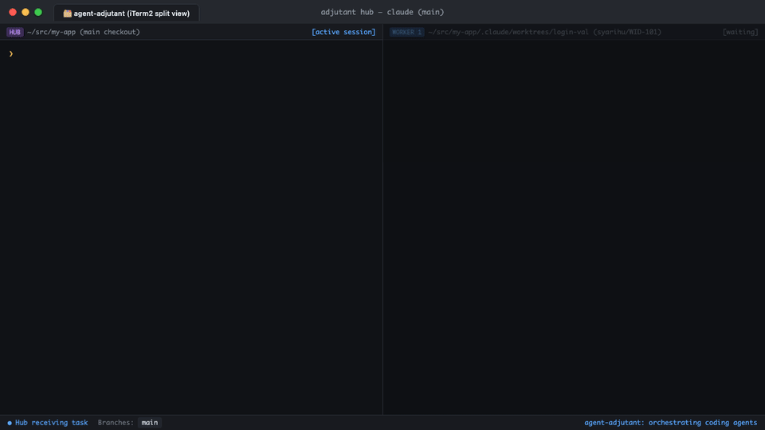

[English](README.md) | 日本語

# agent-adjutant


> 英語版が正本 ([README.md](README.md))

コーディングエージェントのためのタスク hub を、1つのバイナリで。



`adjutant` はリポジトリの「副官」として、タスクを worker に割り振り、その報告を受け取ります。hub がタスクを選定して worktree を作成し、指示書を用意して別タブで worker を起動します。worker が作業中に関係のないバグを見つけた場合は、自ら修正や Issue 起票を行わずに hub へ差し戻します。これら一連のワークフローは手順書（プロンプト）としてバイナリに同梱されています。

## なぜプロンプトを配信するバイナリなのか

従来、エージェントへの手順書は各エージェントのコマンドディレクトリに Markdown ファイルとして配置していました。しかし、ツールのアップデートに伴いファイルが乖離し、環境ごとに古い手順書が残り続ける問題がありました。MCP 経由でバイナリから配信することで、エージェントは常に単一の最新手順を参照できます。

また、hub 名の解決や設定の読み込み、タブ操作、メッセージの受け渡しといった機械的な処理も、以前は複数の手順書に重複して記載されていました。これらを CLI コマンドとして切り出し、手順書からはそのコマンドを呼び出す構成に整理しています。

## インストール

Homebrew の場合:

```bash
brew install syarihu/tap/agent-adjutant # `adjutant` と短縮版 `adj` の両方が入ります
adjutant install-mcp                   # Claude Code に MCP サーバーを登録（user スコープ）
adjutant install-mcp --target agy       # Antigravity (agy) に MCP サーバーを登録
adjutant install-mcp --target json      # 他のクライアント向けに設定用 JSON を出力
```

Cargo の場合:

```bash
cargo install --git https://github.com/syarihu/agent-adjutant # `adjutant` と短縮版 `adj` の両方が入ります
# またはローカルチェックアウトから:
#   cargo install --path .    （`make install` でも可。`make restart` は `adj server` の再起動、`make reinstall` は両方を行います）
# または cargo install を使わない場合:
#   cargo build --release && cp target/release/adjutant target/release/adj ~/bin/
```

`install-mcp` は `--target claude-code`（既定）で `claude mcp add`、`--target agy` で `agy mcp add` を直接実行して登録します。他のクライアントを使う場合は `--target json` で設定 JSON を出力して手動登録できます。

**登録前にバイナリへ PATH を通してください。** PATH が通っていない状態で `install-mcp` を実行するとビルドディレクトリの絶対パスで登録されるため、`cargo clean` などでバイナリが消えるとサーバーが動かなくなります。

**`adj` は `adjutant` の短縮名です。** どちらを実行しても同じように動作します。`adj work` から起動された worker タブも `adj worker` として立ち上がります。

## 2つのモード

シェル側（エージェント起動前のランチャーやフック、手順書内の `Bash` ステップ向け。すべて `adj` でも実行可能）：

| コマンド | 説明 |
| --- | --- |
| `adjutant hub [--tab] [--resume\|--new] [--no-dashboard\|--dashboard]` | このリポジトリの hub をメインチェックアウトで1つ起動。前回のセッションが `hubAutoResumeHours` 以内に終了していれば再開する（`--tab` は今のタブが hub になるのではなく、新しいタブを開いてそこで起動。`--resume` は終了からの時間に関係なく前回のセッションを再開し、`--new` は時間内でも新しく起動する。`--no-dashboard` は起動時の一覧収集を省略し、`--dashboard` は逆に収集させる。どちらも `startupDashboard` より優先） |
| `adjutant hub-name [--json]` | hub のセッション名（報告先のアドレス）を出力 |
| `adjutant config` | このリポジトリ向けに解決された設定を JSON で出力 |
| `adjutant pending [--json\|--read N\|--ack N\|--path]` | hub 宛ての未処理メッセージを一覧・確認 |
| `adjutant send --subject … --body …` | hub にメッセージを送信（本文は stdin 可） |
| `adjutant work --worktree … (--title … \| --task <id> \| --resume)` | 新しいタブを開いて worker を起動（`--task` はタスクレコードのタイトルでタブを名乗る。Issue 由来のタイトルをコマンド行にクォートして書かずに済む。`--resume` はその worktree に保存されたセッションを再開）。`maxWorkers` の数だけ worker が動いていると、何も起動せずに終了コード 3 で返る |
| `adjutant worker --worktree … [--resume]` | 自身を worker として起動（`work` のタブ内で実行されるコマンド。worktree の中で `--resume` を付けると保存されたセッションを再開） |
| `adjutant tell --worktree … --subject …` | 指定 worktree の worker にメッセージを送信 |
| `adjutant outbox [--clear]` | hub から現在の worker 宛てに届いたメッセージを確認 |
| `adjutant spawn --cwd … -- cmd …` | 新しいタブを開いてコマンドを実行 |
| `adjutant focus [--worktree …]` | 実行中の hub タブ（`--worktree` ならその worktree の worker のタブ）をアクティブにする（なければ exit 1） |
| `adjutant phase [--set …]` | worker が今どの工程にいるかを書く（`plan` / `implement` / `self-review` / `verify` / `pr` / `pr-bots` / `review` / `report`）。`--set` 無しなら今の工程を表示 |
| `adjutant review-engine [--json]` | worker 用。このセルフレビューのラウンドで差分を読むエンジンを返す（`reviewEngine`、`auto` なら Claude のレート制限キャッシュと `PATH` 上の `codex` で決める）。ユーザーに伝える一文も返す |
| `adjutant close --worktree …` | 指定 worktree の worker が座っているタブを閉じる（閉じられなければ exit 1） |
| `adjutant ide --worktree …` | worktree を設定されたエディタで開く |
| `adjutant title --title …` | 現在のタブの名前を設定（hub 自身も使用） |
| `adjutant notify --message …` | 人間にデスクトップ通知を送る |
| `adjutant worktree-path --name … [--unique]` | タスク用 worktree のブランチ名・パスと、作成コマンドを打つメインチェックアウトを出力（`--unique`: パスもブランチも空いている最初の `name`、`name-2`、`name-3`… を選び、`name` として返す） |
| `adjutant task fetch-issue --id …` | タスクの GitHub Issue を読み直し、タイトルと本文をレコードの `issueSnapshot` に保存する。`task add` / `task update` は、タスクが着手済み（dispatched か pr）になったとき、または Issue が変わったときに同じ読み取りをする。タイトルは256文字、本文は16 KiB まで。板は表示のたびに GitHub へ問い合わせず、「再取得」を押したときだけ読み直す |
| `adjutant jules start\|show\|findings\|relay` | タスクの承認済みの計画を Jules に渡す。渡した session の状態を確認する。レビュー指摘を Jules に回す（[Jules に実装を渡す](#jules-に実装を渡す)を参照） |
| `adjutant hub-stop` | このリポジトリの hub 実行記録をクリア |
| `adjutant hub-close --hub KEY` | 親タスクの hub を閉じる（この hub に報告する checkout が残っていないときだけ）。実行記録を消し、ボードの一覧から外す。プロセスは止めないので、hub 自身から、または動いていない hub に対して使い、動いている hub を外から閉じようとすると断る。保存済みのセッション・タスク・gate・受信箱は残る |

エージェント側（`adjutant mcp`）：10個のツールと3つのプロンプトを提供します。

- **プロンプト**: `adj-hub`（hub 実行）、`adj-worker`（タスクの着手から完了引き渡しまで）、`adj-report`（作業中に発見したバグを hub に報告）。Claude Code では `/mcp__adjutant__adj-hub` のように呼び出せます。
- **ツール**: `adjutant_config`、`adjutant_hub_status`、`adjutant_send`、`adjutant_pending`、`adjutant_tell`、`adjutant_outbox`、`adjutant_gate_open`、`adjutant_gate_close`、`adjutant_refresh`、`adjutant_skill`。`adjutant_skill` は、プロンプト機能に未対応のエージェントでも同じ手順書を取得できるように用意されています。エージェントに応じた形式（Claude Code の `AskUserQuestion` や Antigravity の `ask_question` など）に自動調整されます（`--agent` または `agent` 引数で指定も可能）。

名前の使い分けとして、人間が入力する CLI コマンドやプロンプトは短く（`adj`, `adj-…`）、システムが参照する MCP サーバー名やツール名は長めに（`adjutant`, `adjutant_…`）揃えています。

リポジトリ固有の情報を扱うコマンドは `--repo owner/name` を受け取ります。省略した場合は、カレントディレクトリ（worktree 含む）の git origin リモートからリポジトリを自動判定します。

1つのリポジトリに hub を複数立てられます。`--hub <id>` はそのどれを指すかを表します。動くのは宛先（セッション名・受信箱・レコード）だけで、設定は変わりません。設定は引き続き `owner/name` で引かれるので、登録済みリポジトリの2つめの hub でも taskSources / issueKeys / verify はそのまま使えます。`--hub` を付けなければ、これまでと同じアドレスのリポジトリ自身の hub になります。ただし `adj work` が開いた worktree の中でだけは、hub を**指す**コマンドがその worktree のレコードから識別子を読みます。何かを**起こす**側（`hub` / `work` / `worker`）は読みません。worktree の中から立てた hub も、タブが開かれた worktree に登録する worker も、他人のレコードを読むことになるからです。

識別子を毎回書き直す必要はありません。`adj hub --hub <id>` はエージェントを起動するコマンドラインに `ADJUTANT_HUB` を載せるので、そのエージェントが叩く `adj` も MCP ツールも自分自身の hub を指します。`adj work` は開いた worktree に識別子を書き込むので、worker は宛先を書かずに送っても自分を出した hub に届きます。

`adj worker` も、登録した識別子をエージェントのコマンドラインに載せます。その前に、引き継いだ `ADJUTANT_HUB` は環境から外します。tmux のように環境を引き継ぐ terminal テンプレートでは、タブを開いた hub の識別子がエージェントに渡り、worktree のレコードより優先されてしまうからです。

ただし動いている worker 自身が打つコマンド（エージェント、そのエージェントの MCP サーバー、その下のシェル）は、`ADJUTANT_HUB` が別の値でも、worktree の worker レコードから hub を読みます。レコードに hub が無ければリポジトリ自身の hub です。ボードでタスクに紐づけて worker の hub を移しても、エージェントを起動し直さずに済むのはこのためです。それ以外のコマンドは従来どおりの優先順位なので、worker の worktree の中でコマンドを打つ hub は、これまでどおり自分自身を指します。

`agentEnv` には `ADJUTANT_HUB` を書けます。これは既定値の扱いで、`--hub` も環境変数も無いときに `hub` / `work` / `worker` がこの値を使い、リポジトリ自身の hub ではなくその hub を立てます。起動したコマンドとエージェントが同じ hub を指すようにするためです。`--hub` や引き継いだ `ADJUTANT_HUB` があればそちらが優先され、エージェントのコマンドラインでも設定の値を置き換えます。このキーを足す前に、そのリポジトリで動いている hub は止めてください。足したあとは、素の `adj hub` が設定の hub を探して立て、`adj work` も新しい worker をその hub の下に登録します。hub を指すコマンド（`send` / `pending` / `hub-stop` / `hub-close` など）は `agentEnv` を読まないので、hub 自身のシェル以外から打つときは `--hub` か `ADJUTANT_HUB` で指定してください。

`--no-dashboard` / `--dashboard` も同じ経路を通ります。これらは同じコマンドラインに `ADJUTANT_STARTUP_DASHBOARD` として載り、`adjutant config` が解決の時点で織り込むため、`settings.startupDashboard` を読む手順書には設定ファイルの値ではなく**その hub が起動したときのフラグ**が見えます。ただし `--tab` のときはこの変数が出てきません。ターミナルに渡せるのはコマンドラインだけなので、フラグは新しいタブで走る `adjutant hub` にそのまま転送され、**環境を組み立てるのはそちらの `adjutant hub`** になります。最終的な結果は同じで、1プロセス遅れるだけです（2つの経路の dry run の出力が違って見えるのはこのためです）。

### 再起動後の再開

エージェントのアップデートやクラッシュで hub や worker が終了することがあります。hub は終了から `hubAutoResumeHours`（既定は3時間）以内なら、`adj hub` を打つだけで前回の会話に戻ります。それを過ぎていれば空の会話で起動するので、朝の1枚目はまっさらになります。時間に関係なく再開したいときは `--resume` を、時間内でも新しく立てたいときは `--new` を付けます。

```bash
adj hub --resume                  # このリポジトリの hub（リポジトリ内のどこからでも）
adj hub --resume --hub ALPHA-233  # 親タスクの hub（識別子は推測しないので明示する）
adj worker --resume               # worktree の中で実行すると、そこで作業していた worker
```

ボードの「hub をリセット」（hub の行のボタンと、セッション画面の端末の上のメニュー）は `--new` と同じことをします。確認のあと、hub が動いていれば止め、新しい会話で起動し直します。前の会話は消えませんが再開もされず、以後 `adj hub --resume` で戻るのは新しい会話です（会話を記録しない runner では戻り先がなくなります）。受信箱、タスクと gate の記録、動いている worker はそのまま残ります。

`{sessionId}` を含むランナー（既定のランナーは `--session-id {sessionId}` として含んでいます）で新しく起動するときは、セッション ID を作ってエージェントに渡し、保存します。再開するときは新しく作らず、保存済みの ID を使います。`{sessionId}` を含まないランナーで新しく起動したときは ID を作らず、前の起動が保存した ID を消します。これで2つ前の起動の会話が開かれることはありません。ID はレコードとは別の場所に保存します。hub の分は state ディレクトリの `sessions/` に、worker の分は worktree の `.claude/adjutant-session.json` に置きます。`hub-stop` や `close` はレコードを消しますが、この ID は残ります。`--resume` はその ID を `hubResumeRunner` / `agentResumeRunner`（既定は Claude Code の `--resume`）で開き直します。二重起動の防止は通常の起動と同じ仕組みで行い、再開したエージェントには止まっていた間に届いた受信箱・outbox を確認するよう伝えます。

親タスクの hub は、hub の実行記録か、その hub のキーを指す checkout（worker の記録か保存済みセッションがそのキーを名指ししている worktree）があるあいだ一覧に出ます。止まっていて checkout が残っていないものや、保存済みのセッションだけが残っているものは、もう一覧に出ません。checkout が残っていない親タスクの hub は `adjutant hub-close --hub KEY`（ボードでは「閉じる」）で閉じられます。ボードの「閉じる」は、動いている hub を止めたうえで一覧から外します。`adjutant hub-close` はプロセスを止めないので、hub 自身から打つか、動いていない hub に対して使います。動いている hub を外から閉じようとすると断ります。保存済みのセッション・タスク・gate・受信箱は残るので、`adj hub --hub KEY --resume` で引き継げます。リポジトリ自身の hub は止めることしかできません。

hub の終了時刻は、hub の下で動く MCP サーバーが記録します。`adj hub` はセッションを記録する起動（`{sessionId}` を含むランナーでの起動と、再開）のときだけ、`exec` するコマンドラインに `ADJUTANT_HUB_SESSION` を載せます。エージェントが起動する `adjutant mcp` がそれを引き継ぎます。`{sessionId}` を含まないランナーで新しく起動した hub にはこの変数が付かないので、MCP サーバーが動いていても終了時刻は記録されません。MCP サーバーは1分ごとと、エージェントがパイプを閉じたときに、セッションが生きていたことを `sessions/<slug>.alive` に書きます。保存したセッションとは別のファイルにしているのは、古い hub の最後の書き込みが新しい hub の保存を上書きしないようにするためです。MCP サーバーはマシン上のすべてのセッションで動きますが、書き込むのはこの変数を持つものだけです。`adj worker` はエージェントを起動する前にこの変数を外します。hub の下に MCP サーバーが無い場合は終了時刻が分からないので、推測せずに新しく起動します。`hubRunner` を独自に設定していて `hubResumeRunner` を設定していない場合も同じです。組み込みの再開コマンドで開くと独自の runner で足した指定が抜けるので、`--resume` を付けたときだけ再開します。

worker は `--resume` を付けたときだけ再開します。`adj work` は hub が新しい指示書を渡す経路なので、そこで古い会話に戻ると指示書が埋もれてしまいます。

再開した worker は、保存しておいた「自分を出した hub」の下に戻ります。`--resume` を打ったタブが別の hub の `ADJUTANT_HUB` を引き継いでいても、保存された値を優先します。保存されたセッションが無い hub を再開しようとすると、そのリポジトリで再開できる hub の一覧を表示します。`{sessionId}` を含まないランナーで起動したセッションは再開できません。ただしエラーになるのは `--resume` を付けたときだけです。

MCP の `instructions` は約5行の最小限に抑えています。1500行を超える詳細な手順書は、hub や worker が必要になったタイミングでオンデマンドに取得するため、常時コンテキストを圧迫しません。

## 権限

MCP 経由で配信される手順書からは、個別ツールの許可リスト（`allowed-tools`）を指定できません。

そのため、**hub も worker も既定では自動実行モード（unattended）で起動します**。worker のビルドや hub の受信箱監視が確認ダイアログで止まるのを防ぐためです。ただし、Issue の起票確認やタスクの着手確認など、人による判断が必要なチェックポイント（`AskUserQuestion`）は手順書側で維持されます。スキップされるのは `gh issue view` などの日常的なコマンド実行確認です。

都度確認を挟みたい場合は、設定で `hubRunner` と `hubResumeRunner` を変更してください：

```jsonc
"hubRunner": "claude -n {name} --session-id {sessionId} {prompt}",
"hubResumeRunner": "claude -n {name} --resume {sessionId} {prompt}"
```

その場合、hub が停止しないよう `~/.claude/settings.json` で必要なツールを事前に許可しておく必要があります：

```jsonc
"permissions": { "allow": [
  "Bash(adj:*)", "Bash(adjutant:*)",
  "Bash(git:*)", "Bash(gh:*)",
  "Bash(cat:*)", "Bash(ls:*)", "Bash(mkdir:*)", "Bash(mv:*)", "Bash(cp:*)",
  "Bash(sed:*)", "Bash(awk:*)", "Bash(printf:*)", "Bash(date:*)", "Bash(ps:*)",
  "Bash(basename:*)", "Bash(open:*)", "Bash(which:*)",
  "Bash(proctor:*)", "Bash(lk:*)", "Bash(codex:*)",
  "mcp__adjutant__adjutant_config", "mcp__adjutant__adjutant_hub_status",
  "mcp__adjutant__adjutant_send", "mcp__adjutant__adjutant_pending",
  "mcp__adjutant__adjutant_tell", "mcp__adjutant__adjutant_outbox",
  "mcp__adjutant__adjutant_gate_open", "mcp__adjutant__adjutant_gate_close",
  "mcp__adjutant__adjutant_refresh", "mcp__adjutant__adjutant_skill"
]}
```

hub はメインチェックアウトで動作します。手順書によってメイン側での直接実装は禁止され、作業は必ず worktree 上の worker に委任されますが、これは手順書による制約であり、OS レベルのサンドボックスではない点に留意してください。

## 設定

設定ファイルは `~/.config/adjutant/config.json` です（`$XDG_CONFIG_HOME` および `ADJUTANT_CONFIG` に対応）。詳細は **`config.example.json`** を参照してください。`//` で始まるキーはスキーマ説明用で、実行時に自動で除去されます。

設定は「リポジトリ固有エントリ > `defaults` > トップレベル > 組み込みの既定値」の順に優先されます。設定内容に不備があってもエラー終了はせず、`warnings` を含んだ上で hub が警告を通知します。

各設定項目はコマンドテンプレートになっており、プレースホルダは**シェルクォートされた状態で**展開されます。テンプレート側でプレースホルダを引用符で囲まないでください：

| キー | プレースホルダ | 既定値 |
| --- | --- | --- |
| `terminal.spawn` | `{cwd}` `{title}` `{command}` | iTerm2 |
| `terminal.focus` | `{pid}` `{tty}` `{title}` | iTerm2 |
| `terminal.attach` | `{socket}` `{session}` `{window}` | iTerm2 で `tmux -CC attach`（iTerm2 のある Mac のみ。ボードからセッションを開く用で、それ以外ではボードがこのキーを名指しして断る） |
| `terminal.close` | `{pid}` `{tty}` `{title}` | iTerm2（`false` でタブを一切閉じない。その場合 `adjutant close` は何もせず exit 1） |
| `terminal.title` | `{title}` | tty への OSC エスケープシーケンス（`spawn` が開く全タブにも適用） |
| `wake` | `{pid}` `{tty}` `{subject}` `{line}` | iTerm2 の `write text` で対象セッションに入力 |
| `hubWake` / `workerWake` | 同上 | `wake` を方向別に上書き |
| `agentRunner` | `{sessionId}` `{prompt}` `{worktree}` `{title}` | `claude --session-id {sessionId} --permission-mode auto {prompt}` |
| `hubRunner` | `{name}` `{sessionId}` `{prompt}` | `claude -n {name} --session-id {sessionId} --permission-mode auto {prompt}` |
| `agentResumeRunner` | `agentRunner` と同じ | `claude --resume {sessionId} --permission-mode auto {prompt}` |
| `hubResumeRunner` | `hubRunner` と同じ | `claude -n {name} --resume {sessionId} --permission-mode auto {prompt}` |
| `notification` | `{title}` `{message}` `{nwo}` | `terminal-notifier`（未インストールなら `osascript`） |
| `ide` | `{worktree}` | なし（手順書内でユーザーに確認） |
| `worktreePattern` | `{repo}` `{branch}` `{name}` | `.claude/worktrees/{name}` |
| `hubAutoResumeHours` | なし（数値。`0` で無効） | `3`（この時間以内に終了した hub は `adj hub` で自動的に再開する） |
| `stuckAfterMinutes` | なし（数値。`0` で無効） | `120`（worker が同じ工程にこの分数とどまると板のカードを赤くする。worker が止まっているカードはこの値に関係なく赤くなる。ただし PR を出したあとのカードは worker のタブが閉じても赤くしない。PR が review bot を待っている間（`pr-bots`）はエージェント側の列に待ちバッジ無しで置き、人のレビュアーに渡した（`pr`）ときだけ人待ちになる） |
| `julesKey` | なし（Jules の API キーを出力するコマンド） | macOS のキーチェーン項目 `jules-api`（`false` にすると Jules に渡せなくなる） |
| `maxWorkers` | なし（1以上の整数） | 制限なし（チェックアウトごとに数える。gate で待っている worker と起動中の worker は枠を使い、止まった worker は使わない） |
| `startupDashboard` | なし（`true` / `false`） | `true`（`false` にすると hub が起動時に一覧を集めなくなる。人が「一覧」と言ったときの収集は止まらない） |
| `hubServe` | なし（`true` / `false`） | `true`（hub の MCP サーバーがその hub の板を hub と同じ寿命で立てる。`127.0.0.1:4577` が空いていればそこ、埋まっていれば空いている port。URL は `adjutant_config` の `board` に入る。手で立てた板が既に動いていればそのままにする。`false` にすると板は `adj serve` で手で立てる） |

キーを省略した場合は既定値が使われ、`false` を指定した場合はその機能が無効化されます。ただしコマンドではない2つの設定は別の値を取ります。`startupDashboard` と `hubServe` は `true` / `false` で、`hubAutoResumeHours` は数値です。`hubAutoResumeHours` を無効にするには `0` を指定します。`false` を指定すると `warnings` に報告され、既定値が使われます。`maxWorkers` は整数で、それ以外の値は `warnings` に報告されて制限なしになります。`terminal` や `wake` 系はキー単位でマージされるため、必要な項目だけを上書きできます。

`{pid}` と `{tty}` は OS 側から見たセッションの名前（プロセスIDと、そのセッションが載っている端末デバイス `ttys004`）であって、**ターミナル自身の pane / window の id ではありません**。そのため `focus` / `close` / `wake` のテンプレートは、動く前にその id を自分で引き当てる必要があります。`{pid}` を pane id を期待する引数（`--pane-id` など）に渡すと別の番号空間を指すことになり、その番号を持っていた無関係な pane に対して動作します。id 解決を行うラッパースクリプトを指定してください。`close` を「実行できたら成功」とみなさないのも同じ理由です。テンプレートは終了コードだけで判断されるため、adjutant は close 後に**その worker が実際に居なくなったこと**を確認してから記録を消し、居たままなら exit 1 を返します。

### 通知の詳細設定
組み込みの通知は `terminal-notifier` があればそれを使い、無ければ `osascript` にフォールバックします。この優先順位には理由があります。コマンドラインの `osascript` が出した通知は macOS が**スクリプトエディタ**からのものとして扱うため、通知バナーの送り主が意図しないアプリになり、クリックしても空のスクリプトエディタが起動するだけで、呼び出し元のセッションには戻れません。[`terminal-notifier`](https://github.com/julienXX/terminal-notifier)（`brew install terminal-notifier`）が入っている場合、組み込みの通知は次のコマンドになります：

```jsonc
"terminal-notifier -title {title} -message {message} -sound Glass -activate com.googlecode.iterm2"
```

これでクリック時にターミナルが前面に出ます。さらに `{nwo}` を使うと、タブ単位まで狙えます。`{nwo}` はそのメッセージが属するリポジトリで、`--repo` が受け取るのと同じ値です（`owner/name`、ただし使える remote が無いチェックアウトではそのディレクトリ名になります）。クリック時に `adj focus --repo {nwo}` を実行する通知コマンドにすれば、**そのリポジトリの hub タブそのもの**が前面に出ます。ただしテンプレート内にクォートで囲んだコマンドを入れ子にするのは避け、スクリプトを用意してそれを指定してください（理由は後述の wake の注意点と同じで、置換される値が自身のクォートを伴って展開されるためです）。なお `adjutant notify` をリポジトリ外で実行した場合 `{nwo}` は空になり、その旨が標準エラー出力に出ます。

macOS 以外には組み込みの通知手段がなく、通知できないことはエラーではなく無音として扱われます。そのため Linux で hub を動かす場合はこのキーの設定が必要です（例: `"notify-send {title} {message}"`）。逆に proctor のサイドバーや tmux のステータス行など、セッションを監視する仕組みが別にある場合は、バナーを二重に出さず `false` で無効化してください。

テンプレートが実際にどのコマンドへ展開されるかは `adjutant notify --message … --dry-run` で確認できます（実際の送信は行われません）。

### wake の詳細設定
`wake`（セッションへの入力通知）は、「ターミナルにどう入力するか」と「エージェントに何を伝えるか」に分かれています。そのため、`hubWake` / `workerWake` ではオブジェクト形式で個別に上書きできます：

```jsonc
"wake": "wake-tab {tty} {line}",                  // ターミナル側の操作
"workerWake": { "line": "check `adj outbox`" }     // エージェント側の入力文言
```

- **wake の Enter**: 自前の `wake` テンプレートでは、`{line}` の入力と Enter を別々に送ってください。行と改行をまとめて送ると、エージェントの入力欄が貼り付けとして扱い、改行が送信にならずに入力欄に残ることがあります。
- **複数コマンドの実行**: `sh -c '…'` で囲むとクォートの二重展開で壊れる可能性があるため、シェルスクリプトを用意してそれを呼び出してください。
- **カレントディレクトリ**: `spawn` テンプレートに `{cwd}` が含まれている場合はそのコマンド自身でディレクトリ移動を行うものとみなし、含まれていない場合は先頭に `cd` が付与されます。
- **タブ名**: 新規タブの名前はターミナル API ではなく、タブ内で実行されるシェルが `adjutant title` を呼ぶことで設定されます。
- **環境変数**: `agentEnv` で、hub および worker の起動時に渡す環境変数を設定できます。別プロファイルでエージェントを動かしたい場合に便利です。

## Jules に実装を渡す

タスクの実装を worker ではなく [Jules](https://jules.google) に任せることもできます。その場合 worker のセッションは起動しません。hub が読むためだけの detached な worktree を作り、サブエージェントにそこで計画を書かせます。強いモデルが必要なのは設計のほうだからです。人が plan gate で計画を承認すると、hub がそれを Jules の session に渡し、worktree を削除します。実装、パッチのセルフレビュー、PR の作成は Jules が行います。

どちらに実装させるかはタスクレコードに持たせます。`adjutant task add --executor jules`（または `task update --executor jules`）で指定します。Jules に渡すのは hub が実行する次のコマンドです。

```bash
adj jules start --id <task> --prompt-file design.md
```

このリポジトリを対象に、ファイルの中身を prompt として session を作ります。起点のブランチはタスクに記録した base（`adj task update --base`）で、コマンド行で `--base` を渡すとそちらを使います。PR は自動で作らせ、計画は確認なしで承認させます（人がすでに承認しているため）。作った session の id はタスクの `julesSession` に書き込みます。`adj jules show --id <task>` で、session の状態、jules.google.com のページ、PR ができていればその URL を確認できます。1つのタスクを渡せるのは1回だけで、`julesSession` を消すまで2つ目の session は作れません。

API キーはエージェントから読めない場所に置きます。`adj config` はすべての設定を出力し、エージェントはそれを読むので、`julesKey` にはキーそのものではなく、キーを出力するコマンドを書きます。組み込みの既定値は macOS のキーチェーン項目 `jules-api` を読みます。次のコマンドで一度だけ登録してください。キーはコマンド行に書かず、表示されるプロンプトで入力します。

```bash
security add-generic-password -s jules-api -a "$USER" -w
```

キーは `curl` に stdin で渡します（引数にすると `ps` で読めてしまうため）。エラーを含め、出力する文字列からはキーを取り除きます。macOS 以外では、キーを保管している場所から読み出して出力するコマンドを `julesKey` に指定してください。

板では、このカードに worker の代わりに session の状態（待機中・作業中・完了・失敗）が表示され、session のページへのリンクになります。このタスクには worker を起動しないので、worker がいなくても赤くしません。session が失敗したときだけ赤くします。状態は板のページが開いている間だけ、進行中とレビュー中のカードについて、1つの session あたり最大45秒に1回問い合わせます。問い合わせはページの応答とは別のスレッドで行うため、API の応答が遅くても板は遅くならず、表示が少し古くなるだけです。PR ができた session を初めて見たとき、板はその PR をタスクに書き込み、カードをレビュー中に移し、hub に `jules-pr` メッセージ（タスクと PR）を送ります。Jules はコメントに対応するたびに完了し直しますが、そのころにはタスクに PR が入っているので、送るのは1回だけです。新規タスクのフォームの「実装」で、どちらに実装させるかを選べます。

その先は手順書が進めます。Jules に渡すタスクでは、`adj-hub` が計画用のサブエージェントに Jules 向けの設計書を書かせます。変えるファイルをすべて挙げ、それぞれ何をどう変えるか、触らないもの、足すテストまで書きます。受け取る側のモデルが弱いので、要約ではなく判断を済ませた設計書にします。サブエージェントが返すのはファイルのパスと1行だけなので、常駐する hub の文脈に計画は溜まりません。hub は `adj gate open --body-file` と `"openedBy": "hub"` で plan gate を開きます。板にはファイルがそのまま表示され、回答は誰も読まない outbox ではなく hub の受信箱に届きます。承認されたら hub がそのファイルで `adj jules start` を実行して worktree を削除し、`changes` なら同じサブエージェントに直させます。計画を見て worker に実装させることになったら、hub が worktree にブランチを作って worker を起動し、worker は計画し直さずに承認済みの計画から実装します。`jules-pr` メッセージが届くと、`adj-hub` は PR の説明の書き直しを軽いモデルのサブエージェントに任せます。材料は設計書（`adj jules show --json` の `prompt`）、Jules が書いた本文、変更ファイルの一覧で、リポジトリの書き方に合わせて書き直します。CodeRabbit の要約ブロックと、Jules の session へのリンク行はそのまま残します。

レビュー指摘は、人が選んで本人の名前で Jules に回します。Jules は起動した本人のコメントには対応しますが、ほかの bot のスレッドには入らないため、レビュー bot の指摘はそのままでは届きません。レビュー中の Jules タスクのサイドシートにある「レビュー指摘を Jules に回す」で、Jules と本人以外（レビュー bot、Copilot、ほかの人）が書いた各スレッドの最初のコメントを一覧し、チェックしたものを1つのコメントにまとめて `gh` で PR に投稿します。`gh` は本人としてログインしているので、本人のコメントになります。Jules は自分の PR へのコメントをメンションなしで読むので、メンションは付けません。`reviewBots` は worker が待つレビューを指定する設定なので、ここでは使いません。各指摘には、コメントにエージェント向けのプロンプトがあれば太字の見出しとそのプロンプトを、無ければ隠しコメントと折りたたみ部分を除いた本文を載せます。プロンプトに毎回入る定型の段落（bot の CLI を実行するよう促す段落など）は除きます。回したコメントの id はタスクの `relayed` に残し、同じコメントを2回回さないようにします。Jules はほかのアカウントのコメントを無視するので、`gh` は session を起動したアカウント（`adj jules start` がタスクの `julesBy` に記録する）でログインしている必要があります。違うアカウントからの転送は断ります。シェルからは `adj jules findings --id <task>` と `adj jules relay --id <task> --comment <id>` で同じことができます。一覧に出るのは行へのコメントだけで、レビュー本文に書かれた指摘は対象外です。

レビューは hub が仕分けて、人は承認するだけにできます。板は、開いている間、レビュー中の Jules タスクの PR も見ます。Jules と本人以外のコメントが届いていて Jules が作業中でなければ、hub に `jules-review` メッセージでそのコメントを知らせます。hub はサブエージェントに、各コメントを PR のコード（ブランチはチェックアウトしない）と照らして、まだ当てはまるか、本当に直す場所はどこかを判断させます。レビュー bot は差分のある行にしかコメントできないので、指摘の場所と直す場所がずれることがあるためです。そのうえで、回す指摘と各指摘への補足、外した指摘とその理由を `relay` の gate に出します。承認すると `adj jules relay --plan-file` で、補足を各指摘の下に付けて投稿します。`changes` なら hub がコメントのとおりに直してから回し、`reject` なら回しません。板がこれを行うのは1つの PR につき2回まで（タスクの `relayRounds`）で、それを超えたらサイドシートの手動の転送を使います。

事前に、対象リポジトリへ Jules の GitHub App を入れておく必要があります。Jules から見えないリポジトリは API が受け付けません。

## 両者はどうやって連絡を取り合うか

### アドレス体系（hub 名）
宛先アドレスとなる hub 名は、両セッションともに `adjutant hub-name` で自動算出します。リポジトリの `owner/name` を正規化した文字列と、小文字化ハッシュの組み合わせで構成され、リポジトリ間での受信箱の衝突を防ぎます。手動で組み立てず、必ずコマンドから取得してください。

### メッセージ配送の仕組み
- **worker → hub**:
  - `adjutant send`（または `adjutant_send` ツール）が `~/.local/state/adjutant/inbox/<slug>/` にファイルを書き込み、`adjutant pending` が読み出します。
  - hub が停止中でもメッセージは保持されます。
  - hub の生存確認は、記録された PID への `kill -0` およびプロセス引数の照合で行われます。
  - すべてのメッセージに `worktree:` ヘッダが付きます。送信元が実際に居た worktree の絶対パスを（本文への手書きではなく）導出したもので、hub が `done` 依頼などを処理するときの宛先になります。git が worktree を特定できない場合はヘッダごと省略され、このヘッダが無い既存のメッセージもそのまま読めます。
- **hub → worker**:
  - 宛先はセッションではなく worktree です。`adjutant tell` が `{worktree}/.claude/adjutant-outbox.md` に追記し、`adjutant outbox` が読み出します。
  - worker 起動時に `adjutant worker` ランチャーが自身の PID を記録し、そのプロセス上でエージェントを `exec` することで、`workerWake` による入力通知を可能にしています。

### wake（起こす処理）と通知
ファイル書き込みだけではエージェントが気づかないため、相手が起動中の場合は **`hubWake`** / **`workerWake`**（既定では iTerm2 へのキー入力）を実行して受信箱の確認を促します。
- `send` は常にデスクトップ通知（`notification`）を発火します。
- `tell` は worker を wake できなかった場合のみデスクトップ通知を発火します（wake できた場合は worker が自律して読むため）。
- wake 処理はベストエフォートであり、失敗してもメッセージ送信自体は成功します。
- tmux では、組み込みの wake はエージェントの画面が空の入力欄のときだけ入力します。質問が出ているときや人が入力の途中のときは何も入力せず、代わりに人に通知します。

これらをテンプレート経由で抽象化しているため、ターミナルやエージェントの種類を問わず柔軟に連携できます。

### tmux バックエンド（`terminal.preset: "tmux"`）

設定に `"terminal": { "preset": "tmux" }` を指定すると、tmux を標準バックエンドとして利用できます。

- **デタッチウィンドウ起動**: worker をバックグラウンドウィンドウ（`tmux new-window -d`）として起動するため、現在の作業画面のフォーカスを奪いません。対象セッションが存在しない場合は自動で初期セッションを作成します。
- **PID/TTYからペインへの自動解決**: プロセスツリーと TTY を探索して tmux ペインを特定するため、手書きのラッパースクリプトなしで wake や focus、close が動きます。
- **入力通知（wake）**: 組み込みの wake は、先にペインを読み（`tmux capture-pane`）、エージェント（組み込みの runner か `claude` の runner なら Claude Code、`agy` の runner なら agy）が空の入力欄で待っているときだけ入力します。`tmux send-keys -l` でリテラル文字列を送信し、その行が入力欄に入ったことを確かめてから、少し遅れて Enter を押します。質問・許可確認・メニューが出ているとき、人が入力の途中のとき、画面を判別できないときは何も入力せず、`send` / `tell` の返答（`wakeNote`）に理由が出て、wake できなかった場合と同じく人に通知します。ターン実行中は最大5秒待ちます。`wake` テンプレート、iTerm2、それ以外の自前 runner は、画面を見ずにそのまま入力します。Enter を押す前に、入力欄にあるのが入力した行だけであることも確かめます。
- **フォーカスと終了**: `adj focus` でウィンドウとペインを選択し、`adj close` で worker のウィンドウを片付けます（`tmux kill-window`）。
- **アタッチ**: `tmux attach -t adjutant` や `tmux -CC attach -t adjutant`（iTerm2 連携）、`ttyd` 等でいつでもセッションに接続できます。
- **CLI サブコマンド**: `adj tmux`（`pane`, `spawn`, `wake`, `focus`, `close`）で tmux セッションの状態確認や操作を直接行えます。
  - `adj tmux wake --pid <pid> [--line <line>] [--agent claude|agy|generic] [--dry-run]`: `--agent claude` / `agy` ではペインを先に読みます。既定の `generic` は画面を見ずに入力します。
- **環境変数**: `$ADJUTANT_TMUX_SESSION`（既定のセッション名 `"adjutant"` を上書き）および `$ADJUTANT_TMUX_SOCKET`（`tmux -L <socket>` でソケットを指定）に対応しています。

### 常駐サーバーの操作

`adj server start` はリポジトリごとの hub とは別に、全リポジトリのボードを 1 プロセスで配る常駐サーバーを起動します（既定は `127.0.0.1:4577`、使われていれば空きポートに回ります）。`adj server status` で稼働状況を確認し（`--json` あり、止まっていれば exit 1）、`adj server stop` で止めます。`adj server restart` は止めて、最大 5 秒待ってから同じポートで起動し直します（`--port` で変更、`--open` でボードを開く）。動いていなければ起動します。hub と worker には触れず、開いているボードのタブは、ポートが同じなら自動で再接続します。再起動後のサーバーは restart を実行したバイナリなので、`make reinstall`（`cargo install --path .` のあとに restart）でインストールした新しい版に入れ替わります。`make install` と `make restart` はそれぞれ片方だけを行います。launchd の `KeepAlive` 配下では `adj server restart` を使わないでください。launchd 自身の再起動と競合し、監視外のサーバーがもう 1 つ残ることがあります。代わりに `launchctl kickstart -k gui/$(id -u)/adj.server` を使います。

### ボードから端末を開く

常駐サーバー（`adj server start`）の `/` は、全リポジトリのボードをその場で切り替える 1 枚のページです。左のサイドバーにリポジトリごとの行があり、その下に親タスクの hub が並びます。各行に hub の稼働状態、あなたの確認待ちの数、作業中の worker の数が出ます。「すべて」は全ボードをまとめて表示します。`/review` は全ボードの要対応レビューです。開いている画面のボードとビューはアドレスに入るので、戻る・進むやアドレスの貼り付けで同じ画面に戻れます。hub の起動・停止などの操作はサイドバーから外れ、「セッション」ビューにあります（停止中の hub の行には「起動」だけが出ます）。

常駐サーバー（`adj server start`）のボードには、左のレールに「セッション」ビューがあります。リポジトリの hub と親タスクの hub、その配下の worker をツリーで並べ、選んだセッションの tmux ウィンドウを右に開いて、読んだり入力したりできます。カードとサイドシートにあるボタンは、そのセッションを選んだ状態でこのビューを開き、元の画面に戻るリンクが付きます。ボタンや端末は、`terminal.preset: "tmux"` で動いていて生きているセッションにだけ出ます。別のセッションに切り替えても、ビューを離れても、切り離すだけで、ウィンドウもその中のエージェントも止まりません。ボードは専用のクライアントとしてアタッチするため、ウィンドウの大きさは tmux の `window-size` オプションに従います。既定は `latest` で、最後に操作したクライアントの大きさになります。

端末の上のバーに、選んだセッションへの操作が並びます。止まった worker の再開、動いている worker を閉じる、hub の起動と停止、自分の端末で開く、そしてメニューから hub のリセット（新しい会話で起動し直す）・IDE で開く・パスをコピー・片付ける、です。片付けは worktree とローカルのブランチを削除します（リモートのブランチには触りません）。未コミットの変更や追跡されていないファイル、どのリモートにもないコミットがあると、失われるので断ります。強制するには worktree の名前を打ち直します。gate の確認待ちがあるセッションには、gate の内容を示すバナーが出ます。計画・質問・結果・着手確認ならそこで答えられ、答えはその gate を出した hub のボードに届きます。動いていないセッションでは、端末の上にパネルが出て、このページが最後に見た画面と、再開（hub なら起動、または「hub をリセット」で新しい会話で起動）のボタンを示します。

worker の端末で答えたゲートは、worker が `adj gate close --terminal --comment "<決めたこと>"` で閉じます。閉じ忘れても、同じ worker が次のフェーズへ進むか次のゲートを開いた時点でボードが閉じ、「ターミナルで答えた」として表示します。hub が開いたゲートをこの方法で閉じることはありません。

### タスクなしのセッション

worker は普通タスクから始まり、ボードはタスクと worker を worktree で結ぶので、タスクのない worker にはカードがありません。`POST /api/sessions` は、それでも hub に worker を立ててもらうための API です。`{"instruction": "…", "hub": "<hubs[].id>", "worktreeName": "…", "agent": "…"}` を送ります。項目はすべて任意です。`hub` を省くとこのボードの hub になります。名前はタスクと同じ規則で検査し、省くと指示文の先頭の英数字4語を小文字にして `-` でつないだものになり、英数字が無ければ `session-YYYYMMDD-HHMM`（UTC。セッション画面はローカル時刻で同じ形を提案します）になります。指示が無いとき、worker はタブであいさつして待ちます（メッセージの `## Instruction` は `-`）。`agent` を渡す場合は `agentRunner` が起動するもの（`state.sessionStart.agent`）と同じでなければなりません。返り値には `{handed, hubStarted, worktreeName, hubStartError?}` に加えて、依頼を受けた `hub`（`hubs[].id`）と `message`（受信箱のファイル名。`hubs[].inbox[].name` と同じ）が入ります。依頼はその hub の受信箱に `session` メッセージとして入り、hub が動いておらず常駐サーバーが起動できるときは、hub のタブも開きます。空きを待つレコードが無いので、worker の空きが無いときは依頼を断ります。hub は空いている最初の `name`、`name-2`… で worktree を作り（`worktree-path --unique`）、指示文を brief に入れて worker を起動します。タスクのレコードは作りません。

`POST /api/sessions/<id>/link` は、そのセッションに後からタスクを持たせます。既存のタスクは `{"task": "<id>"}`、新しいタスクは `{"newTask": {…}}`（`POST /api/tasks` と同じ項目）で、`hub` も任意で渡せます。`newTask.kind: "file-and-start"` にすると、新しいタスクの Issue を起票するよう hub にも頼みます。タスクが載った hub に `file-issue` メッセージを送り、返り値には `fileIssue`（`{handed, message}`。セッションの依頼と同じ形）と、止まっている hub を常駐サーバーが起動しようとした結果の `hubStarted` / `hubStartError` が加わります。hub に伝えられなかったときは `fileIssueError` を返し、紐づけは取り消さずに worker へ `[issue <id>] not filed` と知らせます。既存の `task` に `file-and-start` を付けると断ります。セッションの所属先の hub はタスクに従います。そのタスクのディレクトリを持つ hub が所属先になるので、親タスクの hub のボードにあるタスクなら worker はその hub へ移り、リポジトリのボードのタスクならリポジトリ自身の hub へ戻ります。親タスクの hub の下で作った新しいタスクは、その親の子になります。タスクは worktree を持って `dispatched`（`pr` ならそのまま）になり、worker のレコードにはタスクと、フェーズが無ければ `implement` が入り、worker には outbox に `[linked <id>]` で知らせ、質問のときと同じく起こします。任意の `phase`（`adjutant phase` が受け取る8つのうちの1つ）を渡すと、レコードにフェーズが既にあっても、そのフェーズを入れます。一覧に無い値は、何も書く前に断ります。まだ起動していないセッション、終了したセッション（動いている worker が無い）、すでに別のタスクを持つセッション、完了済みのタスク、Jules のタスク、別の動いている worker が持っているタスクは断ります。

### セッションを見分ける情報

`GET /api/state` の `sessions[]` には、種類だけでなく、開かずに見分けるための情報が入ります。どれも2秒ごとのポーリングで、すでに手元にあるものから読みます。tmux のソケットごとに `tmux list-panes` と `tmux list-clients` を1回ずつと、ゲートのディレクトリだけです。

- `lastActivityAt`: セッションのウィンドウの tmux の `window_activity`（エポック秒）。tmux で動いていない、またはウィンドウが一覧に無いときは出しません。
- `attached`: そのウィンドウにアタッチしているクライアントの数。ボード自身のブラウザ端末（`adjboard-*`）は数えません（ボードが人のために開いた端末 `adjterm-*` は人なので数えます）。コントロールモードのクライアント（iTerm2 の `-CC`）はそのセッションの全ウィンドウに、通常のクライアントは表示中のウィンドウに数えます。誰もいなければ `0`、ウィンドウが一覧に無いときは出しません。
- `waiting`: セッションが待っている、いちばん古い未回答のゲート。`{id, kind, hub, slug, title, openedAt, count}` で、`hub` は `hubs[].id`、`count` は待っているゲートの総数です。worker の分は所属する hub のゲートのディレクトリから読むので、リポジトリのボードでも親タスクの hub の下の worker のゲートが出ます。worker が先へ進んだゲートは除きますが、閉じるのはそのディレクトリを持つボードだけです。hub の分は、hub が人に答えてもらうために開いたゲートです。
- `phases`: worker が宣言したフェーズを古い順に `[phase, エポック秒]` で並べたもの。worker のレコードに直近64件を保存し、同じタスクのために worker を起動し直したとき、レコードが残っていれば引き継ぎます。stop や後片付けでレコードが消えていれば最初からです。`phases` の無い古いレコードは、今のフェーズだけとして読みます。`phase` と `phaseAt` は今のフェーズのままです。

`hubs[].inbox` は、その hub の受信箱で待っているメッセージを新しい順に最大20件、`name`、`subject`、`kind`、`from`、`worktree`、`at`（UTC のスタンプ）つきで並べます。`inboxCount` は待っている総数のままです。

`GET /api/sessions/<id>/git` は、ポーリングではなく尋ねられたときだけ、そのセッションの worktree を調べます。`branch`（detached なら null）、`head`、`uncommitted`（HEAD との差の `files`、`untracked`、`insertions`、`deletions`。`untracked` はファイル数ではなくエントリ数で、まるごと新しいディレクトリは1件と数え、未追跡ファイルの行数は `insertions` に入りません。`.claude/` の下に adjutant 自身が書くファイル（`adjutant-*` と `task-brief.md`）は数えません）、`upstream`（設定のとおり）、`unpushed`（`count`、新しい順に20件の `commits`、何と比べたかを示す `against`）、`merged`（`base`、`ref`、`merged`、判定できないときは `reason`）を返します。未 push のコミットは、upstream がそのブランチ自身の対応先（同じブランチ名）のときだけ upstream と比べ、そうでないとき、また upstream が無いときは全リモート（`HEAD --not --remotes`）と比べます。`origin/main` から作った worktree は upstream が `origin/main` になり、それと比べると、マージ後は何も数えられなくなるためです。base はタスクに指定があればそれ、無ければリモートの既定ブランチ（`origin/HEAD`、次に `main`、`master`。リモート追跡ブランチを先に、ローカルを後に）です。fetch はしないので、`unpushed` と `merged` は最後に fetch した時点のものです。squash や rebase でマージした場合、base に残るコミットが worktree のものと別なので、マージ済みとは判定されません。全体で10秒の期限があり、worktree が無ければ断ります。未知のセッション id は `link` と同じく 400 です。

### セッションへの操作

セッションや hub に対する操作が、ほかに4つあります。どれも常駐サーバーだけが受け付けます。hub が出すボードは、リポジトリ自身のレコードの外に手を伸ばすこれらのルートに 404 を返します。断るときは、ほかの操作と同じく 400 と `{"error": …}` です。

`POST /api/sessions/<id>/resume` は、動いていない worker を `adjutant work --resume` と同じように開き直します。worktree で `adjutant worker --resume` を走らせるタブを開きます。対象は、保存された会話があり、動いても起動中でもない worker だけで、hub を起動するときと同じく `terminal.preset: "tmux"` で `terminal.spawn` を自分で書いていないときに限ります。組み込みの再開コマンドが開き直せるのは Claude の会話だけなので、Claude 以外のエージェントは `agentResumeRunner`（`{sessionId}` を含むもの）が無ければ断ります。worker には hub を渡しません。最後に紐付いた hub へ戻ります（保存されたセッションがそれを覚えています）。`maxWorkers` の数に入り、満杯ならその理由で断ります。返り値は `{resumed, description, hub, hubRunning}` で、`hub` は `hubs[].id` です。

`POST /api/sessions/<id>/open` は、tmux で動いているセッションを、その人自身の端末で開きます。元のセッションと同じ tmux グループに専用のセッション（`adjterm-<pid>-<n>`）を作ってそのウィンドウを表示させるので、ほかのクライアントの表示中のウィンドウは動きません。それを `terminal.attach` に渡します。`{socket}` は tmux のソケット引数（`-L name`、`-S path`、または空）、`{session}` と `{window}` はクォート済みです。コマンドはすぐ返る必要があります。前面に居座るコマンドは、端末を閉じるまでリクエストを待たせます。`terminal.attach` が無いときの既定は、iTerm2 がある Mac で、新しい iTerm2 ウィンドウに `tmux -CC attach` を走らせることです。コントロールモード（`-CC`）を使うのはそのときだけです。それ以外の環境では、ボードがキー名を挙げて断ります。既定の開き方で tmux 3.4 以降なら、最後のクライアントが抜けるとセッションも消えます。`terminal.attach` を自分で書いた場合や、それより古い tmux では、切り離してもセッションは消えず、開くたび・ボード端末を開くたびに走る次の掃除が消します。掃除の対象は、誰もアタッチしておらず作って30秒以上経ったセッションだけなので、30秒以内に接続しなかったアタッチは掃除で消されることがあります。コマンドが失敗したら、そのために作ったセッションは削除します。事前に分かるよう、`state.sessionOpen` が `{available, terminal}` を返します。`terminal` は `"terminal.attach"`、`"iTerm2"`、null のどれかです。返り値は `{opened, description, session, window}` です。

`POST /api/sessions/<id>/cleanup` は、worker の worktree とそのローカルブランチを削除します。動いていれば先に閉じます。`GET /api/sessions/<id>/git` と同じ調べ方で、ボード自身が確かめるので、hub が動いていなくても使えます。未コミットの変更、未追跡のファイル、どのリモートにも無いコミットがある worktree と、調査が失敗または時間切れになった worktree は削除しません。セッションを閉じた後にもう一度調べます（その間に worker がコミットしたかもしれないためです）。無視されているファイル（ビルド成果物、ローカルの環境ファイル）は理由に入らず、worktree と一緒に消えます。その場合の返り値は 200 の `{removed: false, reasons: [{kind, detail}], git}` で、`kind` は `uncommitted`、`untracked`、`unpushed`、`git` のどれかです。エラーではなく 200 なのは、ページがエラーの本文しか拾わず、人が判断に使うのは理由の一覧だからです。それでも削除するときは `{"force": true, "confirm": "<worktree のディレクトリ名>"}` を送ります。名前を打ち返さない `force` は 400 です。何を送っても断るものもあります。メインのチェックアウト、hub、起動中のセッション、worker を止められなかったセッション、キューに入ったタスクが待っている worktree、Jules の計画を書いている最中の worktree です。リモートのブランチには触りません。worktree を消したあとは、ローカルブランチを削除し（hub はマージ済みか空のブランチしか消しませんが、ボードは消します。失敗は報告するだけで、何も戻しません）、hub が片付けるときと同じくリポジトリの `onWorktreeRemove` をメインのチェックアウトで `{worktree}` と `{name}` を埋めて実行して結果を並べ、その worktree の `dispatched` / `pr` のタスクを `done` にします。worker のレコードは worktree の中にあるので、セッションも一緒にボードから消えます。返り値は `{removed, forced, closed, branch: {name, deleted, error?}, tasks, hooks}` です。hub 側の後片付けは変わりません。ボードが消した worktree の依頼を hub があとで受けたときは、何も削除しません。

`POST /api/hubs` に `{"key": "WID-957", "start": "auto"|"resume"|"new"}` を送ると、親タスクのキーの hub を `adjutant hub --hub KEY` と同じように起動します。まだ何もそのキーを指していなくても使えます（`/api/hubs/<id>/start` はボードが一覧に持っている hub にしか使えません）。返り値は `{started, description, hub: {id, slug}}`、すでに動いていれば `{alreadyRunning, pid, hub}` です。hub が `hubs[]` に現れるのは、`adjutant hub` が自分のレコードを書いてからです。

`POST /api/hubs/<id>/reset`（常駐サーバーのみ）は、hub が動いていれば止め、`adj hub --tab --new [--hub KEY]` と同じように起動し直すので、新しい hub は新しい会話で始まります。起動が断られる場合（`terminal.preset: "tmux"` でない、キーの分からない親タスクの hub）は、何も止める前に断ります。返り値は `{reset, wasRunning, started, description}`、すでに動いていれば `{reset, wasRunning, alreadyRunning, pid}` です。その間にリセットが起動したのではない hub が立ち上がっていたときは、新しい会話にはなっていないので `reset` は `false` で、先に止めたかどうかは `wasRunning` で分かります。止めたあとで起動できなかったときは、止めたことを伝えるメッセージ付きの 400 です。

### セッションのサイドバー

セッション画面には、選んだセッションの詳細を出す右サイドバーがあります。全体を表示・非表示にするだけで、節ごとの折りたたみはありません。
タスクのある worker では、タスク（キーと Issue へのリンク、親タスク、2つのボードでのカードの位置）、聞かれたことと答えたことの直近5件（全履歴へのリンク付き）、時刻つきのフェーズの経過、完了条件と止める所、PR へのリンクとレコードから分かる状態、ブランチ・ベース・worktree とその git の状態、同じ親の子タスク（Backlog の子はサイドバーから渡せて、hub が止まっていれば先に起動します。待ちの子は、hub を起動するか、動いている hub に待ちの先頭を着手するよう頼めます）、ノート、キャッシュした Issue 本文（6行まで、再取得つき）を表示します。
hub では受信箱、起動した worker、親タスクの hub の子タスク、実行するコマンドを表示します。タスクのないセッションとセッションのない worktree では、それが何であるかと git の状態を表示します。
親タスクの hub の下にあるセッションのタスク・gate・履歴は、その hub 自身のボードから読みます。git の状態はセッションを選んだとき、フェーズやブランチが変わったとき、更新ボタンを押したときに読み、タイマーでは読みません。
1400px 以上では、表示するかどうかの選択をブラウザごとに保存します。それより狭いときは隠した状態で始まり、端末の上に重なって表示されます。`state.hubRunner` は設定どおりの hub のコマンドのテンプレートで、プレースホルダーのまま返します。サイドバーは `{name}` だけを埋め、ほかのプレースホルダーはそのまま表示します。設定したとおりにボードへ表示されるので、秘密情報は書かないでください。

### セッション画面から始める・紐づける

セッションの一覧の上にある `+` は、64px に畳んだ一覧でも残り、メニューを開きます。リポジトリの hub を起動する（動いている間は選べません）、親タスクの hub をキーで起動する、タスクなしのセッションを始める、の3つです。開始ダイアログでは hub を選び（止まっている hub は依頼を送ったあとに起動します。ダイアログにもそう出ます）、最初の指示は省けます。worktree 名は、名前の欄を触るまで指示から提案します（日付つきの名前はダイアログではローカル時刻、サーバー側の既定は UTC です）。git が受け付けない名前は印が付いて送れず、すでに使われている名前は注記だけです（最終的な名前は hub が決めるため）。選べるエージェントは `agentRunner` が起動するものだけで、worker の空きが無い間は依頼のボタンが押せません。断られた依頼はダイアログと入力を残したまま、理由を出します。hub がセッションを起動するまで、一覧には hub の下にその行が出ます。行は hub の受信箱から作るので、再読み込みしても残ります。待っている、hub が止まっている（起動ボタン、または起動できなかった理由つき）、hub が依頼を受けたのに約15秒たっても何も起動しなかった（起動できなかった）の順に状態が変わります。

タスクのないセッションには、サイドバーに「タスクにする…」（タイトル、本文、完了条件、Issue を起票するか、いまのフェーズ）と「既存のタスクに紐づける…」（どの hub のボードからでも、未完了で、Jules 向けでも追加指示でもなく、動いている worker がいないタスク。フェーズも選びます）が出ます。紐づけでセッションが別の hub に移るときと、その hub が止まっているときは、押す前にダイアログが知らせます。

## レイヤ構成

```
repo  config  template  prompts        末端（標準ライブラリと自身の入力のみ）
terminal  runner  notify  ide  messaging   下位層のみ参照可能（横の参照は不可）
cmd/  mcp                                  各モジュールを結合する最上位層
```

モジュール間の依存方向は `scripts/check-layering.sh` で強制され、CI でも検証されます。

## 開発

```bash
cargo test                    # 単体テスト + CLI テスト
./scripts/check-layering.sh   # レイヤリング検証
cargo fmt --check && cargo clippy --all-targets -- -D warnings
```

テストはすべて環境から隔離されています。`ADJUTANT_CONFIG` と `ADJUTANT_STATE_DIR` が一時ディレクトリに向けられるため、ローカルの設定や実行中の hub に影響を与えることはありません。外部プロセスを起動する処理も `--dry-run` 下で実行されます。

## サブエージェントの利用

worker はタスク実行中、環境内に特化サブエージェントが定義されていればそれを活用します：

- **調査**: コードベースの探索や Issue・ドキュメントの読み取りに特化したエージェント（`task-researcher` や、説明に調査・探索・research を含むもの）。見当たらない場合は、組み込みの `Explore` または読み取り専用の指示を付与した `general-purpose` へ自動でフォールバックします。
- **レビュートリアージ**: PR のレビューコメント取得と分類に特化したエージェント（`review-triage` やトリアージ用）。見当たらない場合は `general-purpose` へフォールバックします。
- **セルフレビュー**: 差分の独立検証に特化したエージェント（`self-reviewer` やレビュー用）。見当たらない場合は `general-purpose`（または設定された codex）へフォールバックします。

カスタムサブエージェントはエージェントクライアント側（Claude Code の場合は `~/.claude/agents/*.md` など）で定義されます。これらが定義されていないまっさらな環境でも、すべて `general-purpose` でそのまま動作します。

## 任意の連携ツール

[`proctor`](https://github.com/syarihu/agent-proctor)（worktree 規約、セッション台帳、タブ着色）や [`lk`](https://github.com/syarihu/local-knowledge-cli)（ローカルナレッジベース）が PATH 上にあれば自動で連携し、なければスキップします。

どちらも必須ではありません。worktree の配置や命名規約は `adjutant worktree-path --name`（ブランチ: `{user}/{name}`、パス: `<main>/.claude/worktrees/{name}`）が同等の形式を標準で提供します。また、リポジトリごとの追加ファイル配置は、本ツールの設定にある `postCreate` フックで対応できます。

3つ目は [`terminal-notifier`](https://github.com/julienXX/terminal-notifier) で、これは組み込みの処理自体が参照する唯一のツールです。インストールされていればクリック先を指定できる通知コマンドを使い、無ければ `osascript`（＝スクリプトエディタ名義の通知）にフォールバックします。

## ライセンス

MIT — [LICENSE](LICENSE) を参照してください。

ボードの端末には xterm.js とそのアドオン2つ（MIT）を同梱しています。ライセンス表記は `src/ui/vendor/xterm/` にあります。
