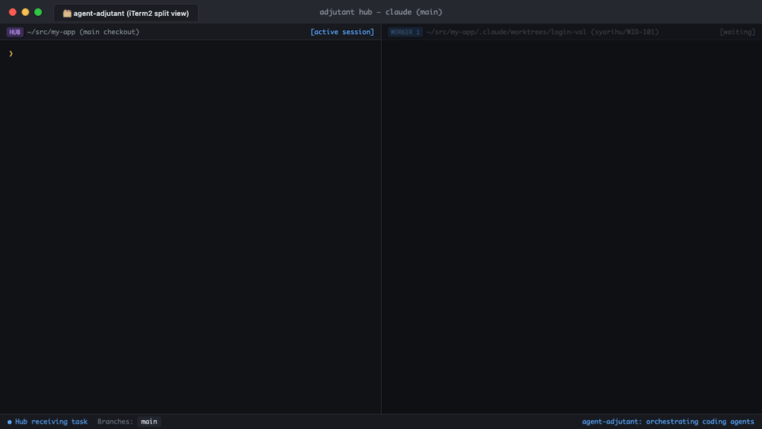

English | [日本語](README.ja.md)

# agent-adjutant


A task hub for coding agents, as one binary.



`adjutant` is a repository's 副官 — its adjutant: it hands work out to workers and takes
their reports back in. The hub picks a task, cuts a worktree, writes a brief and starts a
worker in a new tab; a worker that trips over an unrelated bug hands it back rather than
fixing it or filing it itself. Both halves of that are procedures, and the procedures ship
inside the binary.

## Why a binary that serves prompts

The procedures used to be markdown files copied into each agent's commands directory. A copy
drifts: upgrade the tool and the copies stay behind, one per config directory, all subtly
different. Served over MCP they are a pointer instead — one upgrade moves every caller.

The mechanical parts (deriving the hub's name, resolving the config, opening a tab, moving a
message) used to be prose repeated across three procedure files, which is a rule with three
versions. They are commands now, and the procedures call them.

## Install

Via Homebrew:

```bash
brew install syarihu/tap/agent-adjutant # both binaries: `adjutant` and the short `adj`
adjutant install-mcp                   # registers the MCP server with Claude Code (user scope)
adjutant install-mcp --target json          # or print the JSON for another client
```

Via Cargo:

```bash
cargo install --git https://github.com/syarihu/agent-adjutant # both binaries: `adjutant` and the short `adj`
# or from a local checkout:
#   cargo install --path .
# or without cargo install:
#   cargo build --release && cp target/release/adjutant target/release/adj ~/bin/
```

`install-mcp` performs the registration rather than printing instructions for someone to
follow: it runs `claude mcp add`, because the tool that owns a config file is the one that
should write it. The `json` target is the escape hatch for clients this does not know, and
is the only path that asks you to paste anything.

**Install before registering.** The registration records `adjutant` when PATH already
resolves to the binary you ran, and its absolute path otherwise — so running `install-mcp`
out of a build directory pins that build forever, and `cargo clean` then breaks the server.

**`adj` is the same program under a shorter name** — both binaries are installed, and every
example below works either way. `adj work` even starts its worker tabs as `adj worker`,
because a command that names itself uses the name it was called by.

## Two modes

Shell-side, for the places that run *before* an agent exists — launchers, hooks, the
procedures' own `Bash` steps (`adj` everywhere, if you prefer):

| | |
| --- | --- |
| `adjutant hub` | start this repo's hub, in the main checkout, once |
| `adjutant hub-name [--json]` | the hub's session name — the address a report goes to |
| `adjutant config` | the resolved config for this repo, as JSON |
| `adjutant pending [--json\|--read N\|--ack N\|--path]` | what is waiting for the hub |
| `adjutant send --subject … --body …` | hand a message to the hub (body may come on stdin) |
| `adjutant work --worktree … --title …` | open a tab and start a worker there |
| `adjutant worker --worktree …` | become the worker (what `work` opens a tab to run) |
| `adjutant tell --worktree … --subject …` | leave a message for that worktree's worker |
| `adjutant outbox [--clear]` | what the hub has left for the worker here |
| `adjutant spawn --cwd … -- cmd …` | open a tab and run something in it |
| `adjutant focus` | raise the running hub's tab; exit 1 if there is none |
| `adjutant ide --worktree …` | open a worktree in the configured editor |
| `adjutant title --title …` | name the tab this process is in (the hub names its own) |
| `adjutant notify --message …` | tell the human something happened |
| `adjutant worktree-path --name …` | the branch, path and base for a task's worktree |
| `adjutant hub-stop` | clear this repo's hub record |

Agent-side (`adjutant mcp`), the same machinery as seven tools and three prompts:

- **prompts** — `adj-hub` (run the hub), `adj-worker` (take a task from brief to handover),
  `adj-report` (hand a bug you found to the hub). Claude Code exposes these as
  `/mcp__adjutant__adj-hub` and so on.

- **tools** — `adjutant_config`, `adjutant_hub_status`, `adjutant_send`, `adjutant_pending`,
  `adjutant_tell`, `adjutant_outbox`, `adjutant_skill`. The last one serves the same
  procedure text as the prompts, because MCP prompt support is uneven across agents and a
  procedure nobody can fetch is a procedure nobody follows.

The names are short where a person types them and long where something reads them back:
`adj` on the command line and `adj-…` for the prompts, against `adjutant` for the MCP server
and `adjutant_…` for the tools. A registration or a resolved config that says `adjutant` is
one you can still identify a year later.

Every command that answers *about a repository* takes `--repo owner/name` (`outbox`, `mcp`
and `install-mcp` do not — they are not about one); without it the repository is read from
the origin remote of whichever checkout you are standing in, worktrees included.

`instructions` is five lines. The 1500 lines of procedure matter only while a hub or a worker
is running, and both fetch them on purpose; the one thing worth always-on context is that a
worker is allowed to report a bug it did not come to fix.

## Permissions

A procedure served over MCP cannot carry a tool allowlist. As a slash-command file it could
— `allowed-tools:` in the frontmatter — and that is the one thing lost in moving the
procedures into the binary.

So **both sessions start unattended by default**, hub as well as worker. A worker must not
stop because it has a build to finish; a hub must not stop because a hub waiting for
approval is a hub not reading its inbox, and nobody is watching that tab — which is the
entire premise. This does not remove the questions that matter: the procedures' own
`AskUserQuestion` checkpoints (file this issue? start work on it?) are untouched. What goes
away is being asked whether `gh issue view` may run.

If you would rather the hub asked, take the mode back out —

```jsonc
"hubRunner": "claude -n {name} {prompt}"
```

— and pre-approve what the procedures reach for, in `~/.claude/settings.json`. Note that
this list is a snapshot: it drifts the moment a procedure reaches for something new, and the
symptom is the hub going quiet.

```jsonc
"permissions": { "allow": [
  "Bash(adj:*)", "Bash(adjutant:*)",
  "Bash(git:*)", "Bash(gh:*)",
  "Bash(cat:*)", "Bash(ls:*)", "Bash(mkdir:*)", "Bash(mv:*)", "Bash(cp:*)",
  "Bash(sed:*)", "Bash(awk:*)", "Bash(printf:*)", "Bash(date:*)", "Bash(ps:*)",
  "Bash(basename:*)", "Bash(open:*)", "Bash(which:*)",
  "Bash(proctor:*)", "Bash(lk:*)", "Bash(codex:*)",
  "mcp__adjutant__adjutant_config", "mcp__adjutant__adjutant_hub_status",
  "mcp__adjutant__adjutant_send", "mcp__adjutant__adjutant_pending",
  "mcp__adjutant__adjutant_tell", "mcp__adjutant__adjutant_outbox",
  "mcp__adjutant__adjutant_skill"
]}
```

The hub runs in the main checkout, so an unattended one can touch that working tree. The
procedure forbids it from implementing anything there — everything goes out to a worker in
its own worktree — but that is a rule in prose, not a sandbox.

## Config

`~/.config/adjutant/config.json` (`$XDG_CONFIG_HOME` and `ADJUTANT_CONFIG` are both honoured).
See **`config.example.json`** — its `//` keys are the schema documentation, and they are
stripped before any of it reaches a session.

Most specific wins: a repo entry, then `defaults`, then the top level, then the built-ins.
The resolver never fails on a bad config; it returns `warnings` and lets the hub say what is
wrong.

Nothing about the machine is hardcoded. Each of these is a command template whose
placeholders are substituted **already shell-quoted** — so do not put quotes around them:

| key | placeholders | default |
| --- | --- | --- |
| `terminal.spawn` | `{cwd}` `{title}` `{command}` | iTerm2 |
| `terminal.focus` | `{pid}` `{tty}` `{title}` | iTerm2 |
| `terminal.title` | `{title}` | OSC escape written to this process's tty |
| | | *also names every tab `spawn` opens* |
| `wake` | `{pid}` `{tty}` `{subject}` `{line}` | iTerm2 `write text` into that session |
| `hubWake` / `workerWake` | the same | override `wake` for one direction |
| `agentRunner` | `{prompt}` `{worktree}` `{title}` | `claude --permission-mode auto {prompt}` |
| `hubRunner` | `{name}` `{prompt}` | `claude -n {name} --permission-mode auto {prompt}` |
| | | *drop `{name}` and the session is nameless in every listing* |
| `notification` | `{title}` `{message}` `{nwo}` | `terminal-notifier` if installed, else `osascript` |
| `ide` | `{worktree}` | none — the procedures ask rather than guess |
| `worktreePattern` | `{repo}` `{branch}` `{name}` | `.claude/worktrees/{name}` |

Omitting a key gets the built-in; setting it to `false` turns the behaviour off, which is a
different answer. `terminal` and the `wake` family merge key by key, so a repository can
change one half without restating the other. A setting of the wrong type is dropped *and*
reported in `warnings` — `adj config` is where to look when something silently does nothing.

The built-in `notification` prefers [`terminal-notifier`](https://github.com/julienXX/terminal-notifier)
and falls back to `osascript`, and the order is not a taste: macOS credits a notification posted by
command-line `osascript` to **Script Editor**, so the banner arrives from an app nobody asked for and
clicking it opens an empty Script Editor rather than the session that wanted you. With
`brew install terminal-notifier` on the machine the built-in becomes —

```jsonc
"terminal-notifier -title {title} -message {message} -sound Glass -activate com.googlecode.iterm2"
```

— a click that raises the terminal. `{nwo}` is there to go one better: it is the repository the
message is about, the same value `--repo` takes — `owner/name`, or the checkout's own directory
name when it has no usable remote — so a notifier that runs
`adj focus --repo {nwo}` on click lands on *that repository's hub tab*. Point the key at a script
rather than nesting a quoted command in the template, for the quoting reason the `wake` note below
gives. `{nwo}` is empty when `adjutant notify` runs outside a repository, and says so on stderr
rather than silently.

There is no built-in off macOS, where a missing notifier is silence rather than an error, so a Linux
hub needs the key set (`"notify-send {title} {message}"`). And when something already watches the
sessions — proctor's sidebar, a tmux status line — `false` is the honest answer rather than a second
banner. `adjutant notify --message … --dry-run` prints the command a template resolves to without
sending anything.

`wake` splits along the line the rest of the config does not: **how** to poke a session is a
property of the terminal, and **what to say** once poked is a property of the agent. So
`hubWake` / `workerWake` take a long form that overrides either half —

```jsonc
"wake": "tmux send-keys -t {tty} {line} Enter",   // the machine
"workerWake": { "line": "check `adj outbox`" }     // this agent has no MCP
```

— which is what a repo whose hub is one agent and whose workers are another needs. The
built-in sentences name MCP tools (`adjutant_pending`, `adjutant_outbox`), and each direction
is pointed at its own box. For anything longer than one command, point at a script rather than
wrapping it in `sh -c '…'`: a substituted value arrives with its own quoting and would end
the wrapper's quoted string early. A `spawn` template containing `{cwd}` is trusted to change directory
itself; one without gets a `cd` prepended. A new tab is named by the shell inside it calling
`adjutant title`, not through the terminal's own API — `set name of session` is the one
mechanism that does not generalise, since a profile whose title format is driven by user
variables ignores it and the tab silently keeps the wrong name. `agentEnv` is an object of environment variables
both the hub and its workers are started with, for a repository that runs under a separate
agent profile.

## How the two sides reach each other

The address is the hub name, and both sides derive it the same way (`adjutant hub-name`)
rather than each spelling the rule out. It is `owner/name` collapsed to something readable
plus a digest of the lower-cased original — the readable half alone is not unique
(`acme/foo-bar`, `acme/foo_bar` and `acme-foo/bar` collapse together), and two repositories
sharing an address share an inbox. Lower-cased because the config finds a repository
case-insensitively, and an address that did not would split one repository in two. **Do not assemble the name by hand**; one character off is a
different box, and the digest is not guessable.

**Worker → hub** is a file. `adjutant send` (or the `adjutant_send` tool) writes into
`~/.local/state/adjutant/inbox/<slug>/`, and `adjutant pending` reads it. Delivery never
fails for want of a listener: if the hub is not running the message simply waits, and the
reply says which of the two happened. `adjutant hub-stop`, and a `kill -0` plus a command-line
check against the recorded PID, keep an exited hub from looking present.

**Hub → worker** is also a file, but addressed by worktree rather than by session:
`adjutant tell` appends a `##` section to `{worktree}/.claude/adjutant-outbox.md`, and
`adjutant outbox` reads it. The worker's own record sits beside it, written by
`adjutant worker` — the launcher the tab actually runs, which records its PID and then
`exec`s the agent over itself, exactly as `adjutant hub` does for the hub. That record is
what makes `workerWake` possible; without a PID there is nothing to poke.

A worker's command line says nothing distinctive (it is whatever agent the config names), so
its record is anchored to the process start time instead — `exec` preserves it, which is what
lets a record written by the launcher still identify the agent that replaced it.

A file appearing in a directory notifies nobody, so delivery has a second half in both
directions: when the other side is up, `send` runs **`hubWake`** and `tell` runs
**`workerWake`** — by default iTerm2's `write text` into the session on that tty, which
reaches an interactive agent exactly as if the person had typed it. The line
typed points at the inbox rather than repeating the report, so the text lives in one place.
`send` fires `notification` either way; `tell` fires it only when the worker could not be
woken, since a woken worker reads the message without anyone's help. Both replies say which
of `present` / `woken` happened. Waking is best-effort by construction: the message is already delivered before the
hook runs, so a failed poke never fails a send, and the hub re-reads its inbox at three fixed
points anyway.

The point of routing all of that through templates is that the channel then works from any
agent in any terminal. The previous version was built on one coding agent's session list and
its session-to-session messages, and could not run anywhere else.

## Layout

```
repo  config  template  prompts        leaves — stdlib and their own input, nothing else
terminal  runner  notify  ide  messaging   may reach down, never sideways
cmd/  mcp                                  the only layer that joins them up
```

`scripts/check-layering.sh` enforces the arrows, and CI runs it. It is a fan rather than a
stack, so splitting it into a Cargo workspace would grow an empty relay layer between the two
real ones; as long as the check passes, splitting later stays a mechanical move.

## Development

```bash
cargo test                    # unit + end-to-end
./scripts/check-layering.sh
cargo fmt --check && cargo clippy --all-targets -- -D warnings
```

The tests are hermetic: `ADJUTANT_CONFIG` and `ADJUTANT_STATE_DIR` point into tempdirs, so no
test can read your config or drop a fixture report into a hub you actually have running.
Anything that would open a window, start an agent or notify a human runs under `--dry-run`.

## Optional neighbours

[`proctor`](https://github.com/syarihu/agent-proctor) (worktree conventions, session ledger, tab colours) and [`lk`](https://github.com/syarihu/local-knowledge-cli) (the local knowledge
base) are used when they are on PATH and skipped when they are not.

Neither is needed. A convention tool does not *create* worktrees — it answers where they go
and what branch they sit on, and the `git worktree add` is typed either way — so what is
missing without one is a convention, which `adjutant worktree-path --name` supplies: branch
`{user}/{name}`, path `<main>/.claude/worktrees/{name}`, deliberately the same shape a
convention tool uses rather than a second competing one. The one thing with no equivalent is
its per-repo `copyFiles`; that belongs in this config's `postCreate`, which runs in both
cases.

[`terminal-notifier`](https://github.com/julienXX/terminal-notifier) is the third of these, and
the only one a built-in reaches for by itself: with it installed a notification comes from a
notifier whose click can be aimed, without it from `osascript` and therefore from Script Editor.

## License

MIT — see [LICENSE](LICENSE).
