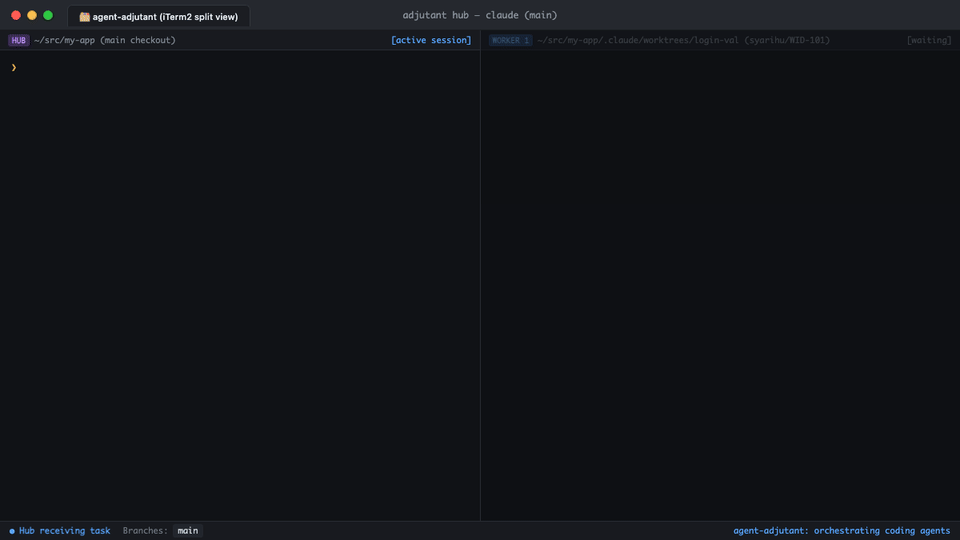

English | [日本語](README.ja.md)

# agent-adjutant


A task hub for coding agents, as one binary.



`adjutant` is a repository's 副官 — its adjutant: it hands work out to workers and takes
their reports back in. The hub picks a task, cuts a worktree, writes a brief and starts a
worker in a new tab; a worker that trips over an unrelated bug hands it back rather than
fixing it or filing it itself. Both halves of that are procedures, and the procedures ship
inside the binary.

## Why a binary that serves prompts

The procedures used to be markdown files copied into each agent's commands directory. A copy
drifts: upgrade the tool and the copies stay behind, one per config directory, all subtly
different. Served over MCP they are a pointer instead — one upgrade moves every caller.

The mechanical parts (deriving the hub's name, resolving the config, opening a tab, moving a
message) used to be prose repeated across three procedure files, which is a rule with three
versions. They are commands now, and the procedures call them.

## Install

Via Homebrew:

```bash
brew install syarihu/tap/agent-adjutant # both binaries: `adjutant` and the short `adj`
adjutant install-mcp                   # registers the MCP server with Claude Code (user scope)
adjutant install-mcp --target agy       # registers the MCP server with Antigravity (agy)
adjutant install-mcp --target json      # or print the JSON for another client
```

Via Cargo:

```bash
cargo install --git https://github.com/syarihu/agent-adjutant # both binaries: `adjutant` and the short `adj`
# or from a local checkout:
#   cargo install --path .    (or `make install`; `make restart` restarts `adj server`; `make reinstall` does both)
# or without cargo install:
#   cargo build --release && cp target/release/adjutant target/release/adj ~/bin/
```

`install-mcp` performs the registration rather than printing instructions for someone to
follow: `--target claude-code` (the default) runs `claude mcp add`, and `--target agy` runs
`agy mcp add`. The `json` target is the escape hatch for clients this does not know, and
is the only path that asks you to paste anything.

**Install before registering.** The registration records `adjutant` when PATH already
resolves to the binary you ran, and its absolute path otherwise — so running `install-mcp`
out of a build directory pins that build forever, and `cargo clean` then breaks the server.

**`adj` is the same program under a shorter name** — both binaries are installed, and every
example below works either way. `adj work` even starts its worker tabs as `adj worker`,
because a command that names itself uses the name it was called by.

## Two modes

Shell-side, for the places that run *before* an agent exists — launchers, hooks, the
procedures' own `Bash` steps (`adj` everywhere, if you prefer):

| | |
| --- | --- |
| `adjutant hub [--tab] [--resume\|--new] [--no-dashboard\|--dashboard]` | start this repo's hub, in the main checkout, once — resuming the last session if it ended within `hubAutoResumeHours` (`--tab`: open a tab and start it there, rather than becoming it in this one; `--resume`: reopen the last session however long ago it ended; `--new`: start a fresh one even so; `--no-dashboard`: skip the listing it collects at startup, `--dashboard`: collect it anyway — both override `startupDashboard`) |
| `adjutant hub-name [--json]` | the hub's session name — the address a report goes to |
| `adjutant config` | the resolved config for this repo, as JSON |
| `adjutant pending [--json\|--read N\|--ack N\|--path]` | what is waiting for the hub |
| `adjutant send --subject … --body …` | hand a message to the hub (body may come on stdin) |
| `adjutant work --worktree … (--title … \| --task <id> \| --resume)` | open a tab and start a worker there (`--task`: name the tab after that task record, so a title from an issue never has to be quoted onto a command line; `--resume`: reopen the worker session saved in that worktree). Exits 3 without starting anything when `maxWorkers` workers are already running |
| `adjutant worker --worktree … [--resume]` | become the worker (what `work` opens a tab to run; `--resume` inside a worktree reopens its saved session) |
| `adjutant tell --worktree … --subject …` | leave a message for that worktree's worker |
| `adjutant outbox [--clear]` | what the hub has left for the worker here |
| `adjutant spawn --cwd … -- cmd …` | open a tab and run something in it |
| `adjutant focus [--worktree …]` | raise the running hub's tab (or, with `--worktree`, that worktree's worker); exit 1 if there is none |
| `adjutant phase [--set …]` | in a worker: say which step it is in (`plan` / `implement` / `self-review` / `verify` / `pr` / `pr-bots` / `review` / `report`), or show it |
| `adjutant review-engine [--json]` | in a worker: which engine reads the diff in this self-review round — `reviewEngine`, then under `auto` Claude's rate-limit cache and whether `codex` is on `PATH` — and the line to tell the user |
| `adjutant agent-sessions [--json]` | what each agent session's hooks last reported — idle, running, waiting on a permission prompt, done or failed, its running sub-agents, and the last tool it reported; sessions whose process has gone are left out |
| `adjutant close --worktree …` | close the tab that worktree's worker is sitting in; exit 1 if it is still there |
| `adjutant ide --worktree …` | open a worktree in the configured editor |
| `adjutant title --title …` | name the tab this process is in (the hub names its own) |
| `adjutant notify --message …` | tell the human something happened |
| `adjutant worktree-path --name … [--unique]` | the branch, path and the main checkout to create it in (`--unique`: the first of `name`, `name-2`, `name-3`… whose path and branch are free, said back as `name`) |
| `adjutant serve [--port N] [--no-open]` | serve this repository's board at `http://127.0.0.1:4577` (`--port 0` picks a free one) — only needed when the hub does not serve it itself (see [The board](#the-board)) |
| `adjutant task add\|list\|show\|next\|update\|refresh\|fetch-issue\|brief` | the records that board is a view of (`brief --id … --worktree … --base …`: write the worker's `.claude/task-brief.md` from the record and the config; without `--id`, a task-less session's brief, instruction on stdin; `next`: the queued task a free worker slot takes next, and the ones that still need a `dispatch` gate; `refresh`: move the ones whose PR was merged to done; `fetch-issue --id`: read the task's GitHub issue again and keep its title and body on the record) |
| `adjutant gate open\|list\|show\|answer\|close` | what an agent has put up for a person, and the answer back |
| `adjutant jules start\|show\|findings\|relay` | hand a task's approved plan to Jules, ask how its session is doing, and pass review comments on to it (see [Handing a task to Jules](#handing-a-task-to-jules)) |
| `adjutant hub-stop` | clear this repo's hub record |
| `adjutant hub-close --hub KEY` | close a parent-task hub none of whose checkouts report to it any more: clear its record and take it off the board's list; run by the hub itself or against a hub that is no longer running, it refuses a running hub from outside (its saved session, tasks, gates and inbox stay) |

**Model, context use and rate limits in `agent-sessions`.** Claude Code gives these only to the status line, so they reach adjutant only if your status line passes them on. adjutant does not install a status line, since that would replace yours; add one line to your own script instead. In a shell script, read stdin into a variable first:

```sh
input=$(cat); printf '%s' "$input" | /absolute/path/to/adj hook claude --status-line 2>/dev/null || true
```

and draw from `"$input"` as before. `adj hook claude --status-line` prints nothing and, once it runs, always exits 0 (the `|| true` covers a missing binary). It records `model`, `contextPercent` and `rateLimits` only on a session that already has a row (see `adj agent-sessions --json`), and writes when they change, and otherwise at most once a minute. Name `adj` by its absolute path (`command -v adj`), since the status line's `PATH` may not include it. A script in another language passes the same text to the command's stdin.

Agent-side (`adjutant mcp`), the same machinery as ten tools and three prompts:

- **prompts** — `adj-hub` (run the hub), `adj-worker` (take a task from brief to handover),
  `adj-report` (hand a bug you found to the hub). Claude Code exposes these as
  `/mcp__adjutant__adj-hub` and so on.

- **tools** — `adjutant_config`, `adjutant_hub_status`, `adjutant_send`, `adjutant_pending`,
  `adjutant_tell`, `adjutant_outbox`, `adjutant_gate_open`, `adjutant_gate_close`,
  `adjutant_refresh`, `adjutant_skill`. The last one serves the same procedure text as the prompts, tailored to the target agent format (such
  as Claude Code's `AskUserQuestion` or Antigravity's `ask_question`), because MCP prompt
  support is uneven across agents and a procedure nobody can fetch is a procedure nobody
  follows.

The names are short where a person types them and long where something reads them back:
`adj` on the command line and `adj-…` for the prompts, against `adjutant` for the MCP server
and `adjutant_…` for the tools. A registration or a resolved config that says `adjutant` is
one you can still identify a year later.

Every command that answers *about a repository* takes `--repo owner/name` (`outbox`, `mcp`
and `install-mcp` do not — they are not about one); without it the repository is read from
the origin remote of whichever checkout you are standing in, worktrees included.

A repository can have more than one hub. `--hub <id>` names which one: it moves the address
— the session name, the inbox, the record — and nothing else. The configuration is still
looked up under `owner/name`, so a second hub of a registered repository keeps its task
sources, issue keys and verify command. Without `--hub` you get the repository's own hub, at
exactly the address it has always had — except inside a worktree `adj work` opened, where a
command that *addresses* a hub reads the identifier out of that worktree's record. The ones
that *start* something — `hub`, `work`, `worker` — never do: a hub launched from inside a
worktree, and a worker registering in the worktree its tab was opened at, would both be
reading a record that belongs to somebody else.

Nothing has to repeat the identifier afterwards. `adj hub --hub <id>` puts `ADJUTANT_HUB` on
the command line it starts the agent with, so every `adj` call and every MCP tool call that
agent makes addresses the hub it is; and `adj work` writes the identifier into the worktree
it opens, so a worker reporting from there reaches the hub that dispatched it without being
told where to send. `adj worker` puts the identifier it registered under on its agent's
command line too, and takes an inherited `ADJUTANT_HUB` out of the environment first: a
terminal template that passes its environment on (tmux does) would otherwise hand the agent
the identifier of whichever hub opened the tab, which outranks the record.

A running worker follows its record, though: a command run by the worker itself — its agent,
that agent's MCP server, or a shell under it — reads the hub from the worker record in its
worktree even when `ADJUTANT_HUB` says otherwise, and a record with no hub means the
repository's own. That is what lets the board move a worker to another hub by linking it to a
task (see [The board](#the-board)) without restarting its agent. Anything else keeps the old
order, so a hub running a command inside a worker's worktree is still itself.

`agentEnv` may name `ADJUTANT_HUB`. It is a default: `hub`, `work` and `worker` take it when
neither `--hub` nor the environment says anything, and claim that hub rather than the
repository's own, so the command and the agent it starts agree on one address. A flag or an
inherited `ADJUTANT_HUB` still wins, and replaces the configured value on the agent's line.
Stop a running hub of the repository before adding the key: from then on a plain `adj hub`
looks for, and starts, the configured hub instead, and `adj work` files new workers under it.
The commands that address a hub (`send`, `pending`, `hub-stop`, `hub-close` and the rest) do not read
`agentEnv`, so from a shell that is not the hub's own, pass `--hub` or set `ADJUTANT_HUB`.

`--no-dashboard` and `--dashboard` ride the same channel: they become
`ADJUTANT_STARTUP_DASHBOARD` on that command line, and `adjutant config` folds the value in
before it answers, so the procedure reading `settings.startupDashboard` sees the flag the hub
was started under rather than the file it disagrees with. With `--tab` there is no such
variable to see: a terminal is handed a command line and nothing else, so the flag is
forwarded to the `adjutant hub` that runs in the new tab, and that one builds the
environment. Same answer, one process later — which is why the two dry runs do not print the
same thing.

### Resuming after a restart

Updating the agent, or a crash, ends the hub and its workers. A hub that ended within the last
`hubAutoResumeHours` (3 by default) comes back on a plain `adj hub`; past that, `adj hub`
starts a new, empty conversation, so the first hub of the morning is a clean one. `--resume`
reopens the one it had whenever it ended, and `--new` starts fresh even inside the window:

```bash
adj hub --resume                  # this repo's hub, from anywhere in the repo
adj hub --resume --hub ALPHA-233  # a parent task's hub — the identifier is never guessed
adj worker --resume               # in a worktree: the worker that was working there
```

The board's 「hub をリセット」 (a button on the hub's row, in the menu above the terminal in the
セッション tab, and the first button of the bar above a hub's terminal in the task panel) does
what `--new` does: after a confirmation it stops the hub if it runs and starts it again on a new
conversation. The old conversation is not deleted, but it is not resumed either,
and from then on `adj hub --resume` reaches the new one (with a runner that records no session id
there is nothing to resume). The inbox, the task and gate records and the running workers stay as they are.

A fresh start through a runner that takes `{sessionId}` (the default ones do, as
`--session-id {sessionId}`) makes up a session id, hands it to the agent and saves it. A
resume reuses the id that was saved rather than making a new one. A fresh start through a
runner without `{sessionId}` gets no id, and clears whatever the start before it saved, so
nothing can reopen a conversation two starts ago. The id is saved beside the records, not in
them: the hub's id under `sessions/` in the state directory, the worker's in the worktree's
`.claude/adjutant-session.json`. That is why `hub-stop` and `close`, which clear the records,
leave it alone. `--resume` reopens that id with `hubResumeRunner` / `agentResumeRunner`
(Claude Code's `--resume` by default), goes through the same claim as a fresh start, and tells
the agent to check its inbox or outbox for whatever arrived while it was gone.

A parent-task hub is listed while a hub record or a checkout (a worktree whose worker record or
saved session names its key) points at it. A stopped one with no such checkout is no longer
listed, and neither is one known only from its saved session. `adjutant hub-close --hub KEY`, or
「閉じる」 on the board, closes a parent-task hub that has no checkouts left and drops it from the
list. The board's close stops a running hub first; `adjutant hub-close` does not stop one, so it
is for the hub itself or a hub that is no longer running, and refuses a running hub from outside.
Its saved session, tasks, gates and inbox stay, so `adj hub --hub KEY --resume` picks them up
again. The repository's own hub can only be stopped.

When the hub ended is written by the hub's own MCP server. For a start that records a session
(a runner that takes `{sessionId}`, or a resume), `adj hub` puts `ADJUTANT_HUB_SESSION` on the
line it `exec`s — a fresh start through a runner without `{sessionId}` gets no variable, and
its MCP server records nothing even though it runs. The agent's `adjutant mcp` inherits it, and
that server records the session as alive every minute and once more when the agent closes
its pipe — in `sessions/<slug>.alive`, a file of its own so that an old hub's last beat can
never overwrite a new hub's saved session. The same server runs under every session on the
machine, and only the one carrying the variable writes anything; `adj worker` strips it
before it starts an agent. With no MCP server under the hub nothing says when it ended, and
`adj hub` starts fresh rather than guessing. The same goes for a hub started by a `hubRunner`
of your own with no `hubResumeRunner` beside it: the built-in resume command would reopen it
without whatever your runner adds, so it is only resumed when `--resume` asks.

Workers are only resumed when asked: `adj work` is how a hub hands over a new brief, and
coming back to an old conversation there would bury it.

A resumed worker goes back under the hub that dispatched it, as saved — ahead of
`ADJUTANT_HUB`, which the tab it is typed in may have inherited from a different hub. A hub
asked to resume with nothing saved lists the hubs of the repository that do have a session.
A runner with no `{sessionId}` starts sessions nobody can resume; that is not an error until
`--resume` is asked for.

`instructions` is five lines. The 1500 lines of procedure matter only while a hub or a worker
is running, and both fetch them on purpose; the one thing worth always-on context is that a
worker is allowed to report a bug it did not come to fix.

## Permissions

A procedure served over MCP cannot carry a tool allowlist. As a slash-command file it could
— `allowed-tools:` in the frontmatter — and that is the one thing lost in moving the
procedures into the binary.

So **both sessions start unattended by default**, hub as well as worker. A worker must not
stop because it has a build to finish; a hub must not stop because a hub waiting for
approval is a hub not reading its inbox, and nobody is watching that tab — which is the
entire premise. This does not remove the questions that matter: the procedures' own
`AskUserQuestion` checkpoints (file this issue? start work on it?) are untouched. What goes
away is being asked whether `gh issue view` may run.

If you would rather the hub asked, take the mode back out of both hub runners —

```jsonc
"hubRunner": "claude -n {name} --session-id {sessionId} {prompt}",
"hubResumeRunner": "claude -n {name} --resume {sessionId} {prompt}"
```

— and pre-approve what the procedures reach for, in `~/.claude/settings.json`. Note that
this list is a snapshot: it drifts the moment a procedure reaches for something new, and the
symptom is the hub going quiet.

```jsonc
"permissions": { "allow": [
  "Bash(adj:*)", "Bash(adjutant:*)",
  "Bash(git:*)", "Bash(gh:*)",
  "Bash(cat:*)", "Bash(ls:*)", "Bash(mkdir:*)", "Bash(mv:*)", "Bash(cp:*)",
  "Bash(sed:*)", "Bash(awk:*)", "Bash(printf:*)", "Bash(date:*)", "Bash(ps:*)",
  "Bash(basename:*)", "Bash(open:*)", "Bash(which:*)",
  "Bash(proctor:*)", "Bash(lk:*)", "Bash(codex:*)",
  "mcp__adjutant__adjutant_config", "mcp__adjutant__adjutant_hub_status",
  "mcp__adjutant__adjutant_send", "mcp__adjutant__adjutant_pending",
  "mcp__adjutant__adjutant_tell", "mcp__adjutant__adjutant_outbox",
  "mcp__adjutant__adjutant_gate_open", "mcp__adjutant__adjutant_gate_close",
  "mcp__adjutant__adjutant_refresh", "mcp__adjutant__adjutant_skill"
]}
```

The hub runs in the main checkout, so an unattended one can touch that working tree. The
procedure forbids it from implementing anything there — everything goes out to a worker in
its own worktree — but that is a rule in prose, not a sandbox.

## Config

`~/.config/adjutant/config.json` (`$XDG_CONFIG_HOME` and `ADJUTANT_CONFIG` are both honoured).
See **`config.example.json`** — its `//` keys are the schema documentation, and they are
stripped before any of it reaches a session.

Most specific wins: a repo entry, then `defaults`, then the top level, then the built-ins.
The resolver never fails on a bad config; it returns `warnings` and lets the hub say what is
wrong.

Nothing about the machine is hardcoded. Each of these is a command template whose
placeholders are substituted **already shell-quoted** — so do not put quotes around them:

| key | placeholders | default |
| --- | --- | --- |
| `terminal.preset` | — | none (iTerm2 on macOS) — `"tmux"` for built-in tmux backend |
| `terminal.session` | — | `"adjutant"` (when `preset` is `"tmux"`, overridden by `$ADJUTANT_TMUX_SESSION`) |
| `terminal.socket` | — | none (when `preset` is `"tmux"`, overridden by `$ADJUTANT_TMUX_SOCKET`) |
| `terminal.spawn` | `{cwd}` `{title}` `{command}` | iTerm2 (or tmux detached window with `preset: "tmux"`) |
| `terminal.focus` | `{pid}` `{tty}` `{title}` | iTerm2 (or tmux window/pane selection with `preset: "tmux"`) |
| `terminal.attach` | `{socket}` `{session}` `{window}` | iTerm2 with `tmux -CC attach`, on a Mac that has iTerm2 (opening a session from the board; otherwise the board refuses and names this key) |
| `terminal.close` | `{pid}` `{tty}` `{title}` | iTerm2 (or tmux window kill with `preset: "tmux"`) |
| | | *`false` closes no tabs: `adjutant close` then exits 1 and clears nothing* |
| `terminal.title` | `{title}` | OSC escape written to this process's tty (or `tmux rename-window` with `preset: "tmux"`) |
| | | *also names every tab `spawn` opens* |
| `wake` | `{pid}` `{tty}` `{subject}` `{line}` | iTerm2 `write text` into that session (or tmux literal `send-keys` with `preset: "tmux"`) |
| `hubWake` / `workerWake` | the same | override `wake` for one direction |
| | | *the built-in `focus`, `close` and `wake` reach a session through the terminal it was started in (recorded when it registered), so changing `preset` does not strand sessions started before; sessions with no such record, or one started by a `spawn` template outside tmux, follow the current `preset`* |
| `agentRunner` | `{sessionId}` `{prompt}` `{worktree}` `{title}` `{settings}` | `claude --session-id {sessionId} --permission-mode auto {settings} {prompt}` |
| `hubRunner` | `{name}` `{sessionId}` `{prompt}` `{settings}` | `claude -n {name} --session-id {sessionId} --permission-mode auto {settings} {prompt}` |
| `agentResumeRunner` | same as `agentRunner` | `claude --resume {sessionId} --permission-mode auto {settings} {prompt}` |
| `hubResumeRunner` | same as `hubRunner` | `claude -n {name} --resume {sessionId} --permission-mode auto {settings} {prompt}` |
| | | *`{settings}` becomes `--settings <file>`, the file holding adjutant's hooks for the session. It is added after `claude` when a template does not name it, unless the template passes its own `--settings`; do not quote it. A binary older than this does not know it, so write it by hand only once every binary sharing the config does* |
| | | *drop `{name}` and the session is nameless in every listing* |
| `notification` | `{title}` `{message}` `{nwo}` | `terminal-notifier` if installed, else `osascript` |
| `ide` | `{worktree}` | none — the procedures ask rather than guess |
| `worktreePattern` | `{repo}` `{branch}` `{name}` | `.claude/worktrees/{name}` |
| `hubAutoResumeHours` | — (a number, `0` to turn it off) | `3` |
| `startupDashboard` | — (`true` / `false`) | `true` |
| | | *`false` skips the listing a hub collects at startup; asking for one still collects* |
| `hubServe` | — (`true` / `false`) | `true` |
| | | *`false` leaves the board to `adj serve`, started by hand* |
| `stuckAfterMinutes` | — (a number, `0` to turn it off) | `120` |
| | | *a card whose worker has sat in one phase this long is flagged; one whose worker has stopped is flagged regardless, unless its PR is open* |
| `julesKey` | — (a command that prints the Jules API key) | the macOS keychain item `jules-api` |
| | | *`false` turns handing tasks to Jules off* |
| `maxWorkers` | — (a whole number, 1 or more) | no limit |
| | | *counted per checkout; a worker parked at a gate or still starting up takes a slot, a dead one does not* |

Omitting a key gets the built-in; setting it to `false` turns the behaviour off, which is a
different answer. The two settings that are not commands take their own values instead:
`startupDashboard` and `hubServe` are `true` / `false`, `hubAutoResumeHours` is a number, turned off by
`0` — a `false` there is reported in `warnings` and the default is used — and `maxWorkers`
is a whole number, where anything else is reported and means no limit. `terminal` and the `wake` family merge key by key, so a repository can
change one half without restating the other. A setting of the wrong type is dropped *and*
reported in `warnings` — `adj config` is where to look when something silently does nothing.

A command line the terminal would have to type is **staged in a file once it grows past
about 900 characters**, and what gets typed is `sh /tmp/adjutant-spawn-….sh`. Long lines do
not fail, they arrive *corrupted* — a chunk dropped somewhere in the middle — and what runs
is whatever that mangling happened to spell. An `agentEnv` carrying a `PATH` is the ordinary
way to reach that length. A dry run is never staged: it is read by a person, and a path to a
file tells them nothing about what would have run.

**`ADJUTANT_CONFIG` and `ADJUTANT_STATE_DIR` are forwarded onto the command line** of every
tab `hub --tab` and `work` open, when this process was given them. `ADJUTANT_HUB` already
travels as a flag; these two have none, and losing them does not fail — it splits. The tab
reads the default config and the default state directory, so the worker it starts registers
in one world while the hub that dispatched it waits in another, and both halves look healthy
from where they stand. A relative `ADJUTANT_STATE_DIR` is forwarded as an absolute path,
resolved against the repository's main checkout, the directory `adj hub` reads wherever the
command was typed. `adj server start`, `stop`, `status` and `restart` resolve it the same way
(against the main checkout of the repository they are typed in), and `start` hands the resident
the absolute directory. The resident and every board it serves read that one directory, so with
a relative `ADJUTANT_STATE_DIR` a resident started in one repository does not see the hubs of
another repository whose state lives under that repository's checkout.

`{pid}` and `{tty}` are the operating system's names for a session — a process id, and the
terminal device it sits on (`ttys004`) — not a terminal's own id for a pane or a window. A
`focus`, `close` or `wake` template has to look that handle up before it acts: handing `{pid}` to
something expecting a pane id addresses a different number space and lands on whichever pane
happens to hold that number, so point those keys at a wrapper that does the lookup. `close`
is checked rather than believed for the same reason — a template is judged by its exit status
alone, so the worker's record is cleared only once that worker is actually gone, and
`adjutant close` exits 1 when it is still there.

The built-in `notification` prefers [`terminal-notifier`](https://github.com/julienXX/terminal-notifier)
and falls back to `osascript`, and the order is not a taste: macOS credits a notification posted by
command-line `osascript` to **Script Editor**, so the banner arrives from an app nobody asked for and
clicking it opens an empty Script Editor rather than the session that wanted you. With
`brew install terminal-notifier` on the machine the built-in becomes —

```jsonc
"terminal-notifier -title {title} -message {message} -sound Glass -activate com.googlecode.iterm2"
```

— a click that raises the terminal. `{nwo}` is there to go one better: it is the repository the
message is about, the same value `--repo` takes — `owner/name`, or the checkout's own directory
name when it has no usable remote — so a notifier that runs
`adj focus --repo {nwo}` on click lands on *that repository's hub tab*. Point the key at a script
rather than nesting a quoted command in the template, for the quoting reason the `wake` note below
gives. `{nwo}` is empty when `adjutant notify` runs outside a repository, and says so on stderr
rather than silently.

There is no built-in off macOS, where a missing notifier is silence rather than an error, so a Linux
hub needs the key set (`"notify-send {title} {message}"`). And when something already watches the
sessions — proctor's sidebar, a tmux status line — `false` is the honest answer rather than a second
banner. `adjutant notify --message … --dry-run` prints the command a template resolves to without
sending anything.

`wake` splits along the line the rest of the config does not: **how** to poke a session is a
property of the terminal, and **what to say** once poked is a property of the agent. So
`hubWake` / `workerWake` take a long form that overrides either half —

```jsonc
"wake": "wake-tab {tty} {line}",                  // the machine
"workerWake": { "line": "check `adj outbox`" }     // this agent has no MCP
```

— which is what a repo whose hub is one agent and whose workers are another needs. The
built-in sentences name MCP tools (`adjutant_pending`, `adjutant_outbox`), and each direction
is pointed at its own box. A `wake` template of your own should type `{line}` and press
Enter as two separate writes: an agent's input box can take the line and its newline, sent
together, as a paste, and then the newline lands in the box instead of submitting it. For
anything longer than one command, point at a script rather than wrapping it in `sh -c '…'`:
a substituted value arrives with its own quoting and would end
the wrapper's quoted string early. A `spawn` template containing `{cwd}` is trusted to change directory
itself; one without gets a `cd` prepended. A new tab is named by the shell inside it calling
`adjutant title`, not through the terminal's own API — `set name of session` is the one
mechanism that does not generalise, since a profile whose title format is driven by user
variables ignores it and the tab silently keeps the wrong name. `agentEnv` is an object of environment variables
both the hub and its workers are started with, for a repository that runs under a separate
agent profile.

### Running Workers in tmux

When `"terminal": { "preset": "tmux" }` is configured, adjutant acts as a first-class tmux backend:
- **Detached window spawning**: Workers start in detached windows (`tmux new-window -d -t <session> -c <cwd> -n <title> <command>`) so current focus is not stolen. If the session does not exist, an initial session is created.
- **Process-to-pane mapping**: adjutant automatically maps worker `{pid}` and `{tty}` to tmux panes by inspecting pane PIDs, TTYs, and process hierarchy. No wrapper scripts required.
- **Waking**: The built-in wake reads the pane first (`tmux capture-pane`) and types only when the agent (Claude Code for the built-in runner or a `claude` one, agy for an `agy` one) sits at an empty input prompt. Keys are sent literally via `tmux send-keys -l -t <pane> <line>`, the line is checked to have landed at the prompt, and Enter follows after a short delay. A question, permission prompt or menu on screen, text someone is midway through typing, and a screen that is not recognised are left alone: nothing is typed, the reply of `send` / `tell` says why (`wakeNote`), and the person is notified as for any wake that did not happen. A turn in progress is waited for, up to five seconds. With a `wake` template, on iTerm2, or for any other custom runner, the line is typed without looking. The line typed has to be all that is in the input box before Enter is pressed.
- **Focus & Close**: `adj focus` selects the window and pane (`tmux select-window`, `tmux select-pane`). `adj close` disposes of the worker's window (`tmux kill-window`).
- **Attaching**: Connect to the session at any time with `tmux attach -t adjutant`, control mode with `tmux -CC attach -t adjutant`, or browse via web terminal (e.g. `ttyd`).
- **CLI helpers**: `adj tmux` provides subcommands to inspect and manage tmux sessions directly:
  - `adj tmux pane [--pid <pid>] [--tty <tty>] [--json]`: list panes or look up pane info.
  - `adj tmux spawn [--title <title>] [--cwd <cwd>] <command...>`: spawn a detached window.
  - `adj tmux wake --pid <pid> [--line <line>] [--agent claude|agy|generic] [--dry-run]`: type into a worker pane; with `--agent claude` or `agy` the pane is read first, and the default `generic` types without looking.
  - `adj tmux focus --pid <pid> [--dry-run]`: select a worker window and pane.
  - `adj tmux close --pid <pid> [--dry-run]`: close a worker window.
- **Environment variables**: `$ADJUTANT_TMUX_SESSION` (overrides default `"adjutant"`) and `$ADJUTANT_TMUX_SOCKET` (runs `tmux -L <socket>`).

## The board

`adjutant serve` puts this repository's work on one page in a browser: what is in the
backlog, what has been handed to the hub, which worktrees have a worker in them, and what is
sitting unread in the inbox.

It is not a second coordination system. Every button on it ends in something this binary
could already do — handing a task over writes a `request` into the hub's inbox and pokes its
tab, through the same code `adjutant send` runs, so waking and notifying cannot drift between
the two callers. The page says so out loud: a strip along the bottom prints the command each
action maps to.

**The hub serves it.** The MCP server started under a hub (`adj hub` puts
`ADJUTANT_HUB_SERVE` on the agent's line) serves that hub's board for as long as it runs, and
since that server lives exactly as long as the hub's session, the board stops when the hub
does. It takes `127.0.0.1:4577` when that is free and any free port when it is not, so two hubs
— of one repository or of two — can each have theirs. 4577 goes to whichever hub started
first, so go by the URL the hub gives rather than a bookmark of that port. A hub for a parent task serves its own
board, scoped to it, as `adj serve --hub` does. The hub reads the URL from `board` in
`adjutant_config` (and `adj config`) and says it as it goes to wait. If a board for the hub is
already running, started by hand, it is left alone. `hubServe: false` turns this off, and a
hub whose agent has no adjutant MCP server gets no board; for both, `adj serve` is the way.
Nothing opens a browser.

**One resident server for every repository.** `adj server start` runs a single server per
state directory that serves the board of every repository on this machine, each at
`/b/<slug>/`, whether or not a hub is running. `/` is one page that switches between those
boards in place: the sidebar lists a row per repository, with its parent-task hubs under it
(each row shows whether its hub runs, what waits on you and how many workers are at work),
and "すべて" reads every board at once. The repository's board also shows its parent-task hubs' tasks as cards marked with the parent key; opening one switches to that hub's board, and without the resident server they are read-only. A parent-task hub's board shows only its own tasks. `/review` is one review queue for every board: the list
on the left, the item on the right (see below). Each screen has an address that carries the board
and the view, so back and forward and a pasted link land on the same screen. It detaches
(its output goes to `server.log` in the state directory); `--foreground` keeps it in the
terminal, which is what a service manager wants. It takes `127.0.0.1:4577` when that is free
and any free port when it is not; `--port 0` asks for any. A second `adj server start` says
where the first one is. `adj server status` lists the boards (`--json` for a script, exit 1
when nothing runs) and `adj server stop` stops it. It never stops a hub. `adj server restart`
stops it, waits up to 5 seconds for it to exit, and starts it again on the same port (`--port`
picks another; `--open` opens the board); with none running it starts one. The new server is
the binary that ran the restart, so `make reinstall` (install, then restart) puts the new
build in service. Hubs and workers are not touched, and open board tabs reconnect on their own
when the port stays the same.

While it runs, it is the board: `adj config`, `adjutant_config` and `adj gate open` report it
(`board.resident` is `true`), and a hub's MCP server binds nothing of its own. The server
learns where a repository is from the hubs that start in it and from `adj config` and
`adj gate open` run in it, and reads the hubs already recorded when it starts; a repository
none of these has seen is added by running `adj server start` inside it. Without a resident
server, everything is as described above.

**A session's terminal in the board.** On the resident server's boards, the tabs under the
board's title (人 / エージェント / セッション) include a セッション tab. It lists the board's hubs,
each with its workers: a repository's board lists its own hub and then its parent-task hubs
(indented), a parent-task board only its own hub, and 「すべて」 every repository's. A hub's header
sticks to the top while its sessions scroll, and shows the hub's state, how many sessions it has and
how many wait for input, with a 「hub」 button that opens the hub in the task panel's ターミナル tab (see below; or
「hub を起動」 when it is stopped). A worker's row shows 入力待ち / 稼働 / 停止 (a finished one is dimmed 終了),
its title and when it last wrote; rows waiting for input come first, and worktrees with no
session are folded at the bottom of their hub's group. Pressing a row opens that session's tmux
window beside the list (`?view=sessions&session=<id>`), where you can read it and type to it;
in 「すべて」 it first switches to the hub's board. The tab asks the server for the sessions only
while it is on screen, and in 「すべて」 of one board per repository. A worker's row whose task
is on the board opens that task's panel on its ターミナル tab instead (see below). A terminal is
offered only for a session that runs in tmux
(`terminal.preset: "tmux"`) and is alive. Switching to another session or leaving the view only
detaches: the window and the agent in it keep running. The board attaches as a client of its own,
so the window's size follows tmux's `window-size` option, which is `latest` by default: the client
that acted last decides.

**The task panel.** Clicking a card opens a panel for that one task beside the sidebar; clicking
another card shows that one instead. Its header has the task's key, the board it comes from, its
state and its title, with 「カードへ」, three placement buttons and a close button. Inside are two
tabs. 詳細 shows, from the top, the Issue and the PR (a row each, with its number and title; the PR
also with its state, its CI and its review status, or a note that there is no PR yet), the open
gate and what can be done about it (one click for a decision that needs no comment, 「判定画面を開く」
for the rest), the phases, the records, the worktree and branch with 「IDE」, and the history with
the instructions. A card carries the same two numbers in its header, each opening on GitHub, and
the PR is coloured by its state (open, draft or merged). The PR's state, CI and review status are
read by the resident server's PR poll and by the PR refresh (「PR確認」, `adjutant task refresh`),
never by the page, so they are as new as the last read. ターミナル is the task's
session in the built-in terminal, with a bar for resuming, closing or opening it in your own
terminal; it shows 「入力待ち」 while the session waits for input, and is disabled when the task has
no session. A card's body opens 詳細; its 「ターミナル」 button, and 「ターミナルで答える」 on a
question, open ターミナル. The panel sits on the right (the default) or the left of the page, or
opens as a large dialog (↗, 「ダイアログで開く」). The dialog is a remembered mode: while it is on,
every panel opens as a dialog, and ×, Escape or a click outside close the panel without leaving
the mode; the left and right sidebar buttons switch back to the sidebar. The side, the mode and
the width are remembered by the browser; while the panel is on the left the sidebar shrinks
to its icon rail, and on a narrow window the panel floats over the board. Moving the panel only
changes where it is laid out: the terminal is not rebuilt, so its connection and scrollback stay.
The open task and tab are in the address (`task=<id>`, `pane=term`), so back and forward and a
pasted link open the same task and tab.

**The review queue.** `/review` (要対応レビュー in the sidebar) lists every gate waiting on you, across
all boards, and opens the first one on its own. The list is grouped by board in the sidebar's
order (a repository, then its parent-task hubs), the longest-waiting first, with each group's
header pinned while the list scrolls. The right side has two tabs. 判断 is one column: the task's
Issue and PR rows (as at the top of 詳細), what is waiting and why, what the kind of gate needs read (the plan or question, the
diff and findings, or the verify checks), 経過をすべて見る to the task's full view, and the buttons the
gate's options name, with the comment box. ターミナル opens the session the gate waits on in place (the
worker, or the hub for the gates it opens); 「ターミナルで話す」 switches to it, and switching tabs keeps
the connection. Only the board of the item shown is asked for its sessions, and only while that
tab is open. After an answer the next waiting item is shown (the checkbox 「処理したら次へ」, saved in the
browser, turns that off); the answered item stays in the list, dimmed, under 処理済み until the page
is reloaded, and leaves the counts and the 人 board at once. 前へ / 次へ go through what is still
waiting. The item is in the address (`/review?item=<board>/<id>`): choosing one in the list or
with 前へ / 次へ is a step in the history, and the move after an answer replaces the entry, so 戻る does
not step back through answered items.

**A hub in the task panel.** A hub opens in the same panel, in three ways: the 「hub」 button at
the right of the board's title (for the board being viewed), a terminal icon that appears when you
hover a board's row in the sidebar (not in the icon rail, which has the title button instead), and
the 「hub」 button on a hub's header in the セッション tab. It opens on ターミナル, the hub's own
session. 詳細 shows the hub's state, the workers at work, what waits on you, the queue and the
inbox (the newest few of each, with 「ほか N 件」; a queued task opens its own panel), and holds the
hub's actions: 着手を促す (start the next queued task if a worker slot is free; it has left the title bar and lives here),
再同期, 止める (or 閉じる for a finished parent-task hub) and 「hub をリセット…」. A stopped hub's
ターミナル tab is disabled, and 詳細 offers 「hub を起動」; so is the tab of a hub that runs outside
tmux, whose 詳細 still works. A hub of another board opens in place with its own numbers and a
「ボードへ」 button. The hub is in the address as `task=hub:<id>`.

The bar above the terminal carries the actions for the selected session: resume a stopped
worker, restart a running hub or worker on its same conversation, close a running worker, start or stop a hub, open the session in your own terminal, and,
under the menu, reset a hub (start it again on a new conversation; above a hub's terminal in the
task panel it is also the first button of the bar), open the worktree in your IDE, copy its path
and clean it up. Cleaning up removes
the worktree and its local branch (never the remote one) and refuses when work would be lost
(uncommitted or untracked files, commits no remote has); forcing it means typing the worktree's
name back. A session that waits on a gate shows a banner with the gate's question and, for a plan,
a question, a result or a dispatch, the buttons to answer it there; the answer goes to the board
of the hub that opened the gate. A session that is not running shows a panel over the terminal
with what the page last saw of it and a button to resume it, or to start the hub (also on a new conversation, with 「hub をリセット」).

To keep it up across logins on macOS, a LaunchAgent at `~/Library/LaunchAgents/adj.server.plist`
does it:

```xml
<?xml version="1.0" encoding="UTF-8"?>
<!DOCTYPE plist PUBLIC "-//Apple//DTD PLIST 1.0//EN" "http://www.apple.com/DTDs/PropertyList-1.0.dtd">
<plist version="1.0">
<dict>
  <key>Label</key><string>adj.server</string>
  <key>ProgramArguments</key>
  <array>
    <string>/path/to/adj</string>
    <string>server</string>
    <string>start</string>
    <string>--foreground</string>
    <string>--no-open</string>
  </array>
  <key>KeepAlive</key><true/>
  <key>EnvironmentVariables</key>
  <dict>
    <key>PATH</key><string>/usr/local/bin:/opt/homebrew/bin:/usr/bin:/bin</string>
  </dict>
</dict>
</plist>
```

Load it with `launchctl bootstrap gui/$(id -u) ~/Library/LaunchAgents/adj.server.plist`. Under
`KeepAlive`, `adj server stop` is undone as soon as it lands; stop it with `launchctl bootout
gui/$(id -u)/adj.server`. Do not use `adj server restart` under it either: it races
launchd's own respawn and can leave a second, unsupervised server; use `launchctl kickstart -k
gui/$(id -u)/adj.server` instead.

**It holds almost no clock.** A request arrives because a person clicked, and the page asks
for state every two seconds. The one thing that answer reaches outside for is a task handed to
Jules: its session is asked about at most once every 45 seconds, and only while the page is
open and the card is in progress or in review (see [Handing a task to
Jules](#handing-a-task-to-jules)). The clocks are the resident server's PR poll, described
below under where a pull request's card sits, and the sweep every board runs every two seconds
to close the gates whose worker has moved on; `/api/state` itself never asks GitHub and
changes nothing.

A task is a file in `~/.local/state/adjutant/tasks/<slug>/`, and it is deliberately not the
message that announces it: the message is read once and acked, and after that the hub would
have no way to say what became of the thing. The hub writes back to the record — `adjutant
task update --id … --status dispatched --worktree …` — and that is what the board shows.
The record is also the referee: a card dragged back to the backlog sets `status` there, and
the hub reads it once more just before it starts, so a task pulled back while its message
was still in the inbox does not get picked up anyway.

A card with a worker behind it shows the step the worker says it is in (`adjutant phase
--set`, one line at the top of each section of the worker's procedure) and how long it has
been there, and has buttons to raise the worker's tab, open the worktree in the editor, and
close the tab. They run `terminal.focus`, `ide` and `terminal.close`, the same templates the
commands use, and only on a worktree of this checkout. A card goes red when its worker has
stopped, or has sat in one step for `stuckAfterMinutes` — a badge rather than a column, so the
card keeps the column that says how far it got. Time counts only while the ball is the
worker's: a card waiting on a gate or on its pull request's reviewers is not flagged for it,
and once the pull request is open a closed worker tab is not flagged either. A pull request
waiting on review bots (`pr-bots`) stays in the agents' column with no waiting badge, but only
while the PR is not the person's turn: a PR with changes requested, an approval, failing CI or a
close sends it to the person's column even then (below).
Done cards fold away after a day; the records stay.

Every worker has a record, whichever way its task came in. A task the hub starts from a
worker's report or from its own tab gets one written before the brief (`adjutant task add
--waiting-in <worktree>`, which queues it without messaging the hub), so the brief can name
it. The record then moves with the work: the worker sets `pr` when it opens its pull request,
and the hub sets `done` when it removes the worktree. A card the board shows as in progress is
a worker that is actually running.

**Where a pull request's card sits.** A card with a `pr` is placed by what GitHub says about
that PR, and the state is kept on the record (`prStatus`). Whose turn it is is worked out from it on every read and never stored:

| The PR is | Whose turn | The card |
| --- | --- | --- |
| a draft | the worker | where it was |
| ready, and another reviewer was asked | another reviewer | agents' column, 「レビュー待ち（他の人）」, no waiting badge |
| waiting on review bots or CI | the bots | agents' column, 「bot・CI 待ち」, no waiting badge |
| changes requested | you | PRレビュー, 「修正の依頼あり」 |
| approved | you, to merge | PRレビュー, 「マージ待ち」 |
| failing CI | you | PRレビュー, 「CI 失敗」 |
| merged | nobody | done |
| closed without merging | you, to decide | PRレビュー, 「閉じられた」; never cancelled by itself |

A worker that is still in a phase other than `pr` or `pr-bots` keeps its card on the agents'
board whatever the PR says. A PR whose turn says nothing (a draft, one nobody was asked to
review, one not read yet) is placed as before: in the human column when the worker's phase is
`pr`, or, with no worker record, when the task's status is `pr`. A Jules task with a PR, once
Jules is not working, follows the same turn: the person's turn puts it in the human column,
another reviewer's, the bots' or a merge takes it off, and a PR whose turn says nothing sits in
the human column as before.

The resident server keeps this up to date by itself, with no setting to turn on. It asks
`GET /notifications?participating=true&all=true` with `If-Modified-Since` (and `since`, so the
page holds only what changed after the last answer), waits the `X-Poll-Interval` GitHub asks for
(60 seconds when it says nothing, and never more than an hour), and when something has
changed reads only the PRs a card holds, all in one GraphQL query. A 304 costs nothing against
the rate limit. Notifications are never marked as read: nothing here writes to GitHub. GitHub
does not notify you of what you did yourself (a PR you merge, close or mark ready), and a
CI run that passes sends nothing either, so every card not yet merged (and one whose PR could not be
read) is also read again every five minutes. The first
round after the server starts, and a page of 50 changed threads, are taken to hold only part
of the news, and every card is read. If GitHub cannot be reached, the cards stay where they were, the wait
doubles up to 15 minutes, and the 「PRレビュー」 column header says 「PR の自動確認が止まっています」
with the reason. A board served by itself (`adjutant serve`) has no poll.

`adjutant task refresh` (the `adjutant_refresh` tool, or 「PR確認」 on the board's review
column) reads every record that is not finished with the same query, as a safety net, and moves
the ones whose PR was merged to `done`. A PR that is open, closed without merging, or that `gh`
cannot read is left alone and listed instead: a closed PR may have been replaced by another,
and only a person knows. The hub runs it once when it starts.

A record holds the task's own text, not the issue's. So that the board can show what the issue
said, `adjutant task add` and `task update` read a GitHub issue (`gh issue view`) when they
start the task — dispatched or in review — or change its issue, and keep its title and body on
the record as `issueSnapshot`, with the time it was read. The title is cut to 256 characters
and the body to 16 KiB, and a cut body is marked. Other updates do not read it, and the server
never polls a tracker: an issue edited afterwards is read again only when someone clicks
「再取得」 on the task or runs `adjutant task fetch-issue --id <id>`. A `gh` that cannot read
the issue leaves the record as it was and prints why; other trackers' URLs are left alone.

A request from the board's form that has a GitHub issue URL and no content of its own needs no
text: the server reads the issue when it creates the record (the same read as `task fetch-issue`),
and the card shows its title from the start. Text the person typed wins over the issue's. If the
issue cannot be read, the record is kept anyway under the title `owner/repo#N` with
`titlePending: true` (shown as 「タイトル未取得」), and the first successful read — at start, or
`task fetch-issue` — replaces the title and clears the flag. A request with no URL, or with one that is not a GitHub issue URL
(another tracker, a pull request), still needs content; a GitHub issue that `gh` cannot read
does not count against it, and is kept with the pending title.

### Sessions without a task

A worker normally starts from a task, and the board joins a task to its worker by worktree, so
a worker with no task has no card. `POST /api/sessions` asks a hub to start one anyway:
`{"instruction": "…", "hub": "<hubs[].id>", "worktreeName": "…", "agent": "…"}`. Every field is
optional. The hub defaults to this board's own; the name is checked as a task's is, and left
out it is the first four ASCII words of the instruction, lowercased and joined with `-`, or
`session-YYYYMMDD-HHMM` (UTC; the セッション tab proposes the same in local time) when there are
none; with no instruction the worker greets the person in its tab and waits (`## Instruction`
reads `-` in the message); `agent`, when given, has to be the one `agentRunner` starts
(`state.sessionStart.agent`). The reply adds `hub` (the `hubs[].id` that took it) and `message`
(the inbox file name, as in `hubs[].inbox[].name`) to `{handed, hubStarted, worktreeName,
hubStartError?}`. The request is a `session` message in that hub's inbox, and the hub starts
its tab if it is not running and the resident server can. Nothing is queued for a free worker
slot, so the request is refused when none is free. The hub creates the worktree under the first
free `name`, `name-2`… (`worktree-path --unique`) and starts the worker with the instruction in
its brief; no task record is made.

`POST /api/sessions/<id>/link` gives that session a task afterwards: `{"task": "<id>"}` for an
existing one or `{"newTask": {…}}` with the fields `POST /api/tasks` takes, and an optional
`hub`. `newTask.kind: "file-and-start"` also asks the hub to file an issue for the new task: a
`file-issue` message goes to the hub the task landed on, and the reply adds `fileIssue`
(`{handed, message}`, as for a session request) and `hubStarted` / `hubStartError` for a
stopped hub the resident server tried to start, or `fileIssueError` when the hub could not be
told, which does not undo the link and tells the worker `[issue <id>] not filed`.
`file-and-start` with an existing `task` is refused. The hub the session belongs to follows the
task: the one whose task directory holds it, so a task on a parent-task hub's board moves the
worker to that hub, a repository-board task moves it back to the repository's, and a new task
made under a parent-task hub is a child of that parent. The task becomes `dispatched` (or stays
`pr`) with the worktree, the worker's record gets the task and, if it has none, the `implement`
phase, and the worker is told in its outbox (`[linked <id>]`) and woken, as for a question. An
optional `phase` (one of the eight `adjutant phase` takes) sets the phase instead, and is
entered even when the record already has one; a value outside the list is refused before
anything is written. A session that has not started, one that has ended (no worker running),
one that already has a different task, a finished task, a Jules task and one another running
worker holds are refused.

### Telling sessions apart

`GET /api/state` says more about each `sessions[]` entry than what it is, so that two sessions
can be told apart without opening either. All of it is read on the same two-second poll from
what is already at hand: one `tmux list-panes` and one `tmux list-clients` per tmux socket, and
the gate directories.

- `lastActivityAt`: tmux's `window_activity` for the session's window, in epoch seconds. Left
  out when the session is not in tmux or its window is not listed.
- `lastLine` (only with `GET /api/state?lines=1`, which the セッション tab sends while it is on
  screen, or `lines=hub`, which the board view sends and which reads the hubs' panes alone): the
  last line the session's pane shows above its input box, cut to 200 characters. Read with one
  `tmux capture-pane` per present tmux session, and only when the window has had activity since
  the last read and that was at least 5 seconds ago, so a busy agent does not make the poll dear.
  Left out for a session that is not in tmux, a pane with nothing written, and always with
  `sessions=0`.
- `attached`: how many clients are attached to that window, not counting the board's own
  browser terminals (`adjboard-*`); a terminal the board opened for a person (`adjterm-*`) is a person and counts. A control-mode client (iTerm2's `-CC`) counts on every
  window of its session, a plain one on the window it is looking at. `0` when nobody is; left
  out when the window is not listed.
- `waiting`: the oldest open gate the session waits on, `{id, kind, hub, slug, title,
  openedAt, count}` with `hub` a `hubs[].id` and `count` how many it waits on in all. A worker's
  is read from the gate directory of the hub it reports to, so the repository's board also
  shows the gates of workers under a parent-task hub; a gate whose worker has moved on is left
  out, though only the board that owns the directory closes it. A hub's is the gates it opened
  for a person.
- `phases`: every phase the worker said, oldest first, as `[phase, epoch seconds]`. Kept in the
  worker's record (the latest 64), and kept when the worker is started again for the same task
  while its record is still there; a record removed by stop or cleanup starts fresh. An older
  record without `phases` reads as its current phase only. `phase` and `phaseAt` remain the
  current one.

`hubs[].inbox` lists the messages waiting for that hub, newest first and at most 20, each with
`name`, `subject`, `kind`, `from`, `worktree`, `at` (a UTC stamp), `seen` and `counted` (whether
`unseen` / `seen` count it at all, as below). `inboxCount` stays the number waiting in all.

A message is *seen* once its body was read (`adjutant_pending action=read`, `adjutant pending
--read`) and stays waiting until it is acked. Listing it does not count, and the board never
reads a body. `hubs[]` also says `unseen` and `seen`, the waiting messages that call for waking
the hub and have not / have been read (the hub's own `question` and `needs-user` copies, acks and
notices are in neither), and `oldestUnseenAt`, the `at` of the oldest unseen one (left out when
there is none). A read leaves an empty `.seen-<name>` file beside the message in the inbox, which
the ack removes; a marker older than the message belongs to an earlier message of that name and
is ignored.

On a board other than 「すべて」 the agent board has the hub's entry above its columns: the hub's
session as a row of the セッション tab shows it (state and last line) and, while `unseen + seen` is
above 0, the counts, the age of the oldest unseen message and a 「hub を起こす」 button.
`POST /api/hub/wake` is what it sends: the hub's wake line is typed into its tab, with the
settings as they are now, and no message is written to the inbox. The answer is `{present, woken,
screen, why?}`: `woken` is whether it was typed, `screen` whether the agent's screen is what
stopped it, and `why` the reason, present only when a running hub was not typed into (when the hub
is not running, `present` is false and there is no `why`). The button is enabled only while
`unseen` is above 0 and the hub runs, and the page shows the reason next to it when nothing was
typed.

`GET /api/sessions/<id>/git` looks at one session's worktree when asked, not on the poll:
`branch` (null when detached), `head`, `uncommitted` (`files`, `untracked`, `insertions`,
`deletions` against HEAD; `untracked` counts entries, so a wholly new directory counts once, and
the lines of untracked files are not in `insertions`; the files adjutant itself writes under `.claude/` — `adjutant-*` and
`task-brief.md` — are not counted), `upstream` (as configured), `unpushed` (`count`, the newest
20 `commits`, and what they were counted `against`) and `merged` (`base`, `ref`, `merged`, and
a `reason` when it could not be told). Unpushed commits are counted against the upstream only
when it is the branch's own counterpart (same branch name); otherwise, and when there is no
upstream, against every remote (`HEAD --not --remotes`). A worktree made from `origin/main`
has `origin/main` as its upstream, and counting against that would say nothing once its work
is merged. The base is the task's own when it has one, otherwise the remote's default branch
(`origin/HEAD`, then `main`, then `master`, remote-tracking before local). Nothing is fetched, so
`unpushed` and `merged` are as of the last fetch; a squash or rebase merge is not seen as
merged, because the commits it left in the base are not the ones in the worktree. The whole
check has a 10-second deadline, and a worktree that is gone is refused. An unknown session id
is a 400, as for `link`.

### Acting on a session

Six more routes act on a session or a hub. They are served only by the resident server: a
board a hub serves answers 404 for them, since they reach outside the repository's own records.
Refusals are a 400 with `{"error": …}`, like every other action.

`POST /api/sessions/<id>/resume` reopens a worker that is not running, as `adjutant work
--resume` would: a tab that runs `adjutant worker --resume` on its worktree. Only a worker with
a saved conversation, that is not running or starting, and only under `terminal.preset:
"tmux"` and no `terminal.spawn` of your own, as for starting a hub. It is refused for an agent other than Claude unless
`agentResumeRunner` is set (with `{sessionId}` in it), because the built-in line only reopens a
Claude conversation. The worker is told no hub: it goes back to the one it was last linked to,
which its saved session remembers. It counts against `maxWorkers`, and a full machine is
refused with that reason. The answer is `{resumed, description, hub, hubRunning}`, with `hub` a
`hubs[].id`.

`POST /api/sessions/<id>/restart` is 「セッションを再起動」 for a worker: it closes the worker's
window and reopens it with `adjutant worker --resume --worktree <worktree>`, on the same
conversation, for instance to pick up a new Claude Code version. The board asks first, and warns
when the restart would cut something off (the session waits on a gate, or wrote output within
the last minute). Everything `resume` refuses is refused before anything is closed (not
`terminal.preset: "tmux"`, no saved conversation, a resume runner without `{sessionId}`, another
agent without `agentResumeRunner`, a worker that is still starting), and so is
`terminal.close` set to `false`, since the old window could not be closed. A worker that is still
running 10 seconds after its window was closed is left alone: nothing is started, its record is
kept and the answer is a 400. When it was closed but could not be opened again, the answer is a
400 whose message says so, and the saved conversation is kept, so 再開 still works. One restart
of a session at a time. The answer is `{restarted, wasRunning, description, hub, hubRunning}`.
While it runs the page shows 「再起動しています…」 and holds the session's other buttons, until the
new process appears.

`POST /api/sessions/<id>/open` shows a session that runs in tmux in the person's own terminal.
It makes a session of its own in the tmux group of the original (`adjterm-<pid>-<n>`), showing
that window, so the other clients' current windows do not move, and hands it to
`terminal.attach`: `{socket}` is the tmux socket arguments (`-L name`, `-S path` or nothing),
`{session}` and `{window}` are quoted. The command has to return at once; one that stays in the
foreground holds the request until the terminal closes. Where `terminal.attach` is not set the
default is a new iTerm2 window running `tmux -CC attach`, on a Mac that has iTerm2 installed;
control mode (`-CC`) is used only there. Anywhere else the board refuses and names the key.
With the default opener on tmux 3.4 or later the session goes when its last client leaves. A
session opened through a custom `terminal.attach`, or on an older tmux, is not destroyed on
detach; the next sweep removes it, and the sweep runs on every open and on every board terminal.
The sweep takes only sessions nobody is attached to and older than 30 seconds, so an attach
that has not connected within 30 seconds may be swept from under it. If the command
fails, the session made for it is removed again. `state.sessionOpen` says in advance:
`{available, terminal}`, with `terminal` `"terminal.attach"`, `"iTerm2"` or null. Answer:
`{opened, description, session, window}`.

`POST /api/sessions/<id>/cleanup` removes a worker's worktree and its local branch, closing the
session first if it is running. It is the board's own check, from the same look as `GET
/api/sessions/<id>/git`, so it does not need the hub to be running. A worktree that holds
uncommitted changes, untracked files or commits no remote has, or one whose check failed or
timed out, is not removed (the check runs again once the session is closed, in case the worker committed meanwhile). Ignored files (build output, local env files) are not in the reasons and go with the worktree: the answer is a 200 `{removed: false, reasons: [{kind, detail}],
git}`, with `kind` `uncommitted`, `untracked`, `unpushed` or `git`. It is a 200 because the page
keeps only the message of an error, and the reasons are what a person decides on. To remove it
anyway, send `{"force": true, "confirm": "<the worktree's directory name>"}`; `force` without
the name typed back is a 400. Some things are refused whatever is sent: the main checkout, a
hub, a session that is starting, one whose worker could not be stopped, a worktree a queued task
is waiting in, and one a Jules plan is being written in. The remote branch is never touched.
After the worktree is gone: the local branch is deleted (unlike the hub, which deletes only a merged or empty one) (a failure is reported and does not undo
anything); the repository's `onWorktreeRemove` commands run in the main checkout with `{worktree}`
and `{name}`, as when the hub cleans up, and each result is listed; and the `dispatched` or `pr`
tasks of that worktree become `done`. The worker's record lives inside the worktree, so the
session leaves the board with it. The answer is `{removed, forced, closed, branch: {name,
deleted, error?}, tasks, hooks}`. The hub's own cleanup is unchanged; when it later meets a
request for a worktree the board has removed, it removes nothing.

`POST /api/hubs` with `{"key": "WID-957", "start": "auto"|"resume"|"new"}` starts the hub for a
parent-task key, as `adjutant hub --hub KEY` does, before anything points at it (the
`/api/hubs/<id>/start` route needs a hub the board already lists). The answer is `{started,
description, hub: {id, slug}}`, or `{alreadyRunning, pid, hub}`. The hub appears in `hubs[]`
once its `adjutant hub` has written its record.

`POST /api/hubs/<id>/reset` (resident server only) stops the hub if it runs and starts it again as
`adj hub --tab --new [--hub KEY]` does, so the new hub opens a new conversation. Everything start
would refuse (no `terminal.preset: "tmux"`, a parent-task hub whose key is not known) is refused
before anything is stopped. The answer is `{reset, wasRunning, started, description}`, or
`{reset, wasRunning, alreadyRunning, pid}`; when a hub came up in the meantime that the
reset did not start, `reset` is `false`, and `wasRunning` says whether one was stopped first. When the hub was stopped but could not be started
again, the answer is a 400 whose message says it was stopped.

`POST /api/hubs/<id>/restart` (resident server only) is the same for a hub: it stops the hub and
starts it again as `adj hub --tab --resume [--hub KEY]` does, on the conversation it had. It is
refused before anything is stopped when the start would be (no `terminal.preset: "tmux"`, a
parent-task hub whose key is not known), when no conversation is saved, when `hubResumeRunner`
has no `{sessionId}`, and when `hubRunner` is your own with no `hubResumeRunner` (the built-in
runner would reopen the session instead of yours). A hub that does not stop within 10 seconds is
not restarted and keeps its record. The answer is `{restarted, wasRunning, started, description}`,
or `{restarted: false, wasRunning, alreadyRunning, pid}`; a hub stopped but not started again is
a 400 that says it was stopped. `state.hubResume` is `{available, reason}`, as `sessionResume`
is for a worker.

### The sessions tab's sidebar

The セッション tab has a right sidebar for the selected session, shown or hidden as a whole.
For a worker with a task it shows the task (key and issue link, parent, where the card sits on
the two boards), the latest five entries of what was asked and answered with a link to the
full history, the phase timeline with times, the done-when and stop-at settings, the PR link
and its state from the record, the branch, base and worktree with its git state, the children
of the same parent (a backlog child is handed over from the sidebar, starting its hub first
when it is stopped; for a queued child the sidebar can start its hub, or ask a running hub to
take the head of the queue), the note, and the cached issue body cut to six lines with its refetch. For a
hub it shows the inbox, the workers it started, a parent-task hub's children and the command it
runs; for a session with no task or a worktree with no session, what it is and its git state.
The task, gates and history of a session under a parent-task hub are read from that hub's own
board. The git state is read when a session is selected, when its phase or branch changes and
on the refresh button, never on a timer. From 1400px up the choice to show the sidebar is kept
per browser; below that it starts hidden and floats over the terminal. `state.hubRunner` is the
hub's command template as configured, sent with its placeholders in place; the sidebar fills in
only `{name}` and shows the rest as they are. It is shown on the board as configured, so keep
secrets out of it.

### Starting and linking from the セッション tab

The `+` at the right end of the list's header (off in 「すべて」) opens a menu: start the
repository's hub (off while it runs), start a parent task's hub by key, and start a session
with no task. The start dialog picks the hub (a stopped one is started after the request is
sent, and the dialog says so), takes an optional first instruction and proposes a worktree name
from it (a dated one is in local time, where the server's own fallback is UTC) until the name
field is edited. A name git refuses is marked and cannot be sent; a name already in use is only
noted, since the hub picks the final one. Only the agent `agentRunner` starts can be chosen,
and the button is off while no worker slot is free. A refused request keeps the dialog and its
text open with the reason. Until the hub has started the session the list shows a row for it
under its hub, derived from the hub's inbox so it survives a reload: waiting, hub stopped (with
a start button, or why it could not start), or, when the hub took the request and started
nothing for about 15 seconds, could not start.

On a session with no task the sidebar offers 「タスクにする…」 (title, body, done-when,
whether to have an issue filed, the current phase) and 「既存のタスクに紐づける…」 (a task
from any hub's board that is unfinished, not Jules', not a postscript and has no running
worker, and the phase). The dialog says beforehand when linking moves the session to another
hub, and when that hub is stopped.

### Gates

A gate is the other half: something an agent has prepared for a person to look at, and the
ball handed over with it. A worker used to stop at three places — its plan, its diff, the
handover for a manual check — and ask in a tab nobody was watching. Now it writes the
question down, ends its turn, and the board shows it.

The payload is three frames rather than one wall of prose, because a reviewer who has to
read four hundred lines to find the two decisions that matter is a reviewer who approves
without reading: **what to look at**, **what was already decided** (folded away), and
**where the agent's confidence ran out**. A gate may also carry two designs side by side and
ask which one — the thing a terminal cannot do, since in a tab the second option has
scrolled past the first by the time you have read it.

The answer goes back out through that worktree's outbox and pokes the worker, which is
`adjutant tell` and nothing new. That path already survives the worker having died: the
answer simply waits there for whoever starts one next.

The hub opens gates too: a task handed over with "confirm before starting" becomes a
`dispatch` gate, and the card sits in 要対応 until someone answers. The hub reads its inbox
rather than an outbox, so the answer to a gate the hub opened is delivered there, as a
`gate` message.

**A gate is one question, one decision and one comment.** Past two rounds it has become a
conversation, and a conversation is faster in the tab than through an outbox — so the board
counts the rounds, says so, and offers a button that raises the tab *without* closing the
gate. Leaving is not failing.

A gate the person answers in the worker's terminal instead is closed by the worker with
`adj gate close --terminal --comment "<what was decided>"`. If it forgets, the board closes
the gate once the same worker moves to a later phase or opens its next gate, and shows it as
answered in the terminal; a gate the hub opened is never closed this way.

`adj gate open` reads its payload as JSON on stdin and answers with `server: up` or
`server: down`. That second answer is the whole reason it reports rather than just
succeeding: with nothing serving, a gate is a message into a directory no one opens, so the
procedure falls back to asking in its own tab. **A worker must never wait on a queue nobody
is watching.**

A `diff` or `verify` gate can also be kept as a record with `"wait": false`, for a review or
a check with nothing in it for a person. It is written to `records/` beside `answered/`
rather than to the open queue, so it is not counted in 要対応, and the command tells the
worker to go on. A person can still send one back with `changes`: the answer reaches the
worktree's outbox like any other, and the record stays, with the answer appended to it.
Both kinds of gate take structured fields beside the prose — `reviewRounds` and `findings`
for a diff, `commands` and `manual` for a check, `problem` and `goal` for a plan — and
`/api/state` hands each live task its records and the plan a person last approved.
A plan is usually a worker's, but the hub opens one for a task handed to Jules; that gate
carries `"openedBy": "hub"` so its answer goes to the hub's inbox, and `--body-file` puts a
file in as the body as it is.
The worker's procedure decides between the two by rule: a diff or a check waits only when
the review hit its round limit with a must open, `verify` failed and could not be fixed,
there is something only a person can check, the worker wrote something under `unsure`, or
the task's stop point covers it. A gate that waits says which of those fired in
`stoppedBy` (`round-limit`, `verify-failed`, `manual-check`, `unsure`, `stop-at`).

On the board, a card carries a chip for the latest review and check its worker recorded
(`レビュー 3R ✓ 収束`, `verify ✓`, `手で見る 2件`; a failure is red and marked ✗), with a dot
until the record has been opened. Which records have been opened is kept in the browser's
localStorage: it is one reader's state, not the task's. The task panel lists each record with a
short summary and a button that opens it in the task's full view, where it can be sent back
with a comment — that answer goes to the worktree's outbox. A gate that stopped the worker
says which rule stopped it, on the card, in the task panel and in the review view. The new-task
form takes the stop point.

The full view (`#task/<id>/<tab>`, or 経過をすべて見る in the task panel) is where everything a task's
gates left can be read at any time, whether they stopped the worker or not. The way back,
the title, the state and the tabs stay pinned at the top. 概要 has the problem and the goal
with where each came from, the plan with when a person approved it (or that it is waiting),
and the task's details. コードレビュー has the facts, the rounds, the findings (open, fixed,
then false positives with the reason) and the files and diff; 動作確認 has the verify
commands (folded, a failure open, a pass that took a second run marked — `attempts` on the
command), the checks left for a person and how to run it. 経過 lists, in time order, the
gates that waited, the records that did not and what people answered; the worker's phase is
kept only as the one it is in now, so it closes the list. A gate waiting on a person is
answered in the tab it belongs to — the gate's tag on a card, 判定画面を開く in the task panel, a
notification all open it there, and a gate with no task on the board opens in the review view
instead. 要対応レビュー in the sidebar opens the review queue, not the task's view — and the 要対応
queue is shown beside the task only while the task is on it. The answered gates come from `GET
/api/tasks/<id>/history`, read when the view opens rather than on every poll, since the archive
only grows.

**The port is bound on `127.0.0.1` and everything needs a token**, kept in
`~/.local/state/adjutant/dashboard-token` and handed out in the URL the command prints.
Anything that changes state needs it in a header as well, and needs an `Origin` naming this
server — a page on another site can submit a form to a loopback port, but it cannot set that
header, and these endpoints are how work gets started.

## Handing a task to Jules

A task can be implemented by [Jules](https://jules.google) instead of by a worker. No worker
session is started for it: the hub cuts a detached worktree to read from and has a subagent
write the plan there — that is where a strong model pays for itself — and once a person
approves the plan the hub hands it to a Jules session and removes the worktree. Jules
implements it, reviews its own patch and opens the pull request.

The choice is on the record: `adjutant task add --executor jules` (or `task update
--executor jules`). The hand-over is one command, run by the hub:

```bash
adj jules start --id <task> --prompt-file design.md
```

It starts a session on this repository with the file as its prompt, from the branch the task
records as its base (`adj task update --base`; `--base` given on the command line takes its
place), asks for the pull request to be opened automatically and for the plan to be approved
without asking (a person already approved it), and writes the session's id onto the task as `julesSession`. `adj
jules show --id <task>` asks how the session is doing: its state, its page on
jules.google.com and, once there is one, its pull request. A task is handed over once;
starting a second session for it is refused until `julesSession` is cleared.

**The key stays out of the agent's reach.** `julesKey` is a command that prints it, not the
key, because `adj config` prints every setting and an agent reads that. The built-in reads
the macOS keychain item `jules-api`; add it once, typing the key at the prompt rather than on
the command line:

```bash
security add-generic-password -s jules-api -a "$USER" -w
```

The key reaches `curl` on its stdin — an argument would be readable through `ps` — and is
taken out of anything printed back, errors included. Off macOS, point `julesKey` at a
command that prints the key from wherever it is kept.

On the board, such a card shows the session in place of a worker: its state (queued,
working, done, failed), linked to its page. No worker is flagged as gone for a card like
this — none is ever started for it — and a session that failed is. The answer is asked for behind the page, never while it waits, so a slow API makes the
badge a little stale rather than the board slow. The first time a session is seen with a pull
request, the board writes it onto the task, moves the card to review, and sends the hub a
`jules-pr` message naming the task and the PR. That happens once: Jules finishes again after
every round of comments it answers, and the record already has its PR by then. The new-task
form's 実装 field picks who implements.

The procedures carry it from there. For a Jules task, `adj-hub` has its planning subagent
write a design for Jules — every file, what changes in it, what must not be touched, the
tests — rather than a summary, because the model on the other end needs the decisions made for
it. The subagent reports back only the file's path and one line, so the plan stays out of the
resident hub's context, and the hub opens the plan gate with `adj gate open --body-file` and
`"openedBy": "hub"`: the board shows the file as it is, and the answer comes to the hub's inbox
rather than to an outbox nobody reads. On approval the hub runs `adj jules start` with that
file and removes the worktree; on `changes` the same subagent revises it. If the plan shows the
task needs a worker after all, the hub gives the worktree a branch and starts one, and the
worker implements the approved plan instead of planning again. When the `jules-pr`
message arrives, `adj-hub` hands the pull request's description to a subagent on a light model
to rewrite in the repository's own style, from the design (`adj jules show --json` returns it
as `prompt`), Jules' own description and the list of changed files. The CodeRabbit summary
block and Jules' link back to the session are kept as they are.

**Review comments are passed on by hand, in your name.** Jules answers the comments of the
person who started it and keeps out of other bots' threads, so a review bot's findings do not
reach it by themselves. The task panel of a Jules task in review has 「レビュー指摘を Jules に
回す」: it lists the first comment of each thread by anyone but Jules and you — a review
bot, Copilot and a colleague alike, since Jules answers none of them — and posts the ones you
tick as one comment on the pull request through `gh`, which is signed in as you. It does not
go by `reviewBots`, which names the reviews a worker waits for rather than whose findings are
worth passing on. Jules is not mentioned in the comment: it reads comments on its own pull
requests without one. What each finding carries is the comment's bold headline with the bot's
prompt for an agent when there is one — without the paragraphs every such prompt repeats, one
of which tells the agent to run the bot's own CLI — and otherwise the comment without its
hidden and folded parts. The ids passed on are kept on the task as `relayed`, so a comment goes once. `gh` has to be
signed in as the account that started the session — `adj jules start` records it as `julesBy` —
since Jules would ignore a comment from any other; a relay from another account is refused. From
a shell it is `adj jules findings --id <task>` and `adj jules relay --id <task> --comment <id>`.
Only inline comments are listed; what a bot writes in the body of its review is not.

**The hub prepares a review for you to approve.** While the board is open, it also looks at
the pull request of each Jules task in review. When comments by anyone but Jules and you have
arrived and Jules is idle, it sends the hub a `jules-review` message naming them. The hub has a
subagent read each one against the pull request's code — without checking the branch out — and
decide whether it still applies and where the change really belongs, since a review bot can
only comment on lines the diff touched. It opens a `relay` gate with what would go, the note
for each, and what it left out and why. Approving it runs `adj jules relay --plan-file`, which
posts them with each note under its finding; `changes` has the hub adjust and pass them on,
and `reject` drops them. The board does this at most twice per pull request (`relayRounds` on
the task); after that a reviewer and Jules are likely answering each other, and the task panel's
manual relay is the way.

The Jules GitHub app has to be installed on the repository first; a repository Jules cannot
see is refused by the API.

## How the two sides reach each other

The address is the hub name, and both sides derive it the same way (`adjutant hub-name`)
rather than each spelling the rule out. It is `owner/name` collapsed to something readable
plus a digest of the lower-cased original — the readable half alone is not unique
(`acme/foo-bar`, `acme/foo_bar` and `acme-foo/bar` collapse together), and two repositories
sharing an address share an inbox. Lower-cased because the config finds a repository
case-insensitively, and an address that did not would split one repository in two. **Do not assemble the name by hand**; one character off is a
different box, and the digest is not guessable.

**Worker → hub** is a file. `adjutant send` (or the `adjutant_send` tool) writes into
`~/.local/state/adjutant/inbox/<slug>/`, and `adjutant pending` reads it. Delivery never
fails for want of a listener: if the hub is not running the message simply waits, and the
reply says which of the two happened. `adjutant hub-stop`, and a `kill -0` plus a command-line
check against the recorded PID, keep an exited hub from looking present. Every message also
carries a `worktree:` header — the absolute path the sender was standing in, derived rather
than typed — so a hub acting on one has an address it did not have to take from the body.
It is left out when git cannot place the sender in a worktree, and messages written before
it existed still read.

**Hub → worker** is also a file, but addressed by worktree rather than by session:
`adjutant tell` appends a `##` section to `{worktree}/.claude/adjutant-outbox.md`, and
`adjutant outbox` reads it. The worker's own record sits beside it, written by
`adjutant worker` — the launcher the tab actually runs, which records its PID and then
`exec`s the agent over itself, exactly as `adjutant hub` does for the hub. That record is
what makes `workerWake` possible; without a PID there is nothing to poke.

A worker's command line says nothing distinctive (it is whatever agent the config names), so
its record is anchored to the process start time instead — `exec` preserves it, which is what
lets a record written by the launcher still identify the agent that replaced it.

A file appearing in a directory notifies nobody, so delivery has a second half in both
directions: when the other side is up, `send` runs **`hubWake`** and `tell` runs
**`workerWake`** — by default iTerm2's `write text` into the session on that tty, which
reaches an interactive agent exactly as if the person had typed it. The line
typed points at the inbox rather than repeating the report, so the text lives in one place.
`send` fires `notification` either way; `tell` fires it only when the worker could not be
woken, since a woken worker reads the message without anyone's help. Both replies say which
of `present` / `woken` happened. Under tmux the built-in wake types only when the agent's screen
shows an empty prompt: over a question or someone's own typing nothing is typed, and the person is
notified instead. Waking is best-effort by construction: the message is already delivered before the
hook runs, so a failed poke never fails a send, and the hub re-reads its inbox at three fixed
points anyway.

The point of routing all of that through templates is that the channel then works from any
agent in any terminal. The previous version was built on one coding agent's session list and
its session-to-session messages, and could not run anywhere else.

## Layout

```
infra      fs, clock, paths, env, shell, git and gh runners, the terminal mechanism and its settings, agent kind, notify, ide, template, pty, http, ws
kernel     config, repository identity, worktree git state, prompts and skill rendering, runner, brief
registry   Context and addressing, hub and worker records, saved sessions, liveness, slots, locks, the board address book and server record
mail       inbox, outbox, delivery and wake, reading an agent's screen
task       task records, their operations and the GitHub reads behind them
gate       gate records and their operations
jules      Jules sessions: starting one, following it, relaying review comments
lifecycle  starting, stopping, resuming, closing, focusing and linking hubs and workers
board      the daemon, the resident server, the read model, the background jobs, and the page's session and hub actions
transport  cli, mcp and board_http: read input, call an operation, word the result
```

The list is bottom first: a module may use the ones above it, never one below it; `lib.rs` and
`main.rs` are the crate roots over all ten. `scripts/check-layering.sh` enforces the arrows, and CI
runs it. As long as it passes, splitting into a Cargo workspace later stays a mechanical move.

[docs/architecture.md](docs/architecture.md) has the details: a picture of the layers, what each
module holds and must not hold, the rules that come with them, and where a change goes.

## Development

```bash
cargo test                    # unit + end-to-end
./scripts/check-layering.sh
cargo fmt --check && cargo clippy --all-targets -- -D warnings
```

The tests are hermetic: `ADJUTANT_CONFIG` and `ADJUTANT_STATE_DIR` point into tempdirs, so no
test can read your config or drop a fixture report into a hub you actually have running.
Anything that would open a window, start an agent or notify a human runs under `--dry-run`.

## Subagents

Workers make use of specialized subagents during a task if your environment defines them:

- **Research**: An agent specialized in exploring the codebase and reading issues/docs (e.g. `task-researcher` or an agent whose description mentions research/exploration). If none is available, the worker falls back to the built-in `Explore` agent or `general-purpose` with explicit read-only instructions.
- **Review triage**: An agent that fetches and groups PR review comments (e.g. `review-triage` or triage-focused). Falls back to `general-purpose`.
- **Self-review**: An agent dedicated to independent diff verification (e.g. `self-reviewer` or review-focused). Falls back to `general-purpose` (or codex when configured).

Custom subagents are defined on the agent client side (such as `~/.claude/agents/*.md` in Claude Code). You do not need to define them to use `agent-adjutant`; a clean environment with only `general-purpose` works out of the box.

## Optional neighbours

[`proctor`](https://github.com/syarihu/agent-proctor) (worktree conventions, session ledger, tab colours) and [`lk`](https://github.com/syarihu/local-knowledge-cli) (the local knowledge
base) are used when they are on PATH and skipped when they are not.

Neither is needed. A convention tool does not *create* worktrees — it answers where they go
and what branch they sit on, and the `git worktree add` is typed either way — so what is
missing without one is a convention, which `adjutant worktree-path --name` supplies: branch
`{user}/{name}`, path `<main>/.claude/worktrees/{name}`, deliberately the same shape a
convention tool uses rather than a second competing one. The one thing with no equivalent is
its per-repo `copyFiles`; that belongs in this config's `postCreate`, which runs in both
cases.

[`terminal-notifier`](https://github.com/julienXX/terminal-notifier) is the third of these, and
the only one a built-in reaches for by itself: with it installed a notification comes from a
notifier whose click can be aimed, without it from `osascript` and therefore from Script Editor.

## License

MIT — see [LICENSE](LICENSE).

The board terminal bundles xterm.js and two of its addons (MIT); their notice is in
`src/ui/vendor/xterm/`.
