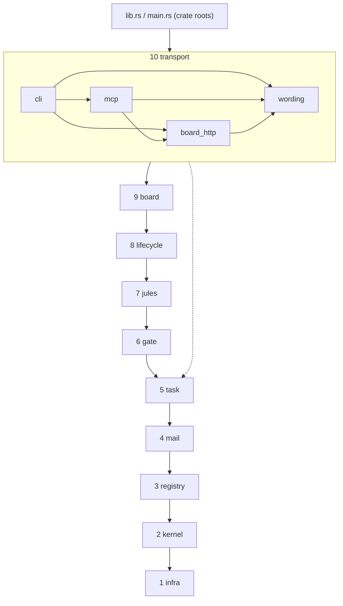
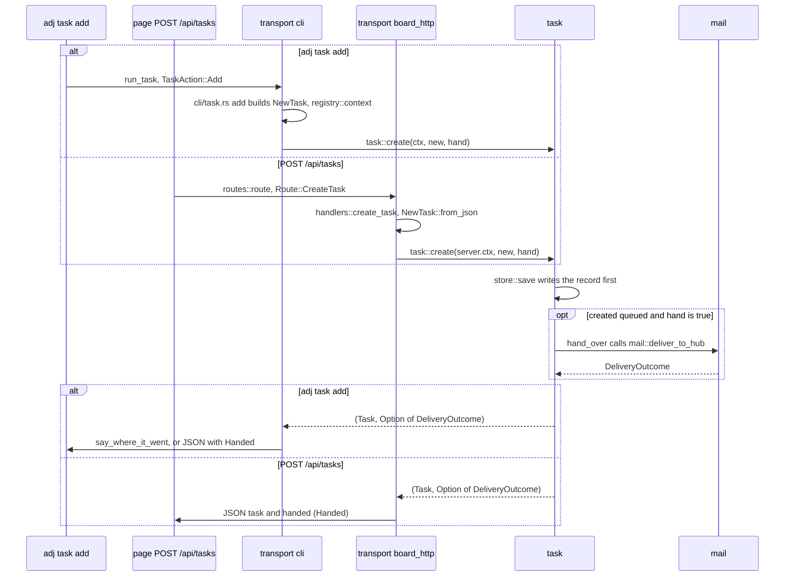
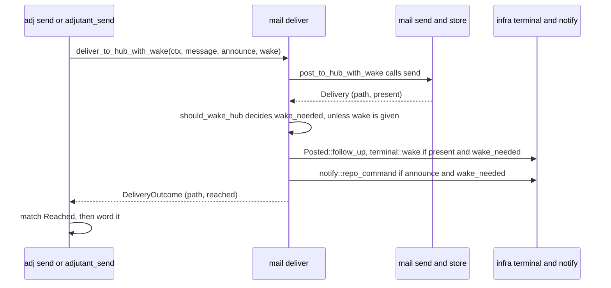

# Architecture

How the crate is put together, for people and agents changing the code. The crate is one library
(`src/lib.rs`, library name `adjutant`) and two thin binaries, `adjutant` (`src/main.rs`) and `adj`
(`src/bin/adj.rs`). Both call `adjutant::run`, which is `transport::cli::run`. Below the roots are
ten modules in a fixed rank. What `adj` does for a user is in the [README](../README.md); this page
is about where code goes.

## The layers

Modules are ranked bottom up. A module may name any module of a lower rank and never one above it or
beside it. The rank is the order that is checked, not "only the one directly below":
`transport` calls `task` directly. `lib.rs` and `main.rs` are the crate roots: they may name
anything and nothing names them. `testing` is `#[cfg(test)]` scaffolding declared in `lib.rs`, not a
layer; any module's tests may name it.

An arrow means "may use". A module may use any lower rank, not only the next one; the dashed arrow
is one example. The solid chain shows the order, not who calls whom: `lifecycle` does not use
`jules` or `gate`, for instance. Inside `transport` the arrows drawn are the only ones that exist:
`mcp` never names `cli`, and `board_http` names only `wording` (convention, no check).

`board` has four public submodules: `board::hub` and `board::session` (what a person runs from the
page), `board::view` (the read model) and `board::jobs` (background work). The rest of `board`
(`daemon`, `resident`, `server`, `dedicated`, `token`, `url`, `last_lines`, `model`) is private and
re-exported from `src/board.rs`.

Not every directory under `src/` is a module. `src/bin/` is the `adj` binary, `src/ui/` is the
board page's HTML, JS and CSS (`make check` runs `node --check` on `src/ui/*.js`), and `src/fixtures/` holds test
fixtures.

## What each module holds

- `infra`: plumbing. `fs` (atomic writes, locks), `clock`, `paths` (`state_dir`, `home_dir`),
  `env` (names of forwarded variables), `shell`, `git`, `gh`, `terminal` (opening, raising, naming,
  closing and waking tabs, plus its settings types `TerminalSettings`, `Wake`, `Hook`), `agent`
  (`Agent`), `notify`, `ide`, `template`, `pty` (unix only), `http`, `ws`. It names no other module, reads no
  config and knows no domain type (task, gate, hub record).
- `kernel`: `config` (location, defaults, resolve), `identity` (repository identity, worktrees),
  `worktree_state`, `prompts` (procedures, `render_skill`), `runner`, `brief`. It names only
  `infra` and holds no records on disk.
- `registry`: who is running and where. `Context` (repo, settings, resolved config, state dir),
  addressing, hub and worker records, `hub_status` / `worker_status`, saved sessions, the agent
  session ledger (what each agent's hooks last said, and its sweep), liveness,
  worker slots, the claim and dispatch locks, and the board address book and server record. It
  names no task or gate and holds none of their records.
- `mail`: inbox (worker to hub), outbox (hub to worker), delivery and wake, `pending`, `ack`,
  `list_hubs`, and `read_screen` (reading an agent's screen before typing into it). A message to a
  hub that is not running is not an error: it is `Reached::NotRunning`. It moves messages and wakes
  agents; it does not decide what a message means, so it holds no task or gate logic.
- `task`: task records, one file per task, and their operations (`create`, `update`, `edit`,
  `remove`, `get`, `list`, `next`, `hand_over`, `refresh`, `write_brief`, ...), plus the GitHub
  reads behind them. It does not wake or type into a terminal itself; it hands a message to `mail`.
- `gate`: gate records and `open`, `answer`, `close`, `close_resumed`, `get`, `list`. An answer
  goes back through `mail`, to the worker's outbox or, for a gate the hub opened, to the hub's
  inbox; a gate has no channel of its own and delivers nothing itself.
- `jules`: Jules sessions (`start`, `follow`, `findings`, `relay`, ...). It has no `store`: the
  session id and what was relayed are fields of the task record, and the private `api` client takes
  the store's place.
- `lifecycle`: `lifecycle::hub` and `lifecycle::worker`: start, resume, focus, stop and close
  hubs and workers; plan and exec a launch, claim slots, register launches and link workers to
  tasks. It returns values such as
  `HubStart` and `TabOutcome` and prints nothing, and it changes other modules' records only
  through their operations.
- `board`: the resident daemon and server, a hub's or `adj serve`'s own board (`dedicated`), the read model, the
  background jobs, and the page's actions. It does not name `transport` or parse HTTP (see
  [How the board gets its handler](#how-the-board-gets-its-handler)).
- `transport`: `cli` (clap args, dispatch, one file per command or family), `mcp` (the stdio
  JSON-RPC server and its tools), `board_http` (HTTP and WebSocket routes) and `wording` (answers
  two or more transports give in the same words). Each reads input, calls an operation and words
  the result. It holds no rule an operation should hold, such as when to wake or what to write; a
  second copy in another transport drifts.

## Rules and what enforces them

1. Ranks. A module names only lower ranks, and naming the crate root (`crate::{...}`) is refused.
   Every module under `src/` must be listed in `RANK` or `TOP`. Below `registry` the rule is
   stricter: `infra` names nothing outside itself, `kernel` only `infra`, and a file of nothing but
   `pub use` lines is checked too. Checked by `scripts/check-layering.sh`, which `make check` and CI
   run. While it passes, a later split into a Cargo workspace stays mechanical
   (`crate::infra::` becomes `adjutant_infra::`).
2. File names. One file per operation, named after what it does (`task/create.rs`,
   `gate/answer.rs`). Shared helpers go in `model.rs` (pure), `store.rs` (disk) or the owning
   operation as `pub(super)`. Files that are not operations are named after what they hold
   (`registry/context.rs`, `board/view/columns.rs`). Checked by `check-layering.sh` only for the
   names `usecase.rs`, `util.rs` and `common.rs`; the rest is by review
   ([review-checklist.md](review-checklist.md)).
3. Private store. `mod store;` is private in `registry`, `mail`, `task` and `gate`, and no other
   module builds those paths or takes those locks. The exception is
   `#[cfg(test)] pub(crate) use store::...` for fixtures in other modules' tests. Checked by the
   compiler; no script checks that a module keeps it private, and that no other module builds the
   paths is by review ([review-checklist.md](review-checklist.md)). One known exception: the board's
   session clean-up (`board/session/clean_up.rs`) moves `.claude/adjutant-*` and `task-brief.md`
   out of a worktree by name when git will not remove it, and `kernel::worktree_state` leaves the
   same names out of a worktree's git state; these names are fixed (rule 10).
4. Reads as operations. Reads take a state root and a hub slug so the board can read every hub:
   `task::list(root, slug)`, `gate::list(root, slug, shelf)`, `mail::pending(root, slug)`,
   `registry::hub_status(root, slug, hub_name)`. Writes take a `Context`. Convention, checked by
   review ([review-checklist.md](review-checklist.md)).
5. Typed outcomes, worded by the transport. Operations return values (`DeliveryOutcome`,
   `Reached`, `HubStart`, `TabOutcome`), never text for stdout. CLI and MCP texts differ on
   purpose; shared words live in `transport::wording`. Convention, checked by review
   ([review-checklist.md](review-checklist.md)).
6. Undo through reverse operations. An operation that writes to several modules takes a failed step
   back with the other modules' own operations, latest first, never by touching their stores.
   `lifecycle::worker::undo` calls `task::remove` and `task::update`. Convention, checked by review
   ([review-checklist.md](review-checklist.md)) and that module's tests.
7. No traits for stores. Stores are built from the state dir in `Context`. Code that runs
   processes has a `_with` variant that takes the runner for tests (`hub_status_with`,
   `worker_liveness_with`, `list_tmux_panes_with`, ...); they take the process table or the runner
   as an argument. Convention, checked by review ([review-checklist.md](review-checklist.md)).
8. `infra` is free of config and domain types. `TerminalSettings`, `Wake`, `Hook` and `Agent` are
   plain data defined in `infra`; `kernel::config` fills them in, and callers name them at
   `crate::infra::...`. Checked by `check-layering.sh` (rule 1).
9. Moves and behavior changes go in separate PRs. A move-only PR changes nothing but the moved items
   and the `mod`, `use`, visibility and path edits a move forces, and it carries the `move-only`
   label. Checked by `scripts/check-move-only.sh <base>`: CI runs it
   (`.github/workflows/move-only.yml`) on every pull request with that label, and you can run it by
   hand on the branch first. It compares the committed HEAD with the merge base (where the branch
   left the base) token by token and the test counts of both, and refuses uncommitted changes under
   `src/` or `tests/`. `make check` runs only its self-test, `scripts/test-check-move-only.sh`. The
   CI job is not a required check: while #340 is open, a brace inside a string or char literal can
   fail a correct move. When it does, say so in the PR and name the item the job reports.
   A PR without the label is not checked.
10. Records shared across versions. `adj server restart` leaves running hubs and workers on the old
    binary, so old and new binaries share the state dir. Paths, key names, lock names, the
    `.acking-` prefix and inbox file names stay as they are. Records keep keys they do not know
    (`Task.extra`, `Gate.extra`, `WorkerRecord.other`, `HubRecord.other`). A new key must be optional to the new binary (`serde(default)` or `Option`), because records
    the old one wrote lack it; the new binary never requires a key the old one does not write. Checked by the unit tests
    `a_key_this_binary_does_not_know_survives_a_load_and_save` (`task`),
    `a_key_this_binary_does_not_know_survives_a_load_save_and_archive` (`gate`) and
    `a_worker_record_rewrite_keeps_unknown_keys_and_unreadable_phases` and
    `an_unknown_key_in_a_hub_record_is_kept_and_the_file_left_alone` (`registry`); the rest is by
    review ([review-checklist.md](review-checklist.md)).

## How the board gets its handler

`board` is rank 9 and cannot name `transport`, yet its accept loop runs `board_http` code. The
transport passes the handler in. `cli/serve.rs` passes `board_http::handle` for `adj serve`,
`mcp.rs` passes it as `board_connection` to `board::serve_for_hub` for a hub's own board, and
`cli/server.rs` passes `board_http::handle_resident` to the resident. The resident strips
`/b/<slug>` (`split_board_path`) and hands the rest to the same `routes::route`. Every board
answers the same routes except the ones `Route::resident_only` lists (a session's resume, restart,
open and clean-up; starting a parent hub; the hub actions; the terminal; assets): `route` answers
those with 404 unless the server is the resident. The terminal is never a live route in `route`:
the resident answers its WebSocket handshake first, and `route` always returns 404 for it. The
resident also serves the page at `/`, `GET /api/boards` and `GET /api/work`. The last is the work
under way in every repository as one document (`board/view/work.rs`): it reads one carrier board per
repository (the repository's own board, which lists its parent-task hubs' sessions and tasks too,
else each parent-task board), joins each worker session to its task, and lists a session once
however many carriers name it. The resident keeps the serialized document for 1500 ms
(`Resident::work_cache`), so several open pages polling every couple of seconds read the boards once
between them. A board served on its own answers it with 404.

## Walk-through: adding a task

`adj task add` and the page's `POST /api/tasks` parse different input and word the result
differently, but both build a `task::NewTask` and call `task::create`, which writes the record. It hands the task to
the hub only when the task is created queued and `hand` is true: `adj task add` creates a backlog
task unless `--queue` or `--waiting-in` is given, and `--waiting-in` queues it without handing it
over.

`adj task add --json` and `POST /api/tasks` both answer `{ "task", "handed" }`, with `handed` built
from `mail::Handed` (`present`, `woken`, `path`) and null when nothing was handed over. The files are `transport/cli/task.rs`,
`transport/board_http/routes.rs` and `handlers.rs`, `task/create.rs` and `task/hand_over.rs`.

## Walk-through: delivering a message

`mail` decides when to wake and when to notify, once. Each transport turns the same
`DeliveryOutcome` into its own words.

The same `DeliveryOutcome` gets three wordings:

- CLI `adj send` (`transport/cli/delivery.rs`) prints a sentence such as "Woke the hub; it will
  pick this up."
- MCP `adjutant_send` (`transport/mcp/tools/send.rs`) adds notes addressed to the calling agent,
  such as not to wait for a reply, plus `present` and `woken` fields.
- The board has no free text: `Handed::from(&DeliveryOutcome)` goes into the JSON and the page
  words it (`handedNote` in `src/ui/actions.js`).

In this walk-through the piece CLI and MCP share is `transport::wording::wake_note_sentence`;
`transport::wording` also holds other answers they give in the same words.

## Where does my change go?

- A new operation: a file named after the verb in the owning module (`src/gate/<verb>.rs`), then
  `mod <verb>;` and `pub use <verb>::*;` in `src/gate.rs`. Pick the lowest module that holds every
  record it writes. If it writes to several modules, put it in the highest of them or above, and
  undo through the lower ones' operations (rule 6); launching or linking processes goes in
  `lifecycle`.
- A type used by several operations of one module: that module's `model.rs`. Disk access: its
  `store.rs`. Not a new `util.rs`.
- Something every module needs that knows nothing of tasks, hubs or config: `infra`. Something that
  needs config but no records: `kernel`.
- A board route: a variant of `Route` in `src/transport/board_http/routes.rs`, its path in
  `Route::named` (or `Route::session` / `Route::hub` for a route with an id), its arm in
  `Route::decoded` and in `route`, and the handler in `board_http/handlers.rs` or `sessions.rs`.
  The handler calls an operation. What the page reads goes in `board::view`. An action that needs
  several modules' operations goes in `board::hub` or `board::session`; some call one operation
  directly (`NudgeHub` calls `task::nudge`, `FocusHub` calls `lifecycle::hub::focus`). If only the
  resident may serve it, because it reaches outside the repository's records, also add its variant
  to `Route::resident_only`.
- An MCP tool: `src/transport/mcp/tools/<name>.rs` with `definition` and `call`, a `pub(super) mod <name>;`
  line and a `Tool` entry in `TOOLS`, both in `src/transport/mcp/tools.rs`.
- A CLI command: the clap variant in `src/transport/cli/args.rs` (`Commands`, or `TaskAction`,
  `GateAction`, ...), its arm in `src/transport/cli/run.rs`, and the function in the file for that
  command family under `src/transport/cli/`, re-exported with a `pub use` in
  `src/transport/cli.rs` (`run.rs` calls it through `super::`).
- A new command, tool or route also needs its text in `README.md` and `README.ja.md`, and the clap
  help or the MCP description.
- Words two transports say the same way: `src/transport/wording.rs`. Words only one says: that
  transport.
- A new module: declare `mod <name>;` in `src/lib.rs` and add it to `RANK` in
  `scripts/check-layering.sh`, or the script fails with "not in any list". Also update the Layout
  lists in `README.md` and `README.ja.md`, and this page (the flowchart and "What each module
  holds").
- Before the PR: `make check`; for a move-only PR also `scripts/check-move-only.sh main`, and the
  `move-only` label on the PR.

## Where state lives

The state dir is `ADJUTANT_STATE_DIR`, else `$XDG_STATE_HOME/adjutant`, else
`~/.local/state/adjutant` (`infra::paths::state_dir`). `registry::state_root` makes it absolute
against the main checkout and it travels as `Context.state`. Config is separate:
`ADJUTANT_CONFIG`, else `$XDG_CONFIG_HOME/adjutant/config.json`, else
`~/.config/adjutant/config.json` (`kernel::config`). The owner is the module that builds the path
(rule 3 names the one exception).

| Path (under the state dir unless noted) | What | Owner |
|---|---|---|
| `hubs/<slug>.json`, `hubs/<slug>.claiming` | hub record, the lock held while a hub is claimed | registry (`store.rs`) |
| `sessions/<slug>.json`, `sessions/<slug>.alive` | saved hub session | registry (`store.rs`) |
| `dashboards/<slug>.json` | a hub's or `adj serve`'s own board | registry (`store.rs`) |
| `boards/<slug>.json`, `server.json` | the resident's address book and record | registry (`store.rs`) |
| `agent-sessions/<session id>.json` (+ `.lock`, `.json.broken`) | what one agent session's hooks last said | registry (`store.rs`) |
| `agent-hooks/claude-<digest>.json` | the hook settings passed with `--settings`, one per `adj` binary | lifecycle (`write_agent_hooks.rs`) |
| `inbox/<slug>/`, `inbox/<slug>/read/` | messages to the hub, read ones archived | mail (`store.rs`) |
| `tasks/<slug>/<id>.json` (+ `<id>.lock`) | task records | task (`store.rs`) |
| `gates/<slug>/`, `records/` and `answered/` under it, each gate with an `<id>.lock` | open gates, gates kept as a record (`wait: false`), answered gates | gate (`store.rs`) |
| `cleanup-<pid>-<time>-<n>/` | files set aside only when the first `git worktree remove` refuses; removed once the worktree is gone or the files are put back, and left only if they could not be | board (`session/clean_up.rs`) |
| `dashboard-token`, `server.lock`, `server.log` | the resident's token, lock and log | board (`token.rs`, `daemon.rs`) |
| `hub-titles/<slug>.json` | cached parent-task titles | board (`jobs/hub_titles.rs`) |
| `<worktree>/.claude/adjutant-worker.json`, `adjutant-worker-starting.json`, `adjutant-session.json` | worker record, starting marker, saved worker session | registry (`store.rs`) |
| `<worktree>/.claude/adjutant-outbox.md` | messages to the worker | mail (`store.rs`) |
| `<worktree>/.claude/task-brief.md` | the worker's brief | task (`write_brief.rs`) |
| `<main>/.claude/adjutant-dispatch.lock`, `<main>/.claude/adjutant-removing/` | dispatch lock, removal markers | registry (`dispatch_lock.rs`, `store.rs`) |
| the temp dir: `adjutant-wake-locks/<key>.lock`, and staged `adjutant-spawn-*.sh` scripts | wake locks, tab launch scripts | infra (`terminal/verbs.rs`) |

Jules keeps nothing on disk of its own, and `board` has no `store.rs`: its few files are written by
the file that owns them. Paths, file names and keys here are shared with older binaries that may
still be running; see rule 10 before changing any.

[#246](https://github.com/syarihu/agent-adjutant/issues/246) has the history: what this replaced
and the order it was done in.
