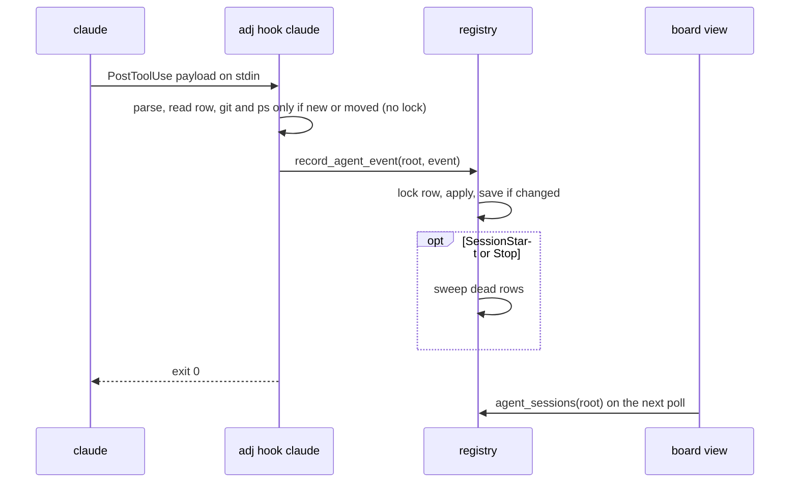

# Session state

A design for knowing what each agent session is doing (running, waiting on a permission prompt, done
with its turn, running sub-agents) without agent-proctor. It is for the people and agents who will
build it. Today that state comes only from
[agent-proctor](https://github.com/syarihu/agent-proctor)'s hooks and ledger, which means installing
proctor and wiring its hooks into each agent's global settings. This page covers the foundation: the
hook receiver, the ledger, and how the hooks reach the sessions adjutant starts. Showing the state
on the board has landed ([#506](https://github.com/syarihu/agent-adjutant/issues/506)). The sections follow the questions in
[#496](https://github.com/syarihu/agent-adjutant/issues/496); the last one splits the work into
issues.

## What comes over from proctor and what stays

proctor is a Swift package. Its CLI exists to feed its iTerm2 sidebar app, and the hook receiver and
the ledger are the parts adjutant needs.

| proctor | Here |
|---|---|
| Hook receiver (`_touch`, `_subagent`) and its state machine | Comes over, as `adj hook` |
| Sub-agent tracking keyed by `agent_id`, with the parent's `done` held until the last one ends | Comes over |
| Notification types told apart (permission prompt against idle prompt) | Comes over |
| Status line relay (`_stats`: context use, rate limits, model) | Comes over, as a relay the user wires in (see [What comes from the status line](#what-comes-from-the-status-line)) |
| Pruning of dead sessions by pid and start time | Comes over, reusing the `registry::liveness` module's process table |
| Ledger as one `state.json` for every repository under one lock | Not as it is: one file per session (see [The ledger](#the-ledger)) |
| Naming hint on `UserPromptSubmit` and `proctor title` | Stays. adjutant names its sessions when it starts them; a second hint would be injected twice next to proctor's |
| `proctor setup`, which prints a guide for the agent to merge by hand | Replaced by injection at launch and an `adj setup` that writes the hooks itself |
| `proctor worktree ls`, worktree conventions, `proctor-worktree` skill | Stays in proctor (see [Worktree conventions and the hub procedure](#worktree-conventions-and-the-hub-procedure)) |
| iTerm2 sidebar app, its reaper, read marks, approval watcher for Antigravity, notifications | Stays. The board is adjutant's view, and its sessions tab landed in [#506](https://github.com/syarihu/agent-adjutant/issues/506) |
| `attach`, `rm`, avatars, logs | Stays |

Two behaviours of proctor's receiver carry over as rules, because each one fixes something seen in
practice:

- A row is created only by a `running`, `waiting` or `idle` event. A stray `done` or `clear` (from a
  session that ended before its row was written) never registers one.
- `SessionStart` on an existing row only clears `request`. It also fires on resume, compaction and
  `/clear`, and must not wipe a turn in progress.

## The ledger

**Where.** One JSON file per agent session under the state dir: `agent-sessions/<session id>.json`,
with `<session id>.lock` beside it. proctor's single file under one `flock` serialises every agent
on the machine; `PostToolUse` fires after every tool call, so the per-session lock keeps one busy
worker from slowing the others. The owner is `registry` (rank 3), whose charter is "who is running
and where": the receiver writes only this record, so the operation sits in the lowest module that
holds it. The store is part of `registry`'s private `store.rs`; no other module builds these paths.

**Key.** The agent's own session id (`session_id` in a Claude Code payload). adjutant already mints
one for every session it starts (`registry::new_session_id`, passed as `--session-id`) and saves it
in `sessions/<slug>.json` for a hub and `<worktree>/.claude/adjutant-session.json` for a worker. So
a ledger row joins to a hub or worker by that id, never by worktree or cwd: two sessions can share a
worktree, and a hub shares the main checkout with anything else run there. A session started by a
custom runner whose template lacks `{sessionId}` still gets a row, keyed by the id the agent chose,
and joins by pid (below). A session adjutant did not start joins to nothing and shows as an
unattached session.

The agent's id can change under a running process: `/clear` ends the session (`SessionEnd`) and
starts a new one with a new `session_id`, and `--fork-session` does the same. The process stays,
though, and both a hub record and a worker record hold its pid with its `ps` start time: `adj hub`
and `adj worker` record their own pid and then exec the runner line, which `sh -c` normally execs
into the agent. Claude Code gives hooks its pid as `CLAUDE_PID`. So a hub or worker is joined by
`sessionId` first and by `pid` plus start time second, and the join survives a `/clear`, and a
custom runner without `{sessionId}`. It does not survive a runner line the shell cannot exec into (a
pipe, `;`): there the recorded pid is the shell's, and only `sessionId` joins.

The join is not carried in an environment variable on purpose. Everything the agent starts inherits
its environment, so a `claude` or `codex exec` run from a worker's shell would carry the worker's
mark and be joined to it.

**Shape.** Every field but the key is optional (rule 10 in [architecture.md](architecture.md)), and
keys this binary does not know are kept in `other`, as `WorkerRecord.other` does.

| Key | What |
|---|---|
| `sessionId` | The key, as above |
| `agent` | `claude` first; `codex` and `agy` later |
| `status` | `idle`, `running`, `waiting`, `done` or `failed` |
| `pendingStatus` | A `done` or `failed` held back while sub-agents run |
| `cwd`, `worktree` | The payload's `cwd` and its `git rev-parse --show-toplevel` (absent outside git; the row is still written) |
| `configDir` | `CLAUDE_CONFIG_DIR` from the hook's environment, else the default: which account the session runs as |
| `pid`, `psStarted` | The agent's process (`CLAUDE_PID` in the hook's environment) and its start time, for the join and for liveness |
| `createdAt`, `updatedAt` | `updatedAt` moves only when `status` changes, so tool activity does not reset "how long in this state" |
| `lastEventAt` | The "seen alive" mark. Moves with any other change, and on its own at most once a minute |
| `activity` | The tool in use (`Edit: src/lib.rs`) |
| `request` | What a permission prompt is asking for, while `waiting` |
| `subagents` | Running sub-agents: `[{ id, type, startedAt, lastSeenAt, activity? }]`, keyed by `agent_id`. `activity` is the tool it last ran, as the parent's `activity` words one. `lastSeenAt` moves at most once a minute, like `lastEventAt`; a sub-agent not seen for ten minutes (its `SubagentStop` never came) is dropped on the next event, and the parent's `pendingStatus` applied if it was the last |
| `finishedSubagents` | `{ agent_id: time }` for five minutes after each stop, so a late event cannot bring one back |
| `model`, `contextPercent`, `rateLimits` | From the status line relay, when wired in |
| `lastMessage`, `lastMessageAt` | What the agent said at the end of its last turn (`last_assistant_message` of `Stop` and `StopFailure`), cut to 1000 characters with its line breaks kept, and when it was received. Only the latest is kept, until the next one replaces it: a turn with no message, a new prompt and a sub-agent's events leave it. The same words again within a minute leave `lastMessageAt` alone, so that a repeated `Stop` is not a write. It goes with the row on `SessionEnd`. Held `done` records it too, since it was said. On `StopFailure` it is the error text Claude Code puts there (such as the rate-limit message), and it replaces what the agent said before |

Every other record stays where it is. The worker record keeps its phase, and the task its status;
the ledger says what the agent is doing right now, and neither of the others does. `adj phase` is
what the worker says about its work; the ledger is what the agent's hooks say about the process.
They answer different questions, and neither replaces the other.

**Writes.** Load, change and save under the row's lock, replacing the file through a rename
(`infra::fs`). A change is any field but `lastEventAt`; with none, the write is skipped unless
`lastEventAt` is a minute old, as proctor does with its sub-agent heartbeat. So `PostToolUse` on the
same tool writes at most once a minute. `activity` and `request` carry the first line of a tool's
command, which can hold a secret, so a row is written readable by its owner only (mode 0600).

What costs a process is done only when it can change the row. The receiver first reads the row
without the lock, only to decide whether it needs `git rev-parse` (the row is new or `cwd` differs,
for an event from the session itself: a sub-agent's never moves `cwd`) or the `ps` start time (the
row is new, `pid` differs, or the start time was never read), and runs those before taking the
lock. The write always reloads the row under the lock and applies the event to that, never to the
first read, so a parent's and a sub-agent's events that overlap both survive. If the locked read
shows a lookup is needed after all (another event moved the row in between), it releases the lock,
runs it, and tries again. A `PostToolUse` on a settled row then costs two reads and, at most once a
minute, one write.

**Pruning.** `SessionEnd` removes the row. For a row that ends without one (the tab was closed, the
process was killed), the receiver sweeps the other rows on `SessionStart` and `Stop`. Not on every
event: a sweep checks processes, and `PostToolUse` fires after every tool call. A sweep takes one
`ProcessTable::snapshot` and checks every row against it, rather than one `ps` per row.

- A row with a `pid` is dead when the pid is gone or its start time differs. A row whose start
  time could not be read cannot tell a reused pid from its own process, so it is also dropped once
  quiet for 24 hours (a live session reads the start time again on every event). The row's own
  pid is used, not the joined hub or worker record: a record can be missing while its agent still
  runs.
- When the table cannot be read, nothing is removed (`Liveness::CannotTell` keeps the row).
- A row without a pid is dropped when `lastEventAt` is older than 24 hours, whatever its status. A
  live session sends events far more often than that (every tool call, every turn), so a row that
  has been quiet that long is a process that died without `Stop` or `SessionEnd`. Unlike proctor, a
  `running` row is not exempt; there it could stay `running` for ever.
- `SessionEnd` removes only the `.json`. The sweep removes a `.lock` that has no row beside it, and
  only after taking it without waiting. Unlinking a lock another process holds open would hand
  two callers two different locks (see `infra::fs::open_lock`), so a writer checks, once it holds
  a lock, that the path still names that file, and opens it again if not
  (`infra::fs::lock_checked`). A `.json.broken` file older than a week goes too.

A sweep only runs when some session sends one of those events, so with nothing else running a closed
tab's row stays on disk. Readers therefore apply the same check: `agent_sessions` leaves out rows
the sweep would remove (a dead pid, or no pid or no start time and quiet for 24 hours), through
`agent_sessions_with(root, table)` (rule 7), so the board's poll and `adj agent-sessions` never
show a closed tab as `running`.

Claude Code sets `CLAUDE_PID` for hook commands (documented from v2.1.214), so a Claude Code row
normally has a pid. adjutant does not require a version: on an older Claude Code, or an agent that
gives none (Codex, as proctor found), the row has no pid, joins by `sessionId` alone, and is pruned
by the 24-hour rule. The reader filter applies the same rule, so such a row stops being shown once
it has been quiet for 24 hours.

**Reading.** `registry::agent_session(root, session_id)` and `registry::agent_sessions(root)`, and
`adj agent-sessions [--json]` on the CLI so the foundation can be checked end to end before the
board shows it. (The board's "sessions" are its hub and worker cards; a row here is what the agent
behind one of them is doing, hence the longer name.) One join is shared by every consumer:
`registry::agent_session_of(root, table, identity)` takes a hub's or worker's saved session id, pid
and start time and returns its row, by `sessionId` first and pid plus start time second. When
several rows share the pid (an old row whose `SessionEnd` was missed after a `/clear`), the one with
the newest `lastEventAt` wins.

Two deliberate exceptions to rule 4: the reads take no hub slug, because the ledger is one per
machine, not one per hub, and the write (`registry::record_agent_event(root, event)`) takes a state
root rather than a `Context`, because the receiver loads no config (below).

## Receiving hooks

One hidden command, `adj hook <agent>`, reads the payload from stdin and takes the event from the
payload's `hook_event_name`, so every entry in the generated settings is the same command. It lives
in `transport/cli/hook.rs`, calls `registry::record_agent_event`, and prints only what the event's
contract needs (Claude Code: `{}` for `PermissionRequest`, nothing otherwise; Codex: nothing at all,
see [Codex](#codex)).

It runs after every tool call, so it must be fast and must not fail the agent:

- It reads the state dir from `ADJUTANT_STATE_DIR` or the XDG default, and resolves no config and
  calls no GitHub. `ADJUTANT_STATE_DIR` already reaches the agent as an absolute path:
  `lifecycle::forwarded_env` sends it to the tab and `lifecycle::agent_command` keeps it. Other
  commands resolve a relative value against the main checkout (`registry::state_root`); the hook
  does the same with the main checkout of the payload's `cwd`, and outside git it uses the XDG
  default.
- It refuses a `session_id` that is not a file-name-safe token (empty, or holding `/` or `..`)
  before taking any lock or writing anything.
- Any error (unreadable payload, a lock that cannot be taken, a full disk) is written to stderr and
  the command exits 0. A hook that fails would show in the agent's transcript on every tool call.
- A corrupt row is moved aside to `<session id>.json.broken` and a new one started, as proctor does
  with its ledger.

The events, taken from proctor's table:

| Claude Code event | Matcher | What it records |
|---|---|---|
| `SessionStart` | | `idle` for a new row; on an existing row only clears `request` |
| `UserPromptSubmit` | | `running`; clears `pendingStatus` |
| `PostToolUse` | `*` | `running`, and `activity` |
| `PostToolUseFailure` | `*` | `running` (`PostToolUse` fires only on success) |
| `PermissionRequest` | `*` | `waiting`, and `request` (immediate; the permission `Notification` comes about 6 seconds later), also from a sub-agent |
| `Notification` | | `waiting` for `permission_prompt`, `elicitation_dialog` and unknown types; back from `waiting` to `idle` for `idle_prompt`; nothing for the rest |
| `Stop` | | `done`, or held in `pendingStatus` while sub-agents run; records `lastMessage` when the payload has one |
| `StopFailure` | | `failed`, held the same way (it fires instead of `Stop` on rate limits and overload); records `lastMessage` the same way |
| `SessionEnd` | | removes the row |
| `SubagentStart` | | adds the sub-agent by `agent_id` |
| `SubagentStop` | | removes it; applies `pendingStatus` when it was the last |

An event that carries `agent_id` comes from a sub-agent. Its `PostToolUse`, `PostToolUseFailure`
and `PermissionRequest` update that sub-agent's `lastSeenAt` and do not set the parent's `status`,
with these exceptions (any other such event sets no status and adds no sub-agent). A sub-agent's
own `PostToolUse` or `PostToolUseFailure` also sets that sub-agent's `activity` and leaves the
parent's alone:

- A `PermissionRequest` from a sub-agent sets the parent to `waiting`, since the person is asked in
  the parent's terminal either way; otherwise the row looks busy until the `Notification` some
  seconds later.
- A sub-agent's `PostToolUse` or `PostToolUseFailure` moves a `waiting` parent back to `running` and
  clears `request`: the prompt was answered. Without it the parent stays `waiting` until the
  sub-agent ends.
- `SubagentStop` for the last sub-agent applies the parent's `pendingStatus`.
- The parent's own `PostToolUse`, `PostToolUseFailure` or `PermissionRequest` clears a held
  `pendingStatus`, as `UserPromptSubmit` does: the parent is in a new turn, and a later
  `SubagentStop` must not put `done` over it.
- Any other event that carries an `agent_id` sets no status and adds no sub-agent.

No hook is run in the background (`async`). A background `PostToolUse` that finished after `Stop`
would put a finished row back to `running`. Run in order, the receiver has to be fast instead, which
is what the next points are for.

A question the model asks with the `AskUserQuestion` tool arrives as a `PermissionRequest` whose
`tool_name` is `AskUserQuestion`, then as a `permission_prompt` `Notification` about 6 seconds
later (measured on Claude Code 2.1.292). It never sends `elicitation_dialog`, and no `idle_prompt`
comes while the question is up. Its `tool_input` has `questions`, not a command or a path, so the
receiver reads `AskUserQuestion: <the first line of the first question>` as the `request`
(`tool_summary`, fixture `permission-request-ask-user-question.json`). Pressing Esc on it fires no
hook at all, and no `idle_prompt` came for it either (observed on 2.1.292): the row stayed
`waiting` for the 5 minutes watched, so it stays so until the next prompt or event. A question
dismissed within the 5 seconds before it is announced may still ring once, since Esc fires no hook to
take the row out of `waiting`. A question the model writes as
text and then ends the turn on is not a prompt: it is a finished turn (`Stop`, and `idle_prompt`
60 seconds later) and cannot be told from any other, so nothing notifies it.

One known gap stays as it is in proctor: cancelling a permission prompt fires no hook, so the row
stays `waiting` until the `idle_prompt` notification about a minute later (not re-measured; for
`AskUserQuestion` no `idle_prompt` came, see above).



## Getting hooks into a session

Both routes are needed, for different sessions.

**Injected at launch, for the Claude Code sessions adjutant starts.** adjutant writes a settings
file under the state dir holding the table above, and passes it with `--settings <file>`. Nobody
edits a global settings file, and removing adjutant leaves nothing behind in the agent's settings.

- The command names `adj` by absolute path (`infra::paths::exe_path_absolute`; `PATH` is not
  reliable inside a hook), guarded so that the command always exits 0: `[ ! -x <path> ] || <path>
  hook claude || true`. Claude Code treats exit 2 as blocking (on `Stop` it keeps the agent from
  stopping and feeds it the text) and any other non-zero exit as a hook error. A binary that is
  gone, or one too old to know `adj hook` (clap refuses unknown arguments with exit 2), then leaves
  a running session's hooks doing nothing until it is restarted. The receiver itself also catches
  panics and exits 0.
  The path is shell-quoted wherever it appears in a command, here and in the `--global` entries; a
  path with a space would otherwise turn every hook into a no-op that the guard hides. When
  `exe_path_absolute` cannot give an absolute path, the launch skips the injection and says why,
  rather than writing a fallback into the file.
- The file is named after the binary it calls, `agent-hooks/claude-<digest of the path>.json`, so a
  development build and an installed one sharing the state dir do not keep rewriting one file. It is
  written when missing or different, through a temporary file and a rename. Files for binaries that
  no longer exist are removed when a new one is written.
- An older binary sharing the config does not know `{settings}` and leaves it in the command line as
  it is. Like any key under rule 10, a user writes `{settings}` into a template by hand only once
  every binary in use knows it; the default runners are each binary's own, so they are safe.
- The runner templates gain a `{settings}` placeholder, rendered in `kernel::runner::worker_line`
  and `hub_line` as `--settings <file>`, with the path quoted but the flag itself not (`Sub::Raw`,
  since it is two words, or none when there is no file). When the runner's agent is `claude`
  (`runner::agent_from_runner`) and the template does not name `{settings}`, it is added after the
  agent's name, unless the template already passes its own `--settings`: adjutant leaves the
  user's alone, and that session has no injected hooks. A second `--settings` would not add to the
  user's: Claude Code takes the last `--settings` flag and drops the earlier ones without an error
  (checked on Claude Code 2.1.291), so the rule of not adding one stands. adjutant does not try to
  parse a template the shell does not read as one command (a pipe, `;`): it inserts after the
  agent's name as above, and a user whose template needs it elsewhere names `{settings}` there. The
  four default runners name it.

**Written once by `adj setup claude`, for everything else.** Sessions adjutant did not start, and
agents with no per-session settings flag (Codex and Antigravity read hooks only from a global file),
are reached only through the agent's global settings. `adj setup claude` adds the same table to
`~/.claude/settings.json` (or `$CLAUDE_CONFIG_DIR`), appending to existing hook arrays and never
removing any, with `adj hook claude --global` (the flag only marks adjutant's entries; the receiver
behaves the same with or without it); `adj setup claude --remove` takes out exactly the entries it
added and nothing else, recognising them by `adj hook claude --global` whatever path they name,
quoted or not. Those entries name the binary by absolute path too, so after an upgrade that moves
it, `adj setup claude` is run again and rewrites its own entries in place. It writes the user's file
through a temporary file and a rename, creating it when missing and keeping its mode; a file that
is not valid JSON or not the shape Claude Code reads is refused with nothing written, and keys
come out sorted. It is opt-in: adjutant works without it.

Claude Code merges hook entries across settings levels rather than letting one replace another, and
`--settings` is one of those levels (above the user's, project and local files). So the injected
hooks run next to whatever hooks the user has, and the user's are untouched.

What this relies on was checked on Claude Code 2.1.291, by running `claude -p` with hand-written
`--settings` files. The `session_id` in a hook payload is the one passed with `--session-id`, and
`--resume <id>` keeps it (`SessionStart` says `source: "resume"`); only `--fork-session` gives a
new one (`source: "fork"`), as `/clear` does, and the pid join covers that. Hooks passed with
`--settings` ran in addition to the user's own, both firing for the same event. `CLAUDE_PID` is set
for hooks and is the `claude` process, the hook shell's parent. `CLAUDE_CONFIG_DIR` is not set on
the default account, so the `~/.claude` fallback is the common case.

**No double counting between the two.** When both are present, a session adjutant started runs both
sets, and both write the same row. That is harmless by construction: every event sets a status, adds
or removes a sub-agent by `agent_id`, or removes the row, so applying it twice gives the same row as
applying it once. Nothing is counted, and the second write is usually skipped as "nothing changed".
The global copy does not step aside for the injected one: if the injected binary goes away, the
global hooks are what keeps the row moving. (Claude Code also runs an identical handler from two
settings files only once, but the two commands differ by `--global`, so adjutant does not rely on
that.)

**Next to proctor.** proctor's hooks write proctor's ledger and adjutant's write adjutant's, so
neither counts the other's sub-agents twice (and, as above, events applied twice would not count
twice anyway). What can happen is that the two disagree, for instance if proctor's hooks are wrapped
in a script that filters an event adjutant sees. That is acceptable: adjutant reads only its own
ledger. Running both costs a second short process per hook.

What the generated file looks like, shortened:

```json
{
  "hooks": {
    "PostToolUse": [
      { "matcher": "*", "hooks": [{ "type": "command", "command": "[ ! -x /opt/homebrew/bin/adj ] || /opt/homebrew/bin/adj hook claude || true" }] }
    ],
    "Stop": [
      { "hooks": [{ "type": "command", "command": "[ ! -x /opt/homebrew/bin/adj ] || /opt/homebrew/bin/adj hook claude || true" }] }
    ]
  }
}
```

## What comes from the status line

A session has one status line. If adjutant injected one through `--settings`, it would replace the
user's, so it does not. Instead `adj hook claude --status-line` reads the same stdin a status line
command gets and records `model`, `contextPercent` and `rateLimits` into the row, without creating
one. It prints nothing, so a user who wants these fields adds one line to their own status line
script, piping its stdin to it. Without it the rows simply lack those fields.

The row keeps `model` as the display name (the id when there is none), `contextPercent` as a whole
number, and `rateLimits` as `{ fiveHour, sevenDay }`, each `{ usedPercent, resetsAt }` with
`resetsAt` in epoch seconds as Claude Code gives it. A draw that lacks a field leaves the stored
value as it is. The write rules are the ordinary ones: a change moves `lastEventAt`, and an
unchanged draw writes at most once a minute. So `lastEventAt` is not the time the rate limits were
captured; it also moves for hooks. Whatever reads the limits from the row (the review engine
below) must keep that in mind.

The review engine used to depend on the user's status line: `task::pick_review_engine` read
`rate-limit-cache.json`, which a status line script writes. Now `adj review-engine` reads the
five-hour and seven-day figures from the Claude row with the caller's `configDir` and the newest
`lastEventAt` among the rows that carry a figure, if it is under 15 minutes old as the cache must be (a row in the future is not
used either). Two accounts have two sets of limits, so the row has to be of the same config
directory, found by the same rule the hook stores it by. The cache file stays as the fallback for a
user who has it and not the relay, and `--json` says which one decided in `source`.

## Which agents, in what order

**Claude Code first.** It has per-session settings, the richest events, and payloads that carry
`session_id` and `agent_id`.

**Codex and Antigravity after the board shows Claude Code sessions.** Neither has a per-session
settings flag, so they are reached only by `adj setup codex` / `adj setup agy` writing their global
hook files. Their differences, from proctor's guides, decide the details of those issues:

- Codex treats hook stdout as a decision, so its hook must print nothing; it asks the user to trust
  new hook commands; it has no `StopFailure`; its rows rely on the 24-hour rule unless a pid is
  found.
- Antigravity has no hook for waiting on approval (proctor polls its conversation store) and reports
  sub-agents only through `PreToolUse` on `invoke_subagent`.

### Codex

`adj setup codex` appends adjutant's hooks to Codex's global `hooks.json` (`$CODEX_HOME/hooks.json`,
else `~/.codex/hooks.json`), in the same shape and with the same rules as `adj setup claude`:
existing entries are kept, a rerun changes nothing, and `--remove` takes out only adjutant's.

- Nine events run `adj hook codex --global`: `SessionStart`, `UserPromptSubmit`, `PostToolUse` and
  `PermissionRequest` (the last two with matcher `*`), `Stop`, `Interrupt`, `SessionEnd`,
  `SubagentStart`, `SubagentStop`. `Interrupt` (a turn cut short) is recorded as `Stop`, so the row
  goes to done, except that an `Interrupt` while sub-agents are still running leaves the row
  running until their `SubagentStop` or the silence sweep. A Codex that does not know `Interrupt` ignores that key.
  It carries no message, so it records no `lastMessage`.
- `SessionEnd` gets `"timeout": 3` (Codex's default of 1 s would kill `adj hook` before it removed
  the row; 3 s is its maximum).
- The hook prints nothing on every event, `PermissionRequest` included, since Codex reads stdout as
  a decision.
- Codex asks the user to trust each new hook command the next time it starts. The trust record is
  Codex's own config, which adjutant never writes; after moving `adj`, run `adj setup codex` again
  and trust the hooks again.
- Codex's `Stop` carries `last_assistant_message`, and the row records it as Claude Code's does.
- Codex gives a hook no pid, so a row has none and is aged out by the 24-hour rule.
- `--status-line` is Claude Code's; with `codex` it only says so on stderr.

**Antigravity is still pending**, as a follow-up: `adj setup agy` and its receiver are not there yet. Its last message is recorded when the receiver lands ([#520](https://github.com/syarihu/agent-adjutant/issues/520)).

adjutant runs Codex as `Agent::Generic` today, and a `Generic` session gets no injection; its row
comes from the global hooks above.

## How adjutant uses it

The board, the permission part of gates and cards, and the hub's line landed in
[#506](https://github.com/syarihu/agent-adjutant/issues/506); the rest is not in the foundation and
is listed so the ledger carries what it will need.

- **The board** (landed, #506). A sessions tab in the sidebar, and the session cards, read `agent_sessions` on the
  existing 2-second poll of `/api/state`. No push channel is added.
- **Notifying a wait** (#524). A row that turns `waiting` is announced once, when it has stayed
  `waiting` for 5 seconds (`board/jobs/wait_watch.rs`, a job beside `sweep_gates` in the resident
  server and in a dedicated board). It reads `registry::waiting_agent_sessions` (every `waiting`
  row with its `updatedAt`, no liveness check) on the 2-second clock, and only when a wait is due
  lists the board's sessions to find whose it is. A wait is the pair of the row's `sessionId` and its
  `updatedAt`, which moves only when the status does, so the `permission_prompt` that follows a
  `PermissionRequest` is the same wait. The waits found when the server starts are listed in 要対応 but not announced, and so are
  the waits whose terminal is open on the board (`quiet` on the notice).
  A wait whose session a gate holds is looked at again every 10 seconds and listed once the gate
  closes while the row still waits. A session that is gone, and a hub on a board that is not its own, are
  not listed; one whose terminal is open on the board is listed but not announced (the person is
  looking at it). Several processes can watch one ledger (a board per hub with no resident server, or one
  started by hand beside it), so a wait is claimed through a marker file made with `create_new`
  under `<state>/wait-notified/`: only the process that makes it runs the configured command, so
  it rings once. The marker stays until it is a day old and is swept when a watch starts: a wait
  is the pair of row id and `updatedAt`, so a later wait never reuses one, and removing it early
  would let a row that dropped out of one ledger read be rung again. A wait with no matching
  session is looked for again next round when any board or session list of that round was
  incomplete, for up to a minute. Each board still records the notice for its own page, which
  notifies on its own. The open-terminal check is per process: a terminal open on one board does
  not stop another process that wins the claim. The announcement runs the configured `notification` (`"{name} is waiting:
  {request}"`, or `"{name} is asking: {question}"` for an AskUserQuestion), and `/api/state` and
  `/api/boards` carry every wait as `waits`: the page lists them in 要対応 (a button that opens that
  session's terminal), counts them in the badges, and rings its own desktop notification for the
  ones that are not `quiet`, which opens that session's terminal when clicked.
- **Waking.** `mail::read_screen` guesses an agent's state from a tmux screen, and works for neither
  iTerm2 nor `Generic`. A row in `waiting` or `running` says not to type now; `idle` or `done` says
  it is safe; a `running` row not heard from in ten minutes is not believed, since an interrupted turn
  sends no `Stop` (Claude Code; Codex sends `Interrupt`, which is mapped to done). The screen check
  stays for typing the line itself, and as the fallback with no row.
- **Gates and cards.** A worker in `waiting` on a permission prompt is waiting on a person even with
  no gate open, and the card says so (landed, #506). Not yet: a worker whose row went `done` and stayed there with no phase
  change is a better "stuck" signal than the phase age alone.
- **The hub's line on the board** (landed, #506). [#497](https://github.com/syarihu/agent-adjutant/issues/497)
  puts one line for the hub above the board's columns, with its last tmux line and its inbox. The
  hub's row adds whether it is running, idle or waiting on a question, and how many sub-agents it
  has. The hub is joined to its row the same way as a worker (`registry::agent_session_of`).
- **Keeping the hub on its inbox.** A hub often goes back to waiting without reading its inbox. An
  injected `Stop` hook for hubs could refuse to end the turn while messages are unhandled, and a
  `UserPromptSubmit` hook could add the inbox subjects to the prompt. Both add text at the end of
  the conversation, so prompt caching is unaffected; the text stays small (subjects only, nothing when
  the inbox is empty). They must count only messages the hub has not parked on purpose (one marked
  for the user, a question waiting on its answer), or the hub loops. These hooks decide something,
  so they are a separate command, not the state receiver: `adj hook` never blocks (see
  [Receiving hooks](#receiving-hooks)), and a hook that may refuse `Stop` has to be allowed to. They
  would go in a second settings file passed to hubs only (`agent-hooks/claude-hub-<digest>.json`);
  injecting per session is what makes a hub-only hook possible.

## Worktree conventions and the hub procedure

The "Where proctor ends" section of `commands/adj-hub.md` is about worktree conventions
(`worktreeBase`, `branchPattern`, `copyFiles`), not session state, and it does not change. `adj
worktree-path` keeps answering where proctor is not installed; nothing here moves worktree
conventions into adjutant.

What changes later is the text that leans on proctor for progress: the hub procedure says a worker
"gets its own tab and its own proctor row" and that the proctor row shows progress, and the README's
"Optional neighbours" paragraph names proctor's session ledger. Once `adj agent-sessions` exists,
those say to read adjutant's own sessions instead. That is a procedure change of its own, after the
board shows the state.

## What proctor does afterwards

proctor is a separate repository and keeps working as it is: its sidebar, its hooks and its ledger
do not depend on adjutant, and adjutant does not read them. Someone who wants the sidebar keeps
proctor's hooks, and the two ledgers live side by side. Whether proctor later reads adjutant's
ledger instead of keeping its own is proctor's decision, outside this repository; the row shape
above is plain JSON with one file per session, so it could.

## Where the new state lives

| Path (under the state dir) | What | Owner |
|---|---|---|
| `agent-sessions/<session id>.json` (+ `.lock`, `.json.broken`) | one agent session's state | registry (`store.rs`) |
| `agent-hooks/claude-<digest>.json` | the hook settings passed with `--settings`, one per `adj` binary | lifecycle (written at launch) |

Both follow rule 10: new keys optional, unknown keys kept, names fixed once released.

The hook table itself (events, matchers, the command) is plain data with no records, so it lives in
`kernel` (`kernel::agent_hooks`), with the function that merges it into an agent's settings JSON or
takes it out again. `lifecycle` writes the injected file from it at launch, and `adj setup` in
`transport/cli/setup.rs` reads and writes the user's settings file with it.

`record_agent_event` runs `ps` and git, so it has a `record_agent_event_with(root, event, table)`
variant for tests (rule 7). Git runs through `infra::git`: the hook inherits the agent's
environment, `GIT_DIR` included if it has one.

## Implementation split

In order. Each one is a sub-issue of #496, and each lands on its own.

**1. adjutant has nowhere to record what an agent session is doing**

```markdown
## What happens

adjutant knows which hubs and workers it started, but nothing records what their agent is doing:
running, waiting on a permission prompt, done with its turn, or running sub-agents. The only source
is agent-proctor's ledger, which adjutant does not read.

## Proposal

Add the agent session ledger from `docs/session-state.md`: one file per session at
`agent-sessions/<session id>.json` in `registry`'s private store, the state machine for the Claude
Code events (sub-agents keyed by `agent_id`, a held `done`, notification types), the sweep of dead
rows, the hidden `adj hook claude` that reads a payload from stdin, and `adj agent-sessions
[--json]` to read the rows. Tests feed recorded payloads through `adj hook` and check the rows,
including a parent's and a sub-agent's events applied at once with both updates kept. Add `adj
agent-sessions` to `README.md` and `README.ja.md`.

Also confirm with a real session, using a hand-written settings file, what the design takes from
Claude Code's documentation without it saying it outright: that the `session_id` in hook payloads is
the one passed with `--session-id` and stays the same after `--resume <id>`, that hooks passed with
`--settings` run alongside the user's own, and what Claude Code does with two `--settings` flags.
Record the answers in the doc.
```

**2. Hooks do not reach the Claude Code sessions adjutant starts**

```markdown
## What happens

Even with `adj hook` in place, a hub or worker adjutant starts only reports its state if the user
has added the hooks to their own Claude Code settings by hand.

## Proposal

Add the hook table to `kernel::agent_hooks` and write it at launch to
`agent-hooks/claude-<digest>.json` under the state dir, naming `adj` by its absolute path with a
guard that always exits 0 (`[ ! -x <path> ] || <path> hook claude || true`, the path shell-quoted).
Add a `{settings}` placeholder to the runner templates, added for a `claude` runner that does not
name it unless the template passes its own `--settings` (inserted after the agent's name; a template
that needs it elsewhere names it), and name it in the four default runners. Add
`registry::agent_session_of`, the one join from a hub or worker to its row (`sessionId`, then pid
and start time), with tests for a `/clear` and a runner without `{sessionId}`. Document `{settings}`
in `config.example.json`, the README runner placeholders (both languages) and the runner settings'
help.
```

**3. Claude Code sessions adjutant did not start cannot report their state**

```markdown
## What happens

A Claude Code session started by hand, or by a runner adjutant does not control, never calls `adj
hook`, so it has no row.

## Proposal

Add `adj setup claude`, which appends the hook table with `adj hook claude --global` to the user's
Claude Code settings without removing any existing hook, and `adj setup claude --remove`, which
takes out only those entries, whatever `adj` path they name; running it again rewrites them for a
moved binary. Both hook sets may write the same row; the events are idempotent, so nothing is
counted twice. Add `adj setup` to `README.md` and `README.ja.md`.
```

**4. Context use and rate limits never reach the session ledger**

```markdown
## What happens

The ledger knows each session's state but not its model, how full its context is, or how much of the
rate limits are used. Claude Code gives these only to the status line.

## Proposal

Add `adj hook claude --status-line`, which reads the status line's stdin, records `model`,
`contextPercent` and `rateLimits` on an existing row, and prints nothing. Document the one line to
add to a status line script in `README.md` and `README.ja.md`. adjutant does not install a status
line, since that would replace the user's.
```

**5. The board cannot show what each session's agent is doing**

```markdown
## What happens

The board shows a session's phase, last line and gates, but not whether its agent is running,
waiting on a permission prompt or done, and on iTerm2 it cannot tell at all.

## Proposal

Join each board session to its row with `registry::agent_session_of` in `board::view`, add the state
to `/api/state`, and show it in a sessions tab in the sidebar and on the session cards. A worker
waiting on a permission prompt shows as waiting on a person even with no gate open.
```

**6. adjutant decides when to type into a session from its screen alone**

```markdown
## What happens

Before waking a session, `mail::read_screen` guesses from a tmux screen whether the agent is busy.
It cannot read iTerm2 or a generic runner, so there adjutant types blind.

## Proposal

Use the session's row when there is one: hold the wake while it is `running` or `waiting`. Keep the
screen check as the fallback.
```

**7. The review engine reads rate limits from a cache file the user's status line must write**

```markdown
## What happens

`adj review-engine` decides between Claude and codex from `rate-limit-cache.json`, which exists only
if the user's own status line script writes it. With the status line relay, the session ledger holds
the same figures.

## Proposal

Take the five-hour and seven-day figures from the row with the same agent and `configDir` and the
newest `lastEventAt`, under the same 15-minute staleness rule the cache has, and fall back to
`rate-limit-cache.json` otherwise.
```

**8. The hub procedure still points at proctor's row for a worker's progress**

```markdown
## What happens

`commands/adj-hub.md` says a worker's progress shows in its proctor row, and the README lists
proctor's session ledger as an optional neighbour, though adjutant now has its own.

## Proposal

Point those passages at `adj agent-sessions` and the board. Leave "Where proctor ends" as it is: it
is about worktree conventions, which stay with proctor.
```

**9. Codex and Antigravity sessions cannot report their state**

```markdown
## What happens

Only Claude Code sessions have hooks into the ledger. Codex and Antigravity have no per-session
settings flag, and their hooks behave differently (Codex reads hook stdout as a decision;
Antigravity has no hook for waiting on approval).

## Proposal

Add `adj setup codex` and `adj setup agy` writing their global hook files, and teach `adj hook`
their payloads, with the differences listed in `docs/session-state.md`. One issue per agent if they
turn out to differ more than expected.
```
