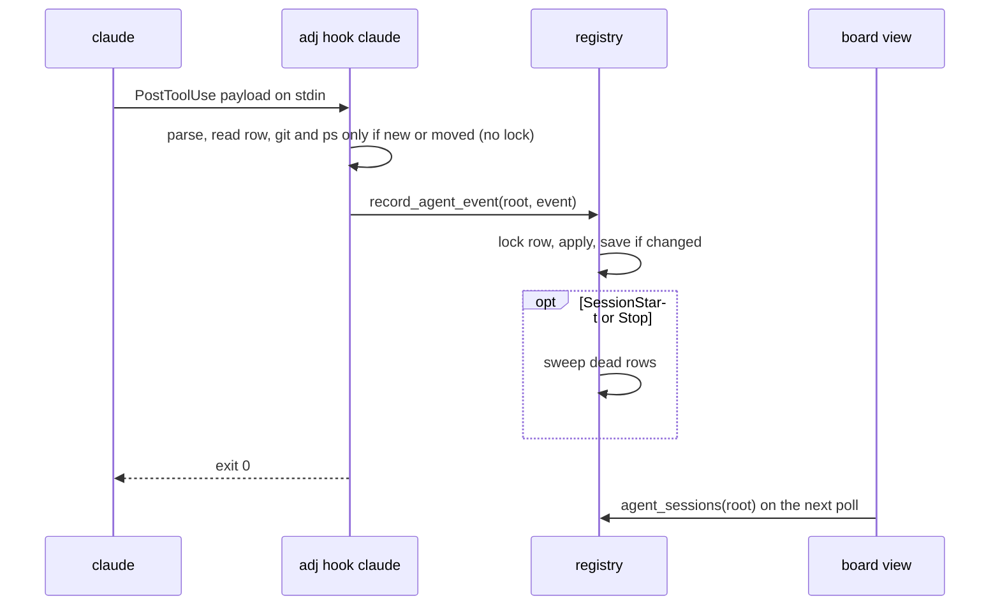

# Session state

A design for knowing what each agent session is doing (running, waiting on a permission prompt,
done with its turn, running sub-agents) without agent-proctor. It is for the people and agents who
will build it. Today that state comes only from [agent-proctor](https://github.com/syarihu/agent-proctor)'s
hooks and ledger, which means installing proctor and wiring its hooks into each agent's global
settings. This page covers the foundation: the hook receiver, the ledger, and how the hooks reach the
sessions adjutant starts. Showing the state on the board is a later piece of work. The sections
follow the questions in [#496](https://github.com/syarihu/agent-adjutant/issues/496); the last one
splits the work into issues.

## What comes over from proctor and what stays

proctor is a Swift package. Its CLI exists to feed its iTerm2 sidebar app, and the hook receiver
and the ledger are the parts adjutant needs.

| proctor | Here |
|---|---|
| Hook receiver (`_touch`, `_subagent`) and its state machine | Comes over, as `adj hook` |
| Sub-agent tracking keyed by `agent_id`, with the parent's `done` held until the last one ends | Comes over |
| Notification types told apart (permission prompt against idle prompt) | Comes over |
| Status line relay (`_stats`: context use, rate limits, model) | Comes over, as a relay the user wires in (see [What comes from the status line](#what-comes-from-the-status-line)) |
| Pruning of dead sessions by pid and start time | Comes over, reusing the `registry::liveness` module's process table |
| Ledger as one `state.json` for every repository under one lock | Not as it is: one file per session (see [The ledger](#the-ledger)) |
| Naming hint on `UserPromptSubmit` and `proctor title` | Stays. adjutant names its sessions when it starts them; a second hint would be injected twice next to proctor's |
| `proctor setup`, which prints a guide for the agent to merge by hand | Replaced by injection at launch and an `adj setup` that writes the hooks itself |
| `proctor worktree ls`, worktree conventions, `proctor-worktree` skill | Stays in proctor (see [Worktree conventions and the hub procedure](#worktree-conventions-and-the-hub-procedure)) |
| iTerm2 sidebar app, its reaper, read marks, approval watcher for Antigravity, notifications | Stays. The board is adjutant's view, and its sessions tab is a later issue |
| `attach`, `rm`, avatars, logs | Stays |

Two behaviours of proctor's receiver carry over as rules, because each one fixes something seen in
practice:

- A row is created only by a `running`, `waiting` or `idle` event. A stray `done` or `clear` (from a
  session that ended before its row was written) never registers one.
- `SessionStart` on an existing row only clears `request`. It also fires on
  resume, compaction and `/clear`, and must not wipe a turn in progress.

## The ledger

**Where.** One JSON file per agent session under the state dir:
`agent-sessions/<session id>.json`, with `<session id>.lock` beside it. proctor's single file under
one `flock` serialises every agent on the machine; `PostToolUse` fires after every tool call, so
the per-session lock keeps one busy worker from slowing the others. The owner is `registry`
(rank 3), whose charter is "who is running and where": the receiver writes only this record, so the
operation sits in the lowest module that holds it. The store is part of `registry`'s private
`store.rs`; no other module builds these paths.

**Key.** The agent's own session id (`session_id` in a Claude Code payload). adjutant already mints
one for every session it starts (`registry::new_session_id`, passed as `--session-id`) and saves it
in `sessions/<slug>.json` for a hub and `<worktree>/.claude/adjutant-session.json` for a worker. So
a ledger row joins to a hub or worker by that id, never by worktree or cwd: two sessions can share a
worktree, and a hub shares the main checkout with anything else run there. A session started by a
custom runner whose template lacks `{sessionId}` still gets a row, keyed by the id the agent chose,
and joins by pid (below). A session adjutant did not start joins to nothing and shows as an
unattached session.

The agent's id can change under a running process: `/clear` ends the session (`SessionEnd`) and
starts a new one with a new `session_id`, and `--fork-session` does the same. The process stays,
though, and both a hub record and a worker record hold its pid with its `ps` start time: `adj hub`
and `adj worker` record their own pid and then exec the runner line, which `sh -c` normally execs
into the agent. Claude Code gives hooks its pid as `CLAUDE_PID`. So a hub or worker is joined by
`sessionId` first and by `pid` plus start time second, and the join survives a `/clear`, and a
custom runner without `{sessionId}`. It does not survive a runner line the shell cannot exec into
(a pipe, `;`): there the recorded pid is the shell's, and only `sessionId` joins.

The join is not carried in an environment variable on purpose. Everything the agent starts inherits
its environment, so a `claude` or `codex exec` run from a worker's shell would carry the worker's
mark and be joined to it.

**Shape.** Every field but the key is optional (rule 10 in [architecture.md](architecture.md)), and
keys this binary does not know are kept in `other`, as `WorkerRecord.other` does.

| Key | What |
|---|---|
| `sessionId` | The key, as above |
| `agent` | `claude` first; `codex` and `agy` later |
| `status` | `idle`, `running`, `waiting`, `done` or `failed` |
| `pendingStatus` | A `done` or `failed` held back while sub-agents run |
| `cwd`, `worktree` | The payload's `cwd` and its `git rev-parse --show-toplevel` (absent outside git; the row is still written) |
| `configDir` | `CLAUDE_CONFIG_DIR` from the hook's environment, else the default: which account the session runs as |
| `pid`, `psStarted` | The agent's process (`CLAUDE_PID` in the hook's environment) and its start time, for the join and for liveness |
| `createdAt`, `updatedAt` | `updatedAt` moves only when `status` changes, so tool activity does not reset "how long in this state" |
| `lastEventAt` | The "seen alive" mark. Moves with any other change, and on its own at most once a minute |
| `activity` | The tool in use (`Edit: src/lib.rs`) |
| `request` | What a permission prompt is asking for, while `waiting` |
| `subagents` | Running sub-agents: `[{ id, type, startedAt, lastSeenAt }]`, keyed by `agent_id` |
| `finishedSubagents` | `{ agent_id: time }` for five minutes after each stop, so a late event cannot bring one back |
| `model`, `contextPercent`, `rateLimits` | From the status line relay, when wired in |

Every other record stays where it is. The worker record keeps its phase, and the task its status;
the ledger says what the agent is doing right now, and neither of the others does. `adj phase` is
what the worker says about its work; the ledger is what the agent's hooks say about the process.
They answer different questions, and neither replaces the other.

**Writes.** Load, change and save under the row's lock, replacing the file through a rename
(`infra::fs`). A change is any field but `lastEventAt`; with none, the write is skipped unless
`lastEventAt` is a minute old, as proctor does with its sub-agent heartbeat. So `PostToolUse` on the
same tool writes at most once a minute.

What costs a process is done only when it can change the row. The receiver reads the row once
without the lock; it runs `git rev-parse` only when the row is new or `cwd` differs, and takes the
`ps` start time only when the row is new or `pid` differs. Both run before the lock is taken. A
`PostToolUse` on a settled row then costs one read and, at most once a minute, one write.

**Pruning.** `SessionEnd` removes the row. For a row that ends without one (the tab was closed, the
process was killed), the receiver sweeps the other rows on `SessionStart` and `Stop`. Not on every
event: a sweep checks processes, and `PostToolUse` fires after every tool call. A sweep takes one
`ProcessTable::snapshot` and checks every row against it, rather than one `ps` per row.

- A row with a `pid` is dead when the pid is gone or its start time differs (a row whose start time
  could not be read is judged by the pid alone). The row's own pid is used, not the joined hub or
  worker record: a record can be missing while its agent still runs.
- When the table cannot be read, nothing is removed (`Liveness::CannotTell` keeps the row).
- A row without a pid is dropped when it is not `running` now and `lastEventAt` is older than
  24 hours.
- A removed row's `.lock` goes with it, and a `.json.broken` file older than a week.

A sweep only runs when some session sends one of those events, so with nothing else running a
closed tab's row stays on disk. Readers therefore apply the same check: `agent_sessions` leaves out
rows the process table says are dead, through `agent_sessions_with(root, table)` (rule 7), so the
board's poll and `adj agent-sessions` never show a closed tab as `running`.

Claude Code sets `CLAUDE_PID` for hook commands, so every Claude Code row has a pid; the 24-hour
rule is for agents that give none (Codex, as proctor found).

**Reading.** `registry::agent_session(root, session_id)` and `registry::agent_sessions(root)`, and
`adj agent-sessions [--json]` on the CLI so the foundation can be checked end to end before the board
shows it. (The board's "sessions" are its hub and worker cards; a row here is what the agent behind
one of them is doing, hence the longer name.) One join is shared by every consumer:
`registry::agent_session_of(root, table, identity)` takes a hub's or worker's saved session id, pid
and start time and returns its row, by `sessionId` first and pid plus start time second. When
several rows share the pid (an old row whose `SessionEnd` was missed after a `/clear`), the one with
the newest `lastEventAt` wins.

Two deliberate exceptions to rule 4: the reads take no hub slug, because the ledger is one
per machine, not one per hub, and the write (`registry::record_agent_event(root, event)`) takes a
state root rather than a `Context`, because the receiver loads no config (below).

## Receiving hooks

One hidden command, `adj hook <agent>`, reads the payload from stdin and takes the event from the
payload's `hook_event_name`, so every entry in the generated settings is the same command. It lives
in `transport/cli/hook.rs`, calls `registry::record_agent_event`, and prints only what the event's
contract needs (`{}` for `PermissionRequest`, nothing otherwise).

It runs after every tool call, so it must be fast and must not fail the agent:

- It reads the state dir from `ADJUTANT_STATE_DIR` or the XDG default, as every `adj` command does,
  and resolves no config and calls no GitHub. `ADJUTANT_STATE_DIR` already reaches the agent:
  `lifecycle::forwarded_env` sends it to the tab and `lifecycle::agent_command` keeps it.
- Any error (unreadable payload, a lock that cannot be taken, a full disk) is written to stderr and
  the command exits 0. A hook that fails would show in the agent's transcript on every tool call.
- A corrupt row is moved aside to `<session id>.json.broken` and a new one started, as proctor does
  with its ledger.

The events, taken from proctor's table:

| Claude Code event | Matcher | What it records |
|---|---|---|
| `SessionStart` | | `idle` for a new row; on an existing row only clears `request` |
| `UserPromptSubmit` | | `running`; clears `pendingStatus` |
| `PostToolUse` | `*` | `running`, and `activity` |
| `PostToolUseFailure` | `*` | `running` (`PostToolUse` fires only on success) |
| `PermissionRequest` | `*` | `waiting`, and `request` (immediate; the permission `Notification` comes about 6 seconds later), also from a sub-agent |
| `Notification` | | `waiting` for `permission_prompt`, `elicitation_dialog` and unknown types; back from `waiting` to `idle` for `idle_prompt`; nothing for the rest |
| `Stop` | | `done`, or held in `pendingStatus` while sub-agents run |
| `StopFailure` | | `failed`, held the same way (it fires instead of `Stop` on rate limits and overload) |
| `SessionEnd` | | removes the row |
| `SubagentStart` | | adds the sub-agent by `agent_id` |
| `SubagentStop` | | removes it; applies `pendingStatus` when it was the last |

An event that carries `agent_id` comes from a sub-agent: it updates that sub-agent's `lastSeenAt`
and does not set the parent's `status`, with these exceptions:

- A `PermissionRequest` from a sub-agent sets the parent to `waiting`, since the person is asked in
  the parent's terminal either way; otherwise the row looks busy until the `Notification` some
  seconds later.
- A sub-agent's `PostToolUse` or `PostToolUseFailure` moves a `waiting` parent back to `running` and
  clears `request`: the prompt was answered. Without it the parent stays `waiting` until the
  sub-agent ends.
- `SubagentStop` for the last sub-agent applies the parent's `pendingStatus`.

No hook is run in the background (`async`). A background `PostToolUse` that finished after `Stop`
would put a finished row back to `running`. Run in order, the receiver has to be fast instead, which
is what the next points are for.

One known gap stays as it is in proctor: cancelling a permission prompt fires no hook, so the row
stays `waiting` until the `idle_prompt` notification about a minute later.



## Getting hooks into a session

Both routes are needed, for different sessions.

**Injected at launch, for the Claude Code sessions adjutant starts.** adjutant writes a settings
file under the state dir holding the table above, and passes it with `--settings <file>`. Nobody
edits a global settings file, and removing adjutant leaves nothing behind in the agent's settings.

- The command names `adj` by absolute path (`infra::paths::exe_path`; `PATH` is not reliable inside a
  hook), guarded so that a missing binary exits 0: `[ ! -x <path> ] || <path> hook claude`. Claude
  Code reports any other non-zero exit as a hook error, so `[ -x <path> ] && …` would not do. An
  upgrade that removes the old binary then leaves a running session's hooks doing nothing, rather
  than failing on every tool call, until the session is restarted.
- The file is named after the binary it calls, `agent-hooks/claude-<digest of the path>.json`, so a
  development build and an installed one sharing the state dir do not keep rewriting one file. It
  is written when missing or different, through a temporary file and a rename.
- An older binary sharing the config does not know `{settings}` and leaves it in the command line as
  it is. Like any key under rule 10, a user writes `{settings}` into a template by hand only once
  every binary in use knows it; the default runners are each binary's own, so they are safe.
- The runner templates gain a `{settings}` placeholder, rendered in `kernel::runner::worker_line`
  and `hub_line` as `--settings <file>`. When the runner's agent is `claude`
  (`runner::agent_from_runner`) and the template does not name `{settings}`, it is added after the
  agent's name, unless the template already passes its own `--settings`: adjutant leaves the user's
  alone, and that session has no injected hooks (whether Claude Code honours two `--settings` flags is
  not documented, and issue 1 checks it). A template the
  shell does not read as one command (a pipe, `;`) places `{settings}` itself. The four default
  runners name it.

**Written once by `adj setup claude`, for everything else.** Sessions adjutant did not start, and
agents with no per-session settings flag (Codex and Antigravity read hooks only from a global file),
are reached only through the agent's global settings. `adj setup claude` adds the same table to
`~/.claude/settings.json` (or `$CLAUDE_CONFIG_DIR`), appending to existing hook arrays and never
removing any, with `adj hook claude --global` (the flag only marks adjutant's entries; the receiver
behaves the same with or without it); `adj setup claude --remove` takes out exactly the
entries it added and nothing else, recognising them by `adj hook claude --global` whatever path
they name. Those entries name the binary by absolute path too, so after an upgrade that moves it,
`adj setup claude` is run again and rewrites its own entries in place. It writes the user's file
through a temporary file and a rename. It is opt-in: adjutant works
without it.

Claude Code merges hook entries across settings levels rather than letting one replace another, and
`--settings` is one of those levels (above the user's, project and local files). So the injected
hooks run next to whatever hooks the user has, and the user's are untouched.

**No double counting between the two.** When both are present, a session adjutant started runs both
sets, and both write the same row. That is harmless by construction: every event sets a status,
adds or removes a sub-agent by `agent_id`, or removes the row, so applying it twice gives the same
row as applying it once. Nothing is counted, and the second write is usually skipped as "nothing
changed". The global copy does not step aside for the injected one: if the injected binary goes
away, the global hooks are what keeps the row moving. (Claude Code also runs an identical handler
from two settings files only once, but the two commands differ by `--global`, so adjutant does not
rely on that.)

**Next to proctor.** proctor's hooks write proctor's ledger and adjutant's write adjutant's, so
neither counts the other's sub-agents twice (and, as above, events applied twice would not count
twice anyway). What can happen is that the two disagree, for instance
if proctor's hooks are wrapped in a script that filters an event adjutant sees. That is acceptable:
adjutant reads only its own ledger. Running both costs a second short process per hook.

What the generated file looks like, shortened:

```json
{
  "hooks": {
    "PostToolUse": [
      { "matcher": "*", "hooks": [{ "type": "command", "command": "[ ! -x /opt/homebrew/bin/adj ] || /opt/homebrew/bin/adj hook claude" }] }
    ],
    "Stop": [
      { "hooks": [{ "type": "command", "command": "[ ! -x /opt/homebrew/bin/adj ] || /opt/homebrew/bin/adj hook claude" }] }
    ]
  }
}
```

## What comes from the status line

A session has one status line. If adjutant injected one through `--settings`, it would replace the
user's, so it does not. Instead `adj hook claude --status-line` reads the same stdin a status line
command gets and records `model`, `contextPercent` and `rateLimits` into the row, without creating
one. It prints nothing, so a user who wants these fields adds one line to their own status line
script, piping its stdin to it. Without it the rows simply lack those fields.

adjutant already depends on the user's status line in one place: `task::pick_review_engine` reads
`rate-limit-cache.json`, which a status line script writes. Once the relay exists, `adj
review-engine` reads the five-hour and seven-day figures from the row with the caller's agent and
`configDir` and the newest `lastEventAt`, if it is under 15 minutes old as the cache must be (the cache file is per config dir today, and two accounts have two sets of
limits) instead, and keeps the cache file as the fallback for a user who has it and not the
relay. That is a separate issue, so the review engine does not change in the foundation.

## Which agents, in what order

**Claude Code first.** It has per-session settings, the richest events, and payloads that carry
`session_id` and `agent_id`.

**Codex and Antigravity after the board shows Claude Code sessions.** Neither has a per-session
settings flag, so they are reached only by `adj setup codex` / `adj setup agy` writing their global
hook files. Their differences, from proctor's guides, decide the details of those issues:

- Codex treats hook stdout as a decision, so its hook must print nothing; it asks the user to trust
  new hook commands; it has no `StopFailure`; its rows rely on the 24-hour rule unless a pid is found.
- Antigravity has no hook for waiting on approval (proctor polls its conversation store) and reports
  sub-agents only through `PreToolUse` on `invoke_subagent`.

adjutant runs Codex as `Agent::Generic` today, and a `Generic` session gets no injection and no row
until its own issue lands.

## How adjutant uses it

None of this is in the foundation; it is listed so the ledger carries what it will need.

- **The board.** A sessions tab in the sidebar, and the session cards, read `agent_sessions` on the
  existing 2-second poll of `/api/state`. No push channel is added.
- **Waking.** `mail::read_screen` guesses an agent's state from a tmux screen, and works for neither
  iTerm2 nor `Generic`. A row in `waiting` or `running` says not to type now; `idle` or `done` says it
  is safe. The screen check stays for typing the line itself, and as the fallback with no row.
- **Gates and cards.** A worker in `waiting` on a permission prompt is waiting on a person even with
  no gate open; the card can say so. A worker whose row went `done` and stayed there with no phase
  change is a better "stuck" signal than the phase age alone.

## Worktree conventions and the hub procedure

The "Where proctor ends" section of `commands/adj-hub.md` is about worktree conventions
(`worktreeBase`, `branchPattern`, `copyFiles`), not session state, and it does not change. `adj
worktree-path` keeps answering where proctor is not installed; nothing here moves worktree
conventions into adjutant.

What changes later is the text that leans on proctor for progress: the hub procedure says a worker
"gets its own tab and its own proctor row" and that the proctor row shows progress, and the README's
"Optional neighbours" paragraph names proctor's session ledger. Once `adj agent-sessions` exists,
those say
to read adjutant's own sessions instead. That is a procedure change of its own, after the board shows
the state.

## What proctor does afterwards

proctor is a separate repository and keeps working as it is: its sidebar, its hooks and its ledger
do not depend on adjutant, and adjutant does not read them. Someone who wants the sidebar keeps
proctor's hooks, and the two ledgers live side by side. Whether proctor later reads adjutant's ledger
instead of keeping its own is proctor's decision, outside this repository; the row shape above is
plain JSON with one file per session, so it could.

## Where the new state lives

| Path (under the state dir) | What | Owner |
|---|---|---|
| `agent-sessions/<session id>.json` (+ `.lock`, `.json.broken`) | one agent session's state | registry (`store.rs`) |
| `agent-hooks/claude-<digest>.json` | the hook settings passed with `--settings`, one per `adj` binary | lifecycle (written at launch) |

Both follow rule 10: new keys optional, unknown keys kept, names fixed once released.

The hook table itself (events, matchers, the command) is plain data with no records, so it lives in
`kernel` (`kernel::agent_hooks`), with the function that merges it into an agent's settings JSON or
takes it out again. `lifecycle` writes the injected file from it at launch, and `adj setup` in
`transport/cli/setup.rs` reads and writes the user's settings file with it.

`record_agent_event` runs `ps` and git, so it has a `record_agent_event_with(root, event, table)`
variant for tests (rule 7). Git runs through `infra::git`: the hook inherits the agent's
environment, `GIT_DIR` included if it has one.

## Implementation split

In order. Each one is a sub-issue of #496, and each lands on its own.

**1. adjutant has nowhere to record what an agent session is doing**

```markdown
## What happens

adjutant knows which hubs and workers it started, but nothing records what their agent is doing:
running, waiting on a permission prompt, done with its turn, or running sub-agents. The only source
is agent-proctor's ledger, which adjutant does not read.

## Proposal

Add the agent session ledger from `docs/session-state.md`: one file per session at
`agent-sessions/<session id>.json` in `registry`'s private store, the state machine for the Claude
Code events (sub-agents keyed by `agent_id`, a held `done`, notification types), the sweep of dead
rows, the hidden `adj hook claude` that reads a payload from stdin, and `adj agent-sessions
[--json]` to read the rows. Tests feed recorded payloads through `adj hook` and check the rows. Add
`adj agent-sessions` to `README.md` and `README.ja.md`.

Also confirm with a real session, using a hand-written settings file, what the design takes
from Claude Code's documentation without it saying it outright: that the `session_id` in hook
payloads is the one passed with `--session-id` and stays the same after `--resume <id>`, that hooks
passed with `--settings` run alongside the user's own, and what Claude Code does with two
`--settings` flags. Record the answers in the doc.
```

**2. Hooks do not reach the Claude Code sessions adjutant starts**

```markdown
## What happens

Even with `adj hook` in place, a hub or worker adjutant starts only reports its state if the user has
added the hooks to their own Claude Code settings by hand.

## Proposal

Add the hook table to `kernel::agent_hooks` and write it at launch to
`agent-hooks/claude-<digest>.json` under the state dir, naming `adj` by its guarded absolute path.
Add a `{settings}` placeholder to the runner templates, added for a `claude` runner that does not
name it unless the template passes its own `--settings`, and name it in the four default runners.
Add `registry::agent_session_of`, the one join from a hub or worker to its row (`sessionId`, then
pid and start time), with tests for a `/clear` and a runner without `{sessionId}`. Document
`{settings}` in `config.example.json`, the README runner placeholders (both languages) and the
runner settings' help.
```

**3. Claude Code sessions adjutant did not start cannot report their state**

```markdown
## What happens

A Claude Code session started by hand, or by a runner adjutant does not control, never calls
`adj hook`, so it has no row.

## Proposal

Add `adj setup claude`, which appends the hook table with `adj hook claude --global` to the user's
Claude Code settings without removing any existing hook, and `adj setup claude --remove`, which
takes out only those entries, whatever `adj` path they name; running it again rewrites them for a
moved binary. Both hook sets may write the same row; the events are idempotent, so nothing is
counted twice. Add `adj setup` to `README.md` and `README.ja.md`.
```

**4. Context use and rate limits never reach the session ledger**

```markdown
## What happens

The ledger knows each session's state but not its model, how full its context is, or how much of the
rate limits are used. Claude Code gives these only to the status line.

## Proposal

Add `adj hook claude --status-line`, which reads the status line's stdin, records `model`,
`contextPercent` and `rateLimits` on an existing row, and prints nothing. Document the one line to add
to a status line script. adjutant does not install a status line, since that would replace the user's.
```

**5. The board cannot show what each session's agent is doing**

```markdown
## What happens

The board shows a session's phase, last line and gates, but not whether its agent is running,
waiting on a permission prompt or done, and on iTerm2 it cannot tell at all.

## Proposal

Join each board session to its row with `registry::agent_session_of` in `board::view`, add the state to
`/api/state`, and show it in a sessions tab in the sidebar and on the session cards. A worker
waiting on a permission prompt shows as waiting on a person even with no gate open.
```

**6. adjutant decides when to type into a session from its screen alone**

```markdown
## What happens

Before waking a session, `mail::read_screen` guesses from a tmux screen whether the agent is busy. It
cannot read iTerm2 or a generic runner, so there adjutant types blind.

## Proposal

Use the session's row when there is one: hold the wake while it is `running` or `waiting`. Keep the screen
check as the fallback.
```

**7. The review engine reads rate limits from a cache file the user's status line must write**

```markdown
## What happens

`adj review-engine` decides between Claude and codex from `rate-limit-cache.json`, which exists
only if the user's own status line script writes it. With the status line relay, the session
ledger holds the same figures.

## Proposal

Take the five-hour and seven-day figures from the row with the same agent and `configDir` and the
newest `lastEventAt`, under the same 15-minute staleness rule the cache has, and fall back to
`rate-limit-cache.json` otherwise.
```

**8. The hub procedure still points at proctor's row for a worker's progress**

```markdown
## What happens

`commands/adj-hub.md` says a worker's progress shows in its proctor row, and the README lists
proctor's session ledger as an optional neighbour, though adjutant now has its own.

## Proposal

Point those passages at `adj agent-sessions` and the board. Leave "Where proctor ends" as it is: it
is about
worktree conventions, which stay with proctor.
```

**9. Codex and Antigravity sessions cannot report their state**

```markdown
## What happens

Only Claude Code sessions have hooks into the ledger. Codex and Antigravity have no per-session
settings flag, and their hooks behave differently (Codex reads hook stdout as a decision; Antigravity
has no hook for waiting on approval).

## Proposal

Add `adj setup codex` and `adj setup agy` writing their global hook files, and teach `adj hook` their
payloads, with the differences listed in `docs/session-state.md`. One issue per agent if they turn out
to differ more than expected.
```
